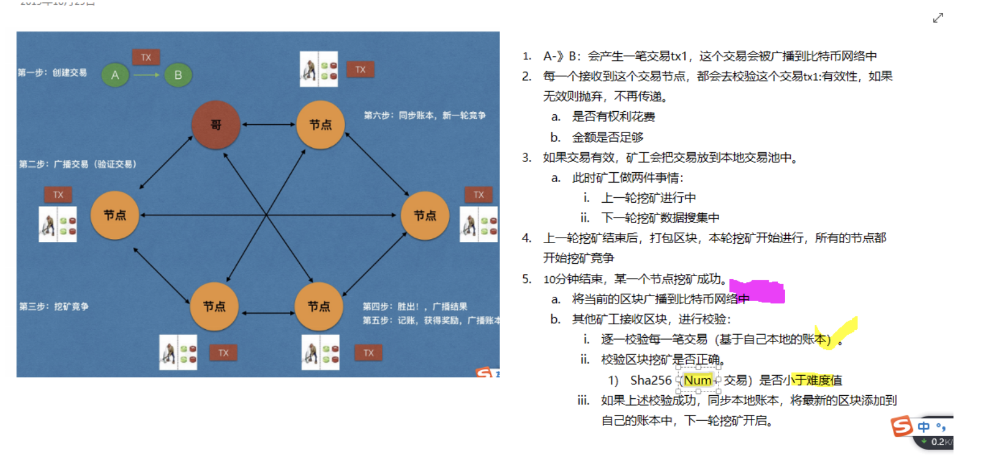
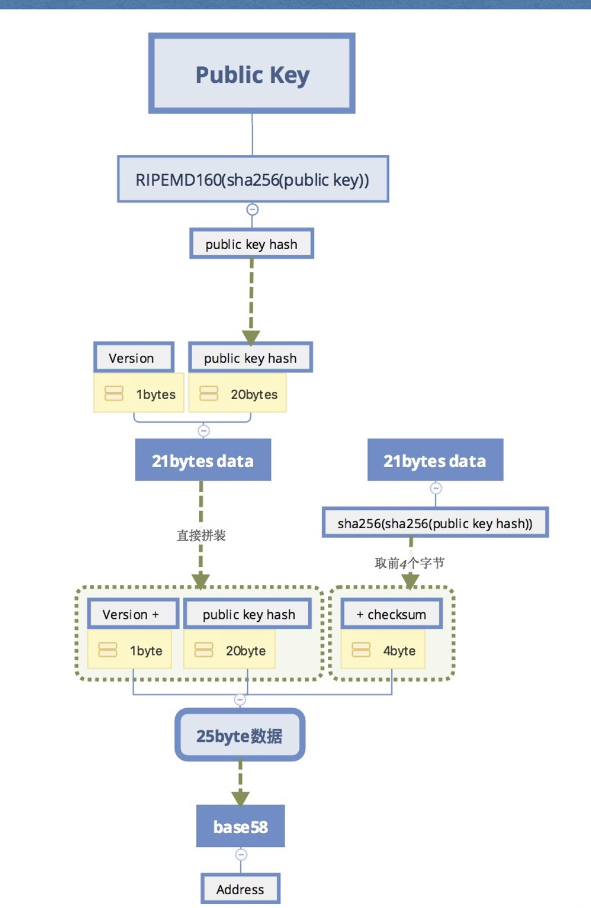
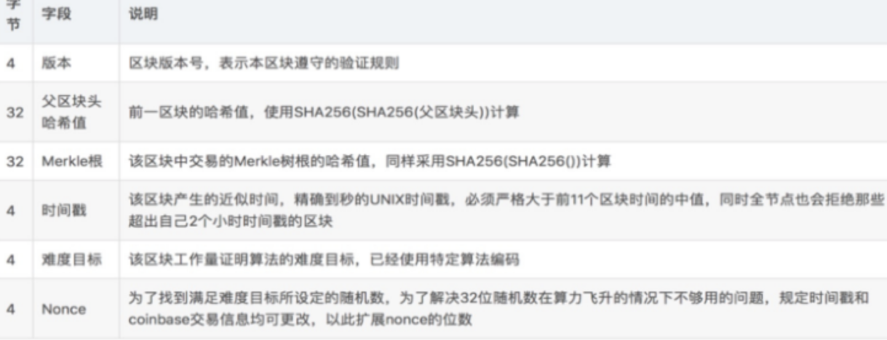
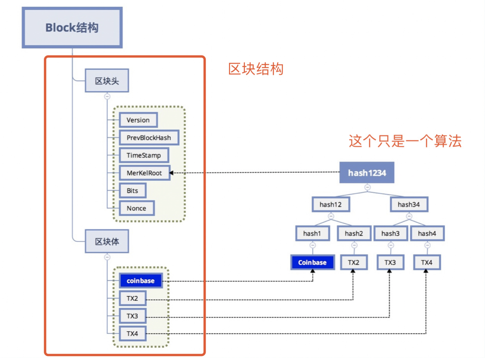

# 比特币

## 1. 去中心化电子记账系统

- 每一个节点都是服务器
- 每一个节点都是客户端
- 加入的节点越多，整个网络越安全
- 不存在一个中心的节点（所有人的地址都是平等的）
- 每一个账本都是公开的

成本： 每一个节点都要存储所有的数据

共识机制：所有的节点对某一个状态达成一致方式


- 举例说明

```json
A,B,C,D 相互交易  *****注意: 最主要是记账 ******

1，A支付10个比特币给B，(A记账没用，因为没人相信)，所以A要广播出去，告诉B，告诉C，告诉D
2. B支付5个比特币给C，广播给其他人知道
3. C支付2个比特币给D，广播给其他人知道
4.然后账单打包，打包成一个块，称之为区块。大小1M左右，内容大约4000条
5.然后把现在的块连接到之前的交易记录上，就叫做区块链

# 解决问题 
# 1. 以谁为准？2.我们为什么要记账？（凭什么要花费我的电脑资源记账） 3. 防伪？ 4.双重支付？ 5. 保密？

# 我们为什么要记账？
答： 1.有奖励，有手续费。2.打包奖励（每次只能一个人打包，没10分钟打一次包）
计算比特币的总数： 10*6*24*365*4（1+1/2+ (1/2)^2....(1/2)^n） 大约 2100万个

# 以谁为准？
答 ： 工作量证明（俗称挖矿）。
挖矿的原理：
hash =sha256(sha256(字符串：前块的头部+账单的信息+时间戳+随机数))
# 难度前N位必须是0 +num  < 难度值
假设算对了，hash值作为新块的头部，打包，然后接到后面去。然后成为一个新快
其他内容无法改变，只能改变随机数 

# 每个人的计算难度是不一样的，因为收集的账单不同，时间戳不同，随机数不同，个人信息不同
# 难度的设置 N为确定
1/2 *1/2*1/2*1/2 .....N  = (1/2)^n （n次幂）
假设世界上有一万台矿机 ==> 每台矿机的算力： 14T/s = 1.4 *10^13次/s
10分钟大概600秒 ：10^4表示1万台矿机 ==> 1.4*10^13 *10^4*600s = 8*10^19
N = 66  P =(1/2)^66 平均是2^66 约等于 8*10^19
```


- 交易如何防伪

```json
# 电子签名
# 随机数 --> 私钥 ---> 公钥 ----> 地址
加密： 私钥
解密： 公钥

操作：
A --给10BTC --B

#1. A首先写一条记录，（A付给B10个比特币)。进行hash运算得到摘要。然后用私钥加密得到一个密码
#2. A广播，A给B10个比特币这件事广播出去。同时还要把自己的公钥广播出去。同时还要把加密的密码广播出去
#3. 别人验证：对这条信息进行Hash运算，得出一个摘要1。同时用公钥和密码解密得出一个摘要2。
#4. 如果摘要1与摘要2相同，如果不同，则认为是伪造的。
# 这就是电子签名 
```


- 双重支付的问题

```json
# 如何进行余额的检查?
方法：通过追溯
追溯以往节点，查看余额是否足够。

# 当我们接收到别人给我们付款时，我们不能当时就认为钱已经到账了。
# 我们必须等着。等到块形成了，记录到主链上去。
# 这样就解决了双重支付问题。
```

- 双重支付图


- 防止篡改

```json
# 比特币有个规则---> 最长链原则

# 怎么样防止篡改？
除非你的算力超过了全球的算力
# 一般大额交易要等到6个块后才确定交易。
# 因为6个块后，很难篡改。

```

**比特币交易时，只需要公钥和地址**

- 交易流程说明



## 2.比特币的安装和使用

### 2.1 安装和配置

```shell
# 运行regtest模式
# 1.修改配置文件
# 修改~/Library/Application Support/Bitcoin/bitcoin.conf文件
testnet=1

# 运行testnet模式
# 2.测试网络 
regtest=1
```

==[bitcoin客户端下载地址](https://bitcoin.org/en/download)==

- 主网（真实比特币网络）
  - 默认黄颜色
- 真实测试网络（全世界都在使用，需要同步账本：30G左右）
  - 绿色
  - tsetnet=1
- 本地开发网络（用于开发）
  - regtest=1

### 2.2 私钥存储

```shell
$ cd ~/Library/Application Support/Bitcoin/
# 私钥一般会存储在wallet.dat中，里面可以存储N多个秘钥对
```

- 比特币系统中，每个人可以拥有N多个秘钥对。
- 尽量转账的时候，每一个地址都只使用一次。
- 这些地址都会同一的由wallet.dat来管理。
- 每次转账时，不需要指定付款地址，客户端会自动处理。


## 3.比特币地址

- 使用非对称加密 ： ecc椭圆曲线
- 随机数 --> 私钥 ---> 公钥-->地址




## 4. 区块结构

### 4.1 区块头



- Block（块）

```go
type Block struct{
  version string 		//版本号
  prevHash []byte		//前一个区块头
  merkle []byte			//merkle根
  timeStamp int64		//时间戳
  bits int64				//难度目标
  nonce int64 			//随机数
  data []byte				//区块体
}
```



### 4.2 区块体

