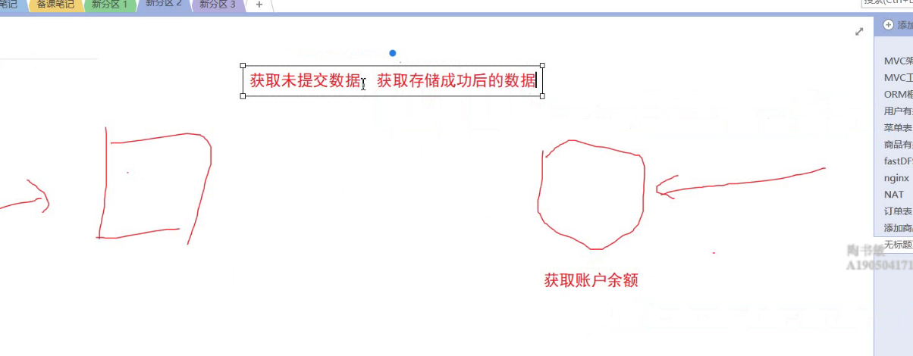
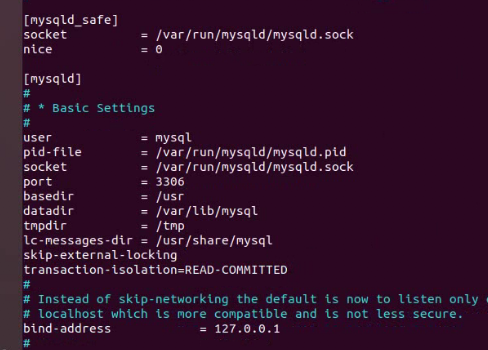

# ORM

## 一对多查询

- RelatedSel() 
  - 有参数:RelatedSel("ArticleType")  左内联
  - 无参数：RelatedSel() 左关联

```go
//1.获取orm对象
o :=orm.NewOrm()
//2. select *from Article inner join ArticleType on Article.id=ArticleType.id;
var article []Article
o.QueryTable("Article").RelatedSel("ArticleType").Limit(size,start).All(&article)
```


## 多对多插入

- 多对多插入五步骤（固定写法）

```go
//1.获取orm对象
o :=orm.NewOrm()
//2.获取被插入的对象
var article Article
article.Id = id
//3.读取
o.Read(&article,"Id")
//4.获取多对多插入对象
// 在mysql中会生成一个article_users第三张表
m2m:=o.QueryM2M(article,"Users") //article的多对多字段是Users
//5.获取插入对象
var usr User
usr.Name= UserName
o.Read(&usr,"Name")
//6.多对多插入
m2m.Add(usr) 
```


## 多对多查询

- LoadRelated :加载关系表

```go
//1.获取orm对象
o :=orm.NewOrm()
//2.获取被插入的对象
var article Article
article.Id = id
//3.读取
o.Read(&article,"Id")
//4.多对多关联 加载关系表 
o.LoadRelated(&article,"Users")
//5.多对多User表去重
//mysql去重distinct
//.Filter("Articles__Article__Id",id) 多对多查询 Articles__ 1对多查询不需要
// select *from user where Article.id = id 
o.QueryTable("User").Filter("Articles__Article__Id",id).Distinct().All(&usrs)
```


## 关联视图函数

- main.go

```go
func main() {
  //关联视图函数
	beego.AddFuncMap("shangyiye",PrePage)
	beego.Run()
}

//	关联视图函数
//  参数1：传入当前页码
func PrePage(pageIndex int)int{
  if pageIndex == 1{
    retrun 1
  }
  retrun pageIndex -1 
}
```

- html 文件

```html
<- .pageIndex 与main.go 文件的 关联函数保持一致 ->
<li><a href="/article/index?pageIndex={{shangyiye .pageIndex}}">上一页 </a> </li>
```


- dateformat 时间格式转换

```html
1.实现了时间的格式化，返回字符串，

//案例：
 <td> {{$value.AddTime.Format "2006-01-02 15:04:05"}}</td>
```


- compare

```html
1.实现了比较两个对象的比较，如果相同返回true，否者false，
使用方法
{{compare .A .B}}

<option {{if compare .ArticleName $.typeName}}selected="true"{{end}}>{{.ArticleName}}</option>
```


## 数据库增加收货地址

```go
/*
	增加收货地址
*/
func AddAddress(revicer,detail,zipcode,iphone,userName string)  {
	o := orm.NewOrm()
	var usr User
	usr.Name = userName
	o.Read(&usr,"Name")
	var address Address
  //查询当前用户默认地址
  err:=o.QueryTable("Address").RelatedSel("User").Filter("User_Name",userName).Filter("IsDefault",1).One(&address)
	if err!=nil {
		address.Receiver =revicer
		address.Addr = detail
		address.Phone = iphone
		address.Isdefault = 1
		address.User = &usr
		o.Insert(&address)
	}else {
    //将原来的默认地址更新为非默认地址
		address.Isdefault = 0
		o.Update(&address,"IsDefault")
    //增加新地址
		var newAddress Address
		newAddress.Receiver =revicer
		newAddress.Addr = detail
		newAddress.Phone = iphone
		newAddress.Isdefault = 1
		newAddress.User = &usr
		o.Insert(&newAddress)
	}
}
```

## 事务的并发

==事务的并发会有一个bug，事务的隔离级别。==

- 获取未提交内容： 事务还没走完，就预测未走完的结果。==读取事务未提交commit的数据==   简称：脏读

  - 左侧A，右侧B。B存钱，还未存储成功。A就获取到B存储成功的金额。
    - 错误数据，简称：脏读。（事务还有回滚的操作，错误数据）

  

- ==读取已提交的内容：大部分数据库默认的隔离级别==

- ==读取事务之前的数据：==**MYSQL 默认的隔离级别**
  - A取钱，B存钱。A取钱取得是B存之前的数据。
    - 会出现==幻读==

- 串行化： 
  - 一个一个处理。串行 -- 安全性最高

```shell
# 出现事务并发bug解决方法：
	
$ cd /etc/mysql/mysql.conf.d
$ sudo vim mysql.cnf
# 修改 事务级别为：读取已提交的内容
transaction-isolation=READ-COMMITTED
```

