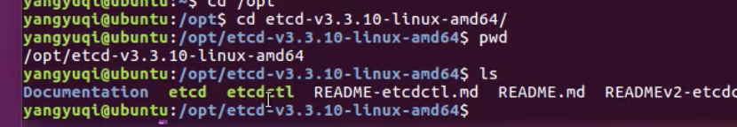
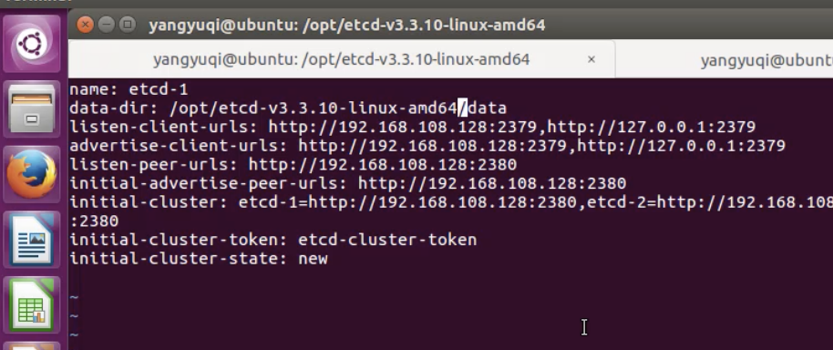

# Etcd安装与使用

## 1.安装与配置

- 下载

```shell
$ wget https://github.com/etcd-io/etcd/releases/download/v3.3.10/etcd-v3.3.10-linux-amd64.tar.gz
```

- 解压下载文件到安装目录 opt目录

```shell
$ sudo tar -zxvf etcd-v3.3.10-linux-amd64.tar.gz -C /opt/
```

- 配置为V3版本： 系统默认是V2  修改如下：

```shell
# 环境变量中增加
$ sudo vim /etc/profile
# 末尾追加
export ETCDCTL_API=3
# 保存
$ souce /etc/profile
```
- 如图：
  
- 配置节点 ： 特点-> 一般基础 最小3个

```shell
# 创建配置文件目录
$ sudo mkdir /etc/etcd

# 创建etcd配置文件
$ sudo vim /etc/etcd/conf.yml

# 添加节点 -1 
# 添加如下内容:  
name: etcd-1
data-dir: /opt/etcd-v3.3.10/data
listen-client-urls: http://192.168.208.131:2379,http://127.0.0.1:2379
advertise-client-urls: http://192.168.208.131:2379,http://127.0.0.1:2379
listen-peer-urls: http://192.168.208.131:2380
initial-advertise-peer-urls: http://192.168.208.131:2380
# 演示环境 集群etcd 只配置了一个
initial-cluster:  etcd-1=http://192.168.208.131:2380
# 正式 按照正式的集群配置
#initial-cluster: etcd-1=http://192.168.208.131:2380,etcd-2=http://192.168.208.131:2380,etcd-3=http://192.168.208.131:2380
initial-cluster-token: etcd-cluster-token
initial-cluster-state: new

# 添加节点2  
# etcd-2  等等
# ....
```



- 获取本机的ip地址


- 怕麻烦 使用安装脚本

```shell
#!/bin/bash
# 文件路径，安装地址URL
ETCD_VER=v3.3.4
ETCD_DIR=etcd-download
DOWNLOAD_URL=https://github.com/coreos/etcd/releases/download

# Download
mkdir ${ETCD_DIR}
cd ${ETCD_DIR}
wget ${DOWNLOAD_URL}/${ETCD_VER}/etcd-${ETCD_VER}-linux-amd64.tar.gz
tar -xzvf etcd-${ETCD_VER}-linux-amd64.tar.gz

# Install
cp etcd-${ETCD_DIR}-linux-amd64
cp etcdctl /usr/local/bin
```


## 2. 启动

- 查看版本号

```shell
$ cd /opt/etcd-v3.3.10/
# V3版本 
$ ./etcdctl version
# V2版本
$ ./etcdctl --version
```

- 启动

```shell
$ ./etcd --config-file=/etc/etcd/conf.yml
```

- 查看集群成员信息

```shell
$ ./etcdctl member list
```

- 查看集群状态 (Leader节点)

```shell
$ ./etcdctl cluster-health
```

- 查看leader状态

```shell
$ cur http://127.0.0.1:2379/v2/stats/leader
```

- 查看自己的状态

```shell
$ cur http://127.0.0.1:2379/v2/stats/self
```

- 参数endpoints

```shell
# endpoints 支持远端操作
$ ./etcdctl --endpoints=127.0.0.1:2379
```


## 3. Etcd的主要命令

- 键值写入与读取

```shell
# 写入
$ ./etcdctl set /message Hello
$ curl -X PUT http://127.0.0.1:2379/v2/keys/message -d value="Hello" # 方法2
# 读取
$ ./etcdctl get /message 
$ curl http://127.0.0.1:2379/v2/keys/message

# 模糊搜索 
$ ./etcdctl get mess -prefix

# 删除
$ ./etcdctl rm /message
$ curl -X DELETE http://127.0.0.1:2379/v2/keys/message
```

- 过期时间

```shell
$ ./etcdctl set -ttl 10 /message Hello
$ curl -X PUT http://127.0.0.1:2379/v2/keys/key -d value=value -d ttl=time
```

-  观察者

```shell
# 终端输入:
$ curl http://127.0.0.1:2379/v2/keys/foo?wait=true
# 终端会阻塞等待

# 另一终端改变他的值
$ curl http://127.0.0.1:2379/v2/keys/foo -XPUT -d value=bar
```

- 原子操作

```shell
# 条件成立的时 设置key值
$ curl http://127.0.0.1:2379/v2/keys/foo?prevExist=false -XPUT -d value=three
# 支持的判断条件有:
# prevValue : 以前的值是什么
# prevIndex : 以前的index下标是什么
# prevExist : 以前是否存在


# 当条件成立时删除
$ curl http://127.0.0.1:2379/v2/keys/foo?prevValue=two -XDELEFE
# prevValue
# prevIndex
```


## 4.租约（lease）

- V3版本里没有ttl 过期，需使用租约

```shell
# 生成
$ ./etcdctl lease grant 20
# 执行后返回信息:
# lease 2be754fbc6a5afa granted with TTL(20s)

# 关联租约到key 
$ ./etcdctl put test_lease 20 --lease=2be754fbc6a5afa

# 维持租约
$ ./etcdctl lease keep-alive 2be754fbc6a5afa

# 撤销租约
$ ./etcdctl lease revoke 2be754fbc6a5afa
```


## 5.观察者

==观察者: 事件的接收者==

```shell
# 终端输入：
$ curl http://127.0.0.1:2379/v2/keys/foo?wait=true
# 该终端进入等待返回状态

# 第二个终端去改变他的值
$ curl http://127.0.0.1:2379/v2/keys/foo -XPUT -d value=bar

# 然后返回第一个终端观察变化
# 等待指定的index ,这个index 是node 属性中的modifiedIndex
# waitIndex=14 意识是: 修改次数内createIndex= 14次时变化
$ curl 'http://127.0.0.1:2379/v2/keys/foo?wait=true&waitIndex=14'
```

