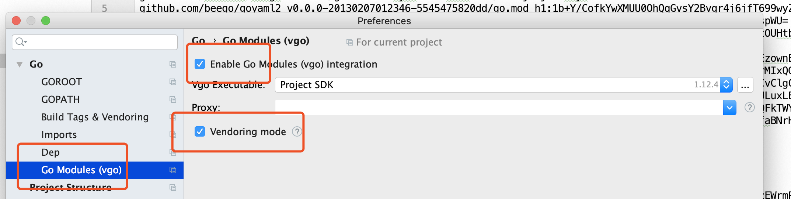
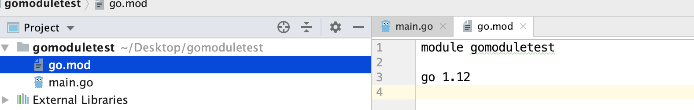
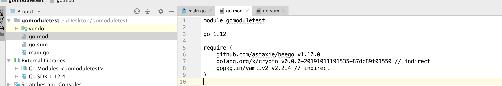
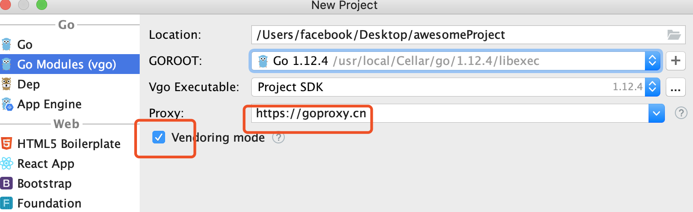

# Go Modules


## 1. GOMODULE 环境变量 

- Linux:

```shell
# 在~/.bashrc 里面增加环境变量
export GOPROXY=https://goproxy.cn  #或者 https://goproxy.io
export GO111MODULE=on #auto

# GO111MOUDLE 解释：在1.11版本，引入了一个概念GOMODULE 
# on ==> 打开
# auto ==> 自动
# off ==> 不使用
```

- Mac

```shell
# 在~/.bash_profile 里面增加环境变量
export GOPROXY=https://goproxy.cn 
export GO111MODULE=on
```


## 2.创建项目

- 在非GOPATH目录下创建一个gomoduletest目录 
- 创建main.go文件

```go
package main

import ( 
  "github.com/astaxie/beego"
)

func main() { 
  beego.Run()
}
```


## 3.Goland配置 




## 4.Mod命令

### 4.1创建go.mod 文件

```shell
# 初始化go.mod
# gomoduletest : 当前文件夹名，工程名
go mod init gomoduletest 
```

- 执行结果




### 4.2 下载依赖包

```shell
# 此时会下载依赖包，
# 下目录为$GOPATH/pkg/mod下面
go mod tidy 

# 注意事项
# 在go.mod里假设修改beego版本号 v1.12.0 
# 执行go mod tidy
# vendor里还是原来beego的版本，要想同步
# go mod vendor
```



### 4.3将依赖下载到项目中

```shell
# 此时会在gomoduletest 
# 下面生成vendor目录，里面是当前项目依赖包(具体版本)
go mod vendor
```


## 4.4 编译项目

```shell
go build --mod vendor -o bee
```


## 5.Vgo

- 相当于使用==go mod init awesomeProject==
-  相当于Goland ==>Setting===>设置Proxy

