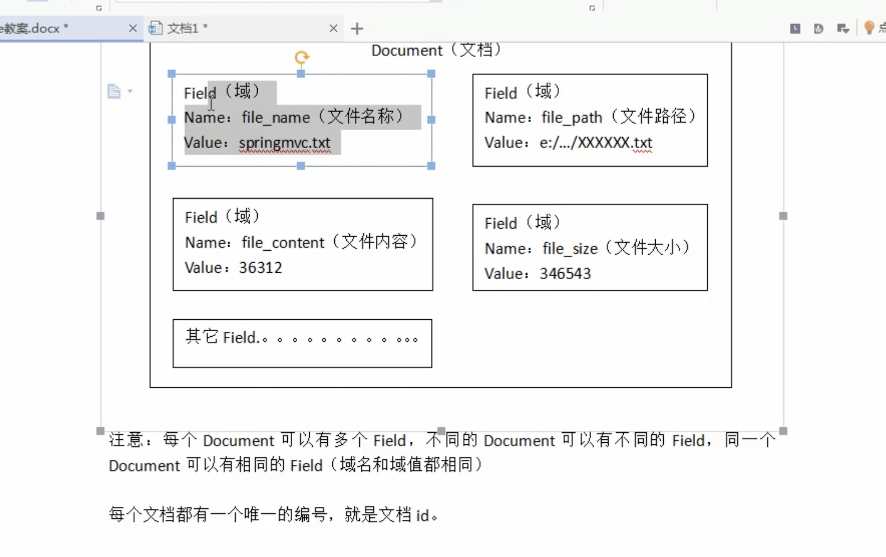
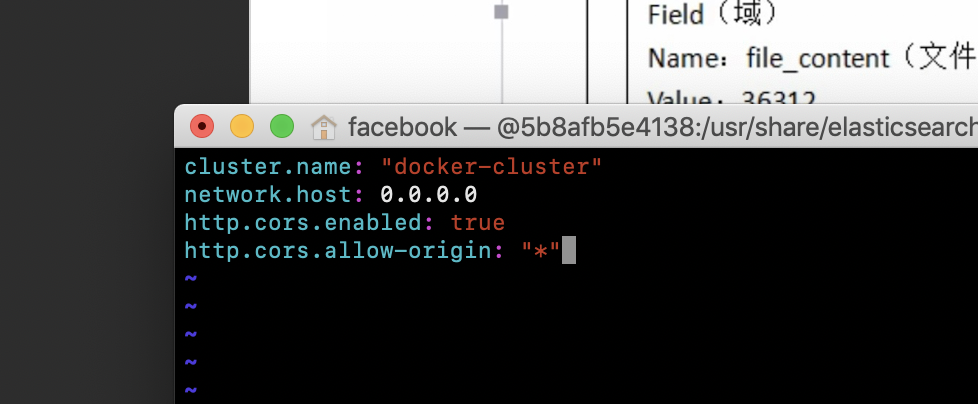
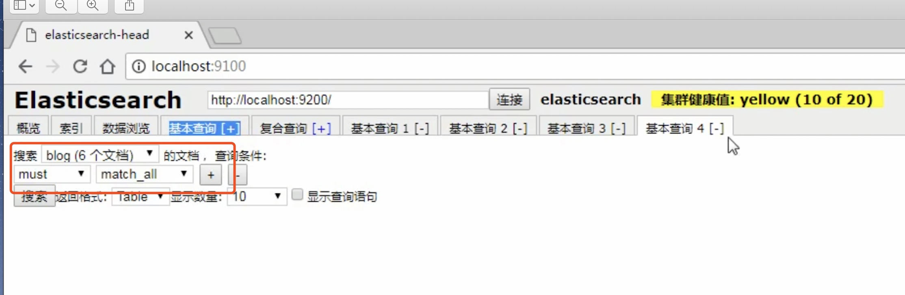
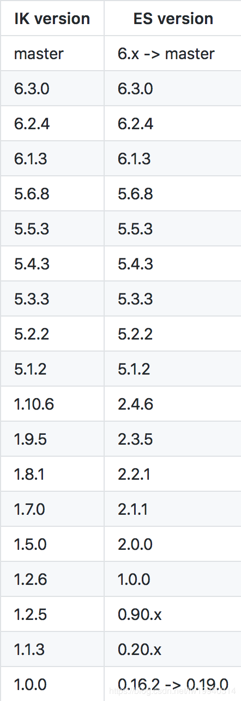

# ElasticSearch  
***全文检索服务器，基于Lucene的API。很容易搭建一个集群**</br>

[参考文档1](https://juejin.im/entry/5913d6132f301e006b82e068)</br>
[参考文档2](https://blog.csdn.net/wd2014610/article/details/82426863)</br>

>ElasticSearch安装及环境配置，Kibana安装及环境配置，中文分词器安装IK

### 1.1安装ElasticSearch 

[**参考安装**](https://www.jianshu.com/p/b128a880436d)

Elasticsearch 是一款稳定高效的分布式搜索和分析引擎，它的底层基于 Lucene，并提供了友好的 RESTful API 来对数据进行操作，还有比较重要的一点是， Elasticsearch 开箱即可用，上手也比较容易。

```
1.docker 搜索镜像
docker search elasticsearch

2.拉取elasticsearch镜像
docker pull elasticsearch:6.8.3

3.启动Elasticsearch
docker run -id --name esearch -p 9200:9200 -p 9300:9300 elasticsearch:6.8.3

4.检查启动后的ElasticSearch启动镜像状态
docker ps -a 

5.检查ElasticSearch的web服务运行情况
curl  http://宿主机IP:9200/

6.Elasticsearch 启动后，也启动了两个端口 9200 和 9300：
解释：
	1.9200 端口：HTTP RESTful 接口的通讯端口
	2.9300 端口：TCP 通讯端口，用于集群间节点通信和与 Java 客户端通信的端口
	
测试:浏览器访问-->http://localhost:9200/ 或如下访问
curl 'http://localhost:9200/?pretty'


7.导入数据:  取得本地数据[/Users/facebook/Downloads/logs.jsonl]
curl -H 'Content-Type: application/x-ndjson' -XPOST 'localhost:9200/_bulk?pretty' --data-binary  @/Users/facebook/Downloads/logs.jsonl


8.查看数据:
curl -XGET 'localhost:9200/_cat/indices?v&pretty'

```
[**数据导入参考文档**](https://www.jianshu.com/p/76cc57d46328)

如果ElasticSearch服务停止或是挂掉，先使用docker删除对应的进程：docker rm ae89feb13d62



### 1.2图形界面管理工具 ElasticSearch-head
[参考文献资料](https://blog.csdn.net/fw19940314/article/details/86482971)
##### 修改跨域问题

```
1.进入容器
docker exec -it b8c7c128df2f /bin/bash

2.查看目录
ls
cd config/

3.编辑 .yml 文件
vim elasticsearch.yml 

4.增加跨域功能
文件末尾：
http.cors.enabled: true
http.cors.allow-origin: "*"

5.重启容器
service docker restart
```
效果图：



##### elasticsearch-head的安装

[参考文档](https://blog.csdn.net/sinat_28434649/article/details/79285831)

```
1..镜像拉取
docker pull mobz/elasticsearch-head:5

2.启动
docker run --name es-head -p 9100:9100 mobz/elasticsearch-head:5


3.查看启动是否成功
Started connect web server on http://localhost:9100
```


### 1.3docker容器关闭异常处理

```
1.查看进程
	docker  ps  - a 
2.杀死没用，删除
	docker rm ae89feb13d62
3.查看删除
	docker ps  -l 
```

### 1.4安装Kibana 6.8.3版本
>Kibana是ES的一个配套工具，让用户在网页中可以直接与ES进行交互。 Kibana的默认端口是5601

```
1.安装
brew install kibana
2.启动
kibana

```

### 1.5安装httpie或使用curl
[参考文档](https://httpie.org/doc#installation)</br>

```
1.安装
brew install httpie
2.启动
port install httpie
```
### 1.5ElasticSearch相关概念（面向文档）

对应关系:

```
Mysql:
databases --> tables -->row ----> columns

ElasticSearch:
indexs ---> Types ----> Document---->Fields(域)

映射：mapping  对应数据库表结构的定义

```

### 1.6ES使用

1.创建索引，然后分片，副本（备份）</br>
2.复合查询发送json数据，建议使用postman<br>


1.创建索引库

```
PUT:		
	http://127.0.0.1:9200/blog1
	
{
	"mappings":{			//索引库信息
		"article":{			//type的名称，mysql表的概念
		"properties":{		//mysql表属性名称概念 相当于字段的定义
				"id":{			//字段的名称
					"type":"long",		//字段类型
					"store":true,		//是否存储
					"index":"not-analyzed" //默认是不索引的
				},
				"title":{			//标题
					"type":"text",
					"store":true,
					"index":"analyzed",	//是否索引
					"analyzer":"standard"  //分词器 ：标准分词器
				},
				"content":{			//内容
					"type":"text",
					"store":true,
					"index":"analyzed",
					"analyzer":"standard"
				}
			}
		}
	}
	
}

```

2.设置mappings 

POST:		
	http://127.0.0.1:9200/blog1(索引名称)/hello(相当于表名)_mappings(执行动作)

```
"hello":{			
		"article":{			
		"properties":{		
				"id":{			
					"type":"long",		
					"store":true,	
					"index":"not-analyzed" 
				},
				"title":{			
					"type":"text",
					"store":true,
					"index":"analyzed",
					"analyzer":"standard"  
				},
				"content":{		
					"type":"text",
					"store":true,
					"index":"analyzed",
					"analyzer":"standard"
				}
			}
		}
	}

```	

3.删除索引库

DELETE:
	http://127.0.0.1:9200/blog1
	
```
"mappings":{			
		"article":{			
		"properties":{		
				"id":{			
					"type":"long",		
					"store":true,	
					"index":"not-analyzed" 
				},
				"title":{			
					"type":"text",
					"store":true,
					"index":"analyzed",
					"analyzer":"standard"  
				},
				"content":{		
					"type":"text",
					"store":true,
					"index":"analyzed",
					"analyzer":"standard"
				}
			}
		}
	}

```

4.创建文档 (一条数据就是一个Document)

POST:		
	http://127.0.0.1:9200/blog1/hello/1   (解释：blog数据库名，hello 表名,1 文档Document 对应row)

```
{
	"id":1
	"title":新添加文档
	"content":"新添加的文档的内容"
}

```

返回数据解析:

```
{
	"_index":"blog1",
	"_type":hello,
	"_id":1,   //** _id 文档真正的id相当于主键， 并不是我们的id 属性
	"_version":1,
	"reslut":"created",
	"_shards":{
	"total":2,
	"sucessfull":1,
	"failed":0
	}
	"created":true
}

```


5.删除文档

DELETE:

http://127.0.0.1:9200/blog1/hello/1 (删除blog1文档下hello表名为id为1的)


不需要body


6.修改文档 【Lucene底层实现的删除都是先删除后添加】
	
POST

http://127.0.0.1:9200/blog1/hello/1 

	
```
{
	"id":1,
	"title":"修改文档1",			//本质是先删除都添加
	"content":"修改文档1内容"
}
```

7.查询 根据_id

GET

http://127.0.0.1:9200/blog1/hello/1   查询的是主键_id 


8.根据关键词 term

POST

http://127.0.0.1:9200/blog1/hello/_search  关键字_search

```
"query":{				//查询条件	query
	"term":{		 //根据term关键词查询  必须要指定在哪个字段 (title)，哪个关键词  用户输入
		"title":"关键词(用户输入)"
	}
}
```


9.querystring 带分析的查询  Lucene  queryPath


POST

http://127.0.0.1:9200/blog1/hello/_search  关键字_search

```

"query":{				
	"query_string":{		//需要指定默认搜索域
		"default_field":"title" //默认搜索域
		"query":"今天在修路"
	}
}

```


10.使用head 插件查询

 + 1.基本查询
 	+ 1.查询条件 
 		+  两个条件should ，两个只需要满足一个就行  多条件查询时 假设两个查询条件  OR
 		+  must：两个条件必须都满足   多条件查询时 假设两个查询条件 AND
 + 2.复合查询

对应效果图



### 1.6 中文分词器

**** 标准分词器: 一个汉字一个词 ,标准分词器 中文只能分成一个汉字 ****

1.查看分词器的分析结果 使用postman

```
http://127.0.0.1:9200/_analyze?analyze=standard&pretty=true&text="我是程序员"

解释：
	_analyze :分词器关键字
	analyze=standard:指定标准分词器
	pretty=true:表示格式化输出
	text: 我们要分析的内容
```

** 做中文项目 我们要使用中文分词器 IK中文分词器***

### 1.7 集成IK中文分析器 

1.进入elasticsearch容器 -->plugins 目录下
> docker exec -it b8c7c128df2f /bin/bash</br>
> ls</br>
> cd plugins/</br>
2.下载ik分析器
>wget https://github.com/medcl/elasticsearch-analysis-ik/releases/download/v6.8.3/elasticsearch-analysis-ik-6.8.3.zip </br>
>ls</br>
3.解压缩
** cd /usr/share/elasticsearch/plugins/ik ** 一定要创建文件夹
> unzip xxx 重命名为ik
4.重启
> docker restart esearch (esearch 与前面创建的esearch 名字一致)

IK两种算法:
ik_smart:	
ik_max_word: 拆分更多的中文分词

```
GET
http://127.0.0.1:9200/_analyze?analyze= ik_smart&pretty=true&text="我是程序员" 

GET
http://127.0.0.1:9200/_analyze?analyze= ik_smart&pretty=true&text="我是程序员" 
```

效果：




### 1.7ES集群  出奇的简单
概念：大于2个节点就可以成为集群，一个node成为一个服务器。每个节点都有自己的名臣。

```
集群：cluster 

节点：node

ES：默认分5片 --->5片加起来就是一个完整的索引库
高可用：备份节点
一般备份节点与节点不在同一个服务器上，防止服务器挂掉，备份节点就无法工作。

物理存储单元：
一个物理存储单元就是一个Lucene创建的索引库。

```


### 集群的搭建

```
1. 准备三台ElasticSearch服务器
创建ElasticSearch-cluster文件夹，在内部复制三个ElasticSearch服务
elasticSearch/data 目录不能有数据，这里就是Lucene的索引库

2.修改每台服务器的配置
修改 elasticSearch/config/elasticsearch.yml 配置文件

```

配置信息

```
/* 这个文件里
http.cors.enabled: true
http.cors.allow-origin: "*"
*/

# 节点1的配置信息
# 集群名称，保证唯一
cluster.name: my-elasticsearch
#节点名称  必须不一样
node.name: node-1
#本机的ip地址
network.host:127.0.0.1
#服务端口号，在同一机器侠必须不一样
http.port:9200
# 集群建的通讯端口号 在同一机器侠必须不一样
transport.tcp.port:9300
#设置集群自动发信机器ip集合
discovery.zen.ping.unicast.host:["127.0.0.1:9300","127.0.0.1:9302","127.0.0.1:9303"]


星号： 主检点
圆点：从节点

```


