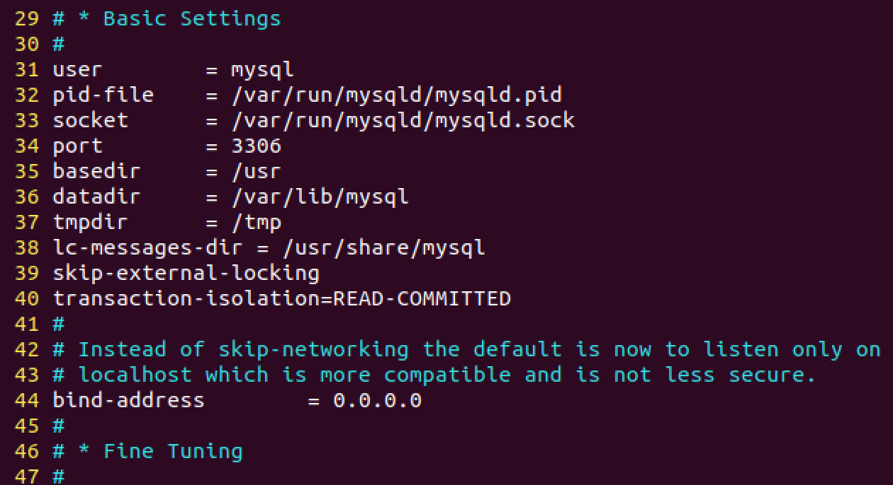

# MySQL 事务的隔离级别

### 1.MySQL 事务

事务的概念:**一组mysql语句，要么执行，要么全不不执行。 **

事务的特点：

+ 原子性 ：一组事务，要么成功；要么撤回。 
+ 稳定性：有非法数据（外键约束之类），事务撤回。 
+ 隔离性：事务独立运行。一个事务处理后的结果，影响了其他事务，那么其他事务会撤回。事务的100%隔离，需要牺牲速度。 
+ 可靠性：软、硬件崩溃后，InnoDB数据表驱动会利用日志文件重构修改。可靠性和高速度不可兼得， innodb_flush_log_at_trx_commit 选项 决定什么时候吧事务保存到日志里。 

### 2.事务的隔离级别

> SQL标准定义了4类隔离级别，包括了一些具体规则，用来限定事务内外的哪些改变是可见的，哪些是不可见的。低级别的隔离级一般支持更高的并发处理，并拥有更低的系统开销。 

#### 2.1Read Uncommitted（读取未提交内容）：

```json
在该隔离级别，所有事务都可以看到其他未提交事务的执行结果。
本隔离级别很少用于实际应用，因为它的性能也不比其他级别好多少。
读取未提交的数据，也被称之为脏读（Dirty Read）。 
```


#### 2.2 Read Committed（读取提交内容)

```json
这是大多数数据库系统的默认隔离级别（但不是MySQL默认的）。
它满足了隔离的简单定义：
一个事务只能看见已经提交事务所做的改变。这种隔离级别 也支持所谓的不可重复读（Nonrepeatable Read），因为同一事务的其他实例在该实例处理其间可能会有新的commit，所以同一select可能返回不同结果。 
```


#### 2.3Repeatable Read（可重读）

```json
这是MySQL的默认事务隔离级别，它确保同一事务的多个实例在并发读取数据时，会看到同样的数据行。
不过理论上，这会导致另一个棘手的问题：
幻读 （Phantom Read）。
简单的说，幻读指当用户读取某一范围的数据行时，另一个事务又在该范围内插入了新行，当用户再读取该范围的数据行时，会发现有新的“幻影” 行。
InnoDB和Falcon存储引擎通过多版本并发控制（MVCC，Multiversion Concurrency Control）机制解决了该问题。 
```


**Serializable（可串行化） **：这是最高的隔离级别，它通过强制事务排序，使之不可能相互冲突，从而解决幻读问题。简言之，它是在每个读的数据行上加上共享锁。在这个级别，可能导致大量的超时现象和锁竞争。 /body> 

这四种隔离级别采取不同的锁类型来实现，若读取的是同一个数据的话，就容易发生问题。例如：

**脏读(Drity Read)：**某个事务已更新一份数据，另一个事务在此时读取了同一份数据，由于某些原因，前一个RollBack了操作，则后一个事务所读取的数据就会是不正确的。

**不可重复读(Non-repeatable read):** 在一个事务的两次查询之中数据不一致，这可能是两次查询过程中间插入了一个事务更新的原有的数据。

**幻读(Phantom Read):** 在一个事务的两次查询中数据笔数不一致，例如有一个事务查询了几列(Row)数据，而另一个事务却在此时插入了新的几列数据，先前的事务在接下来的查询中，就会发现有几列数据是它先前所没有的 。


设置MySQL的隔离级别：

```shell
# 出现隔离性问题解决
sudo vim /etc/mysql/mysql.conf.d
# 修改:
transaction-isolation=READ-COMMITTED
```



### 3.并发处理

当我们在一个网站购物时，可能会遇到这样一种情况，两个用户同时向网站中提交了购买请求。业务逻辑如下：


可能会出现如下错误。当用户A判断完商品1库存之后，**系统的执行时间**可能会跳转到B的进程，这时候用户B把商品买完了，也把商品数据更新了一边，然后A已经判断过库存了，认为商品是充足的，所以仍然会去更新数据库，这就造成了**一件商品可能被卖了两次**。那怎么解决这个问题呢？

我们需要先设定一个原始的库存数据，然后在更新的时候，先去判断现在的库存数据是否和原始的数据一致，如果不一致，认为库存数据已经改变了，判断提交订单失败，如果一致，认为可以继续下订单。

代码如下：

```go
updateCount,_ := o.QueryTable("GoodsSKU").Filter("Id",goods.Id).Filter("Stock",preStock).Update(orm.Params{"Stock":goods.Stock,"Sales":goods.Sales})
		if updateCount == 0{
			resp["code"] = 3
			resp["errmsg"] = "商品数量变动"
			this.Data["json"] = resp
			o.Rollback()  //标识事务的回滚
			return
		}
```

但是有时候我们数量变动的时候，库存量还是足够的还是要让用户去购买的，所以这里面我们不能一次性就把数据认为是错误的，所以这里面我们需要多做几次判断，这里我们规定，循环三次，如果有一次原来的库存和要更新的库存一致，就更新数据，不然返回错误。

```go
_,err=o.QueryTable("GoodsSKU").Filter("Id",id).Filter("Stock__gte",count).Update(orm.Params{
			"Stock": orm.ColValue(orm.ColMinus, count),"Sales": orm.ColValue(orm.ColAdd, count)})
```