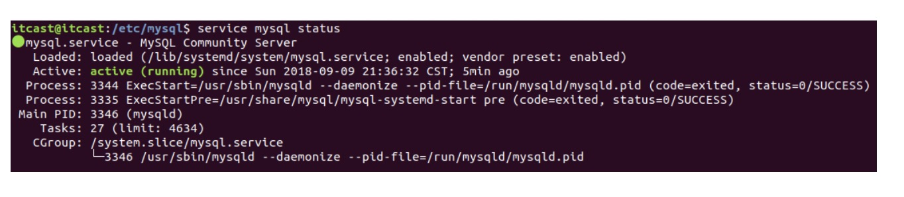
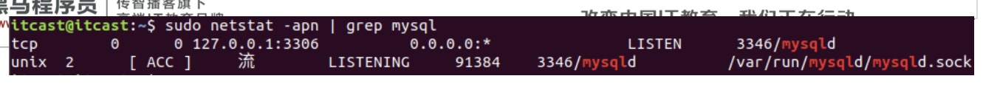

# MySQL安装和启动 

## 1.安装

> Linux 下的MySQL安装，十分简单。保证联网状态下，直接使用命令即可顺序完成。

```
sudo apt-get update 

sudo apt-get install mysql-server

会弹出提示，让输入root的密码，根据提示操作即可。

安装完成可以使用 aptitude 命令查看安装是否完成。并能查看到当前所安装的MySQL版本信息。

sudo aptitude show mysql-server

或者也可以使用 mysql -V 查看当前版本信息。

成功安装后，MySQL的配置文件位于 /etc/mysql 目录中。

```

## 2.启动MySQL服务

> 有两种方法可以启动、关闭、重启MySQL数据库服务器。</br>
> 
>方式1：sudo /etc/init.d/mysql start/stop/restart  
>
>方式2：sudo service mysql start/stop/restart
>
>判断是否启动成功，可以使用命令 service mysql status 来查看。

如果看到了一个绿色的小灯亮起，就表示MySQL服务正在欢快地运行着。如：


```
也可以利用网络编程阶段我们接触过的netstat命令，来查看MySQL服务器的启动状态。

对应的是一个名为“mysqld”的守护进程。

使用命令：sudo netstat -apn | grep mysql。

看到该服务的状态为“LISTENING”，说明服务已经启动，正在等待用户与之建立连接。同时可以看到，mysql服务使用的默认端

口为：3306
```


## 3.登录MySQL数据库

```
使用“mysql”关键字，-h指定IP地址，-P指定端口号（3306），-u指定用户名（root），-p指定密码（123456）即可登录MySQL数据库。如：

mysql -h127.0.0.1 -P3306 -uroot -p123456

通常，如果MySQL服务器在本地，Ip地址可以省略；如果MySQL服务器用的是3306端口，-P也可以省略，如：

mysql -uroot -p123456。但，这种登录方式，密码为明文显示状态。如果希望使用密文。可以使用：

mysql -uroot -p“回车”。这时，系统会提示“Enter password:”再输入密码，就不可见了。

成功登陆，可以看到“mysql>”的提示字样。可以使用 “show databases;” 查看当前MySQL中，有哪些数据库。注意，不要落写“;”。

退出MySQL：exit 和 quit 都可以做到。“\q”也可以。

```
