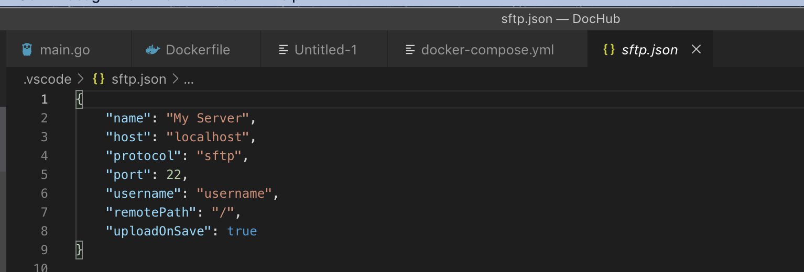
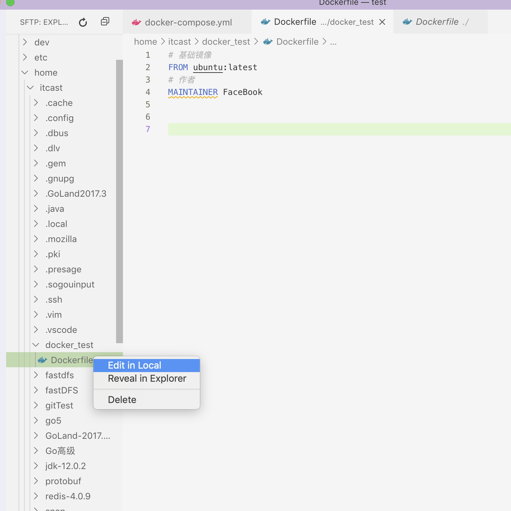
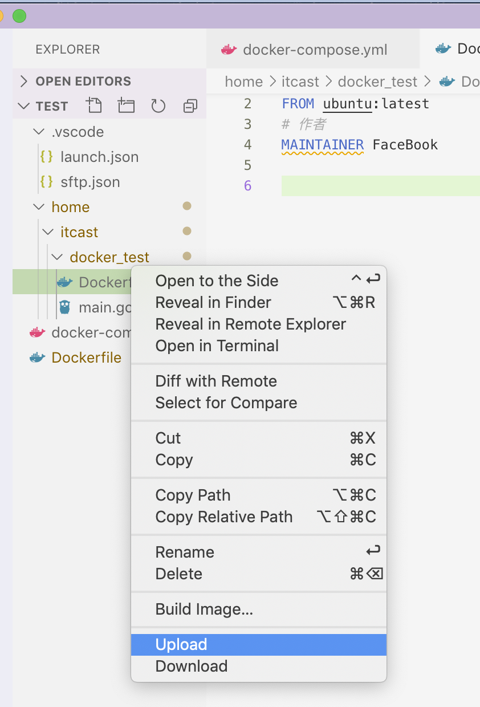

## VSCode 搭建golang 环境


### 1.  安装VSCode

- 方法一：
  
- [VSCode下载地址](https://code.visualstudio.com/)
  
- 方法二： 推荐终端安装

  - ```shell
    $ brew cask install visual-studio-code
    ```

    

### 2. Golang 环境变量配置

```shell
 export GOROOT=/usr/local/Cellar/go/1.12.4/libexec	#go语言安装包  GOROOT
 export PATH=$PATH:$GOROOT/bin				#go语言包可执行文件bin
 export GOPATH=$HOME/go								# GOPATH
 export PATH=$PATH:$GOPATH/bin
 
 # 查看环境变量
 $ go env 
```


### 3. ==Golang 插件安装==

* VSCode扩展中搜索“Go”：安装官方Go扩展
* 打开VSCode的 Code -》首选项 -》设置 打开 ==settings.json==文件，增加 go 的配置信息

```json
{
    "files.autoSave": "onFocusChange",
    "go.buildOnSave": "off",
    "go.lintOnSave" :"off",
    "go.vetOnSave":"off",
    "go.buildTags": "",
    "go.buildFlags": [],
    "go.lintFlags": [],
    "go.vetFlags": [],
    "go.coverOnSave": false,
    "go.useCodeSnippetsOnFunctionSuggest":true,
    "go.formatTool": "goreturns",
    "go.formatOnSave": true,
    "go.gocodeAutoBuild": false,
    "go.autocompleteUnimportedPackages": true,
    "go.gocodePackageLookupMode": "go",
    "go.gotoSymbol.includeImports": true,
    "go.inferGopath": true,
    "go.useCodeSnippetsOnFunctionSuggestWithoutType": true,
    "go.goroot": "/usr/local/Cellar/go/1.12.4/libexec",
    "go.gopath": "/Users/facebook/go",
}
```

- 插件安装

```shell
go install github.com/mdempsky/gocode   
go install github.com/uudashr/gopkgs/cmd/gopkgs
go install github.com/ramya-rao-a/go-outline  
go install github.com/acroca/go-symbols         
go install golang.org/x/tools/cmd/guru      
go install golang.org/x/tools/cmd/gorename  
go install github.com/derekparker/delve/cmd/dlv   # 注意  xcode 
go install github.com/stamblerre/gocode         
go install github.com/rogpeppe/godef        
go install github.com/ianthehat/godef   
go install github.com/sqs/goreturns         
go install golang.org/x/lint/golint1. 安装vscode、golang、git 
```

### 4. yml搭建环境

- 在vscode应用商店中搜索拓展yml插件，然后进行安装。


### 5. ==VSCode安装SFTP==

- 在vscode应用商店中搜索拓展sftp插件，然后进行安装。
- 安装完成后重启窗口，按快捷键Ctrl+shift+p，输入sftp:config回车进入配置文件。



```jso
{
    "host": "192.168.226.165",		
    "port": 22,
    "username": "itcast",
    "password": "itcast",
    "protocol": "sftp",						
    "agent": null,				
    "privateKeyPath": null,
    "passphrase": null,
    "passive": false,
    "interactiveAuth": true,
    "remotePath": "/",					
    "uploadOnSave": true,
    "syncMode": "update",
    "ignore": [
        "**/.vscode/**",
        "**/.git/**",
        "**/.DS_Store"
    ],
    "watcher": {
        "files": "glob",
        "autoUpload": true,
        "autoDelete": true
    }
}
```

- 使用SFTP传输数据
  - 选中远端单独某个文件,点击Edit inLocal




- 修改完毕后，上传到远端

