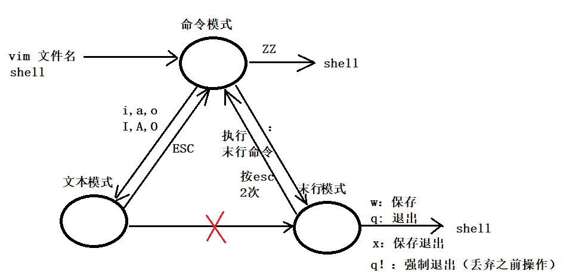

## ==用户切换==

- sudo su : 切换root
- su 用户名：将登陆用户切换，不修改工作目录位置。
- su - 用户名：将登陆用户切换，修改工作目录位置到当前用户的家目录。


## 创建、删除新用户

1. sudo adduser 新用户名
2. 输入密码2次。用户信息。。。（默认 Enter）
3. 创建成功，/home 多出新用户宿主目录。也可以在 /etc/passwd 看到新用户信息。/etc/group 看到新用户组信息。
4. 修改文件所有者给新用户。
    1. sudo chown 新用户名 文件/目录名
    2. 修改后的文件所有者变为新用户。新用户遵循，“所有的rwx权限”

5. 删除用户：sudo deluser  用户名


## 创建、删除用户组

1. sudo addgroup 新用户组名
2. 创建成功，可以在 /etc/group 文件中看到新组信息。
3. 修改文件所属组给新组。
    1. sudo chgrp 新用户组名 文件/目录名
4. 删除用户组：sudo delgroup  用户组名

- 一次性修改文件所有者、所属组 语法：
    - sudo chown 用户名：用户组名  文件/目录名
    - e.g. : sudo chown nobody:nogroup out


## ==chmod 修改文件权限==

- 文字设定法
    - u、g、o、a
    - +、-、=
    - r、w、x
    - e.g.1 :  chmod u+x,g-w,o+wx out
    - e.g.2:  chmod u=rx,g=r,o=rx out

- **==数字设定法==**
    - r=4, w=2, x=1
    - -rwxr-xr--  ---> 7 5 4 ---> chmod 754 文件名


## 系统管理

### 查看系统进程信息

- 语法：ps aux | grep 关键字

- 如果查询结果为 1 条。代表当前系统中，没有关键字对应进程。

- 命令行的 “任务管理器” --- top

    

### 终止进程

- Linux 系统中，所有进程的结束，都是由于收到信号导致的。
- kill -l 查看 Linux 支持的信号。
- kill -9 进程ID (pid/PID)  来杀死指定的进程。（不能超出用户权限）

```
1)SIGHUP :控制终端挂起信号，或者控制进程结束
2)SIGINT :键盘上输入中断（Ctrl+C 解释成一个信号）
3)SIGQUIT:键盘输入的退出(Ctrl+\)
4)SIGILL :无效的硬件指令
5)SIGFPE :浮点运算例外
9)SIGHKILL: 杀死进程信号
11)SIGSEGV:无效的内存引用
16)SIGSTKFLT:协处理器堆栈错误

```


### 网络

- 查看网络信息：
    - ifconfig：  （只Linux使用。 windows 下用 ipconfig）
        - IP、子网掩码、广播地址。
- 探测网络是否畅通：
    - ping：（Linux、windows 共用）
        - 探测内网（班级内网络）：ping  目标主机 IP地址。
        - 探测外网：ping 8.8.8.8   或   ping 域名


## ==find 命令 按文件属性搜索==

- 语法：find  搜寻目录  参数  条件
- 按文件名搜索
    - -name： 按名称搜索。可以使用 “*?” 通配符
        - e.g. :   find ./ -name “*hello.go”
        - e.g. :   find /etc/init.d -name “h???.conf”
- 按类型搜索：
    - -type: 
        - 使用 文件类型中的字符 d/s/p/l/c/b  不能使用 ‘-’代表普通文件，使用“f”
        - e.g. : find ./ -type “d”    查找目录文件
        - e.g. : find ./ -type “f”    查找普通文件
        - e.g. : find ./ -type “p”    查找管道文件
- 按文件大小搜索：
    - -size：
        - 如果指定起始、结束范围，需要 2个size。
        - k 只能小写，M只能大写，G只能大写。
        - 不添加单位，默认的单位为扇区的个数（不是字节）。（0.5KB=512byte）
        - e.g. : find ./ -size +5k -size -7k    查找5-7k的文件
        - e.g. : find ./ -size +5M -size -7M -name “*.go”    查找5-7M的普通文件

- 指定搜索层级深度：
    - -maxdepth：
        - 该参数位于其他参数之前。
        - e.g. : find ./ -maxdepth 1 -name “*.go”

- 对搜索结果集执行命令：

    - -exec
    - 语法：find语法  -exec 操作命令 {} \;
    - e.g. :  find ./ -maxdepth 1 -type "f" -exec rm -i {} \;
    - e.g. :  find ./ -maxdepth 1 -name "*.h" -exec ls -l {} \;

    

- 使用 xargs 对搜索结果集执行命令：
    - | xargs：
    - 语法：find语法  | xargs 操作命令
    - 普通 e.g. :  find ./ -maxdepth 1 -type "f" | xargs ls -l
    - 特殊测试：
        1. 创建 特殊文件，名中包含 “空格”   touch  abc\ xyz
        2. find ./ -maxdepth 1 -type "f" | xargs ls -l  命令报错： abc 、  xyz 文件找不到。
        3. 修改为：find ./ -maxdepth 1 -type "f" -print0 | xargs -0 ls -l 
            1. “0”代表 nil 是新的结果集分割符。 
            2. xargs 按 nil 分割，就不会将含有空格的文件分为2个文件了。


## ==grep 按文件内容搜索==

- 语法： grep -r/-R  “带搜索关键字” 目录位置
    - -n : 指定行号。
    - e.g. :  grep -r  "love"  ./  -n
- 结合 find使用：
    - e.g. : find ./ -maxdepth 1 -type "f" -print0 | xargs -0 grep "love" -n


## ==vim==

### vim三种工作模式

- 命令模式：用户键入的所有内容，都被 vim当成 命令看待
- 文本模式（编辑模式）：用户可以编写文件内容。
- 末行模式：用户键入的所有内容，当成 末行命令。



### 打开、退出文件

- 打开：
    - vim 文件名。  没有自动创建。有！打开。
    - vim 文件名 +N。 打开并跳转至第N行。

- 退出：

    - :wq: 保存并退出
    - :w:只保存
    - :q: 直接退出（没有做过修改）
    - :x  保存并退出
    - :q!: 强制退出，不保存。
    - ZZ: (命令模式下)保存并退出

    

### 命令模式转编辑模式

- **“i”**：插入到光标所在位置之前。
- “a”：插入到光标所在位置之后。
- **“o”**：插入到光标所在行的下一行。
- “I”：插入到光标所在行的行首。
- “A”：插入到光标所在行的行尾。
- “O”：插入到光标所在行的上一行。
- “s”：以删除光标选中字符为代价，切换工作模式。
- “S”：以删除光标所在行为代价，切换工作模式。


### 光标的移动

- 上下左右：k，j，h，l
- 首行：gg
- 未行：G
- 第N行：NG      (末行模式 : N 回车)
- 行首：0 / ^
- 行尾：$


### 复制粘贴

- 复制单行：将光标移动至待复制行任意位置，yy复制。移动至粘贴位置，p向后。P向前。
- 复制多行：将光标移动至待复制多行的第一行。Nyy复制。移动至粘贴位置，p向后。P向前。
- 复制指定区域：
    1. 将光标移动至待复制区域的首字符上
    2. 按 v （左下角提示“--可视--”）
    3. 使用 hjkl 移动光标，选择待复制区域。
    4. 按 y 复制。
    5. 移动至粘贴位置，p向后。P向前。
- 复制单词：将光标移动至待复制单词首字母上，yw 复制。移动至粘贴位置，p向后。P向前。
- 复制光标至行首：y0 
- 复制光标至行尾：y$


### 剪切删除

- vim中的删除：剪切后，不粘贴。
- 剪切单行：将光标移动至待剪切行任意位置，dd剪切。移动至粘贴位置，p向后。P向前。
- 剪切多行：将光标移动至待剪切多行的第一行。Ndd剪切。移动至粘贴位置，p向后。P向前。
- 剪切指定区域：
    1. 将光标移动至待剪切区域的首字符上
    2. 按 v （左下角提示“--可视--”）
    3. 使用 hjkl 移动光标，选择待剪切区域。
    4. 按 d 剪切。
    5. 移动至粘贴位置，p向后。P向前。
- 剪切单词：将光标移动至待剪切单词首字母上，dw 剪切。移动至粘贴位置，p向后。P向前。

- 剪切光标至行首：d0 
- 剪切光标至行尾：d$ -- D


### 查找

- 想象一个关键字，查找在文档中是否存在。
    1. 命令模式下 “/” (在末行位置，提示用户键入关键字。)
    2. 按 n 在文档中查找。
- 看到文档中有某个关键字，查找在文档的其他位置是否出现。
    - 将光标放置于关键字上。使用 “*”匹配，使用 n 找下一个。向后
    - 将光标放置于关键字上。使用 “#”匹配，使用 n 找下一个。向前。


### 替换

- 借助**末行命令**实现！！！

- 替换光标所在行：
    - s/旧关键字/新关键字/g。  不添加 g 只替换本行首个。
    - e.g. : s/append/add/g
- 替换通篇：
    - %s/旧关键字/新关键字/g。  不添加 g 只替换每行首个
    - e.g. : %s/append/add/g
- 替换指定行：
    - 起始行号，终止行号s/旧关键字/新关键字/g。  不添加 g 只替换每行首个
    - e.g. : 119, 145s/append/add/g


### 撤销、反撤销

- 撤销：u
- 反撤销：Ctrl-r


### vim的其他应用

#### 分屏

- 横屏：
    - 末行模式：sp
    - 切换：Ctrl-w-w
    - 退出：在哪个子屏幕wq，退出哪个子屏幕
    - 全退出：wqall

- 竖屏：
    - 末行模式：vsp

- 在一个vim的多个屏幕中，打开多个文件。
    - 末行模式：vsp 文件名。   e.g.  :   :vsp /etc/passwd    :sp /etc/group    :vsp ./out

#### 执行shell命令

- 末行模式：! shell命令


## vim配置

- 系统配置：
    - 配置位置：/etc/vim/vimrc
    - 写入：末行命令。

- 用户配置：
    - 配置位置：~/.vimrc
    - 写入：末行命令。

- 扩展说明 ：
    - ~/.bashrc  文件是 bash 的配置文件。在启动新终端时（默认运行了一个bash），自动生效。


## 远程登录、拷贝

### 远程登录

- 本地、远端都需要安装  ssh 工具。

- 语法：ssh  远端主机用户名@远端主机IP地址。 回车。 输入密码。
- 像操作本地主机一样操作远端主机。


### 远程拷贝

- 本地、远端都需要安装  ssh 工具。
- 语法：
    - 本地--> 远端：scp -r 本地文件路径(相、绝对)  远端主机用户名@远端主机IP地址：存放的绝对路径
        - e.g. : scp -r ./passwd itcast@127.0.0.1:/home/itcast/777
    - 远端--> 本地：
        - scp -r  远端主机用户名@远端主机IP地址：待拷贝的文件绝对路径  本地存储的路径(相、绝对) 
        - e.g. : scp -r itcast@127.0.0.1:/home/itcast/elasticsearch-7.2.0-amd64.deb ./888da