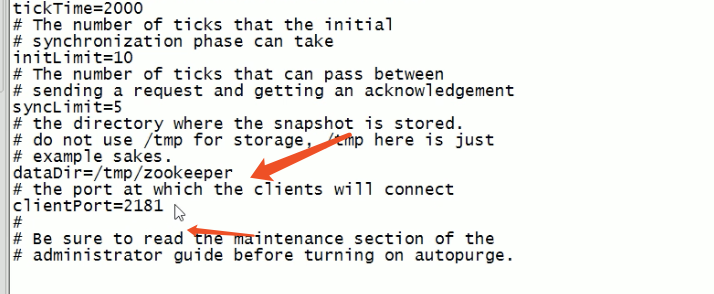
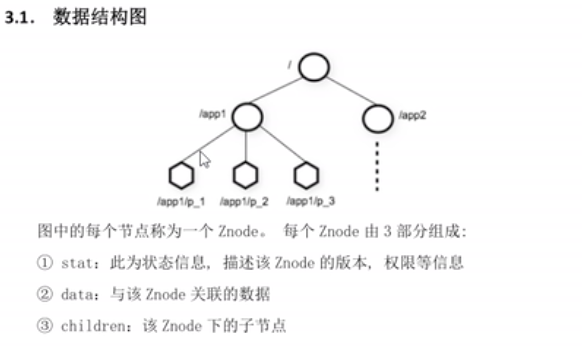
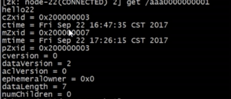
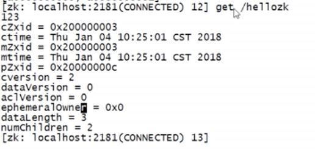
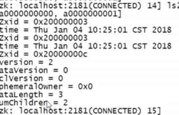

# ZooKeeper

## 1.1 ZooKeeper简述

`		ZooKeeper是一个==分布式协调的开源框架==，主要用来解决分布式集中应用系统的一致性问题，

例如：怎么避免同时操作同一数据造成脏读的问题。

​		 ZooKeeper本质是一个分布式的==小文件存储系统==（几十KB），提供基于类似文件系统的目录方式的数据

存储，并且可以对数中的节点进行有效的管理。从而用来维护和监控你存储的数据的变化。诸如：

统一命名服务，分布式配置管理，分布式消息队列，分布式锁，分布式协调等功能。 ==>目录数（类似文件目录结构）==

## 1.2 ZooKeeper的特性

​	

		 1. ==**全局一致性**==：无论客户端连接哪个服务器，所查看到的文件目录数都是一样的。
   		 2. ==可靠性==：如果消息（增删该查）被其中一台服务器接受，那么所有服务器接受。（例如：在node-1中删除1.txt,其他服务器也删除了1.txt）
      		 3. ==顺序性==，例如：在node-1上先创建aaa文件夹，后创建bbb文件夹，则其他服务器也显示先创建aaa,在创建bbb
         		 4. ==数据更新的原子性==：要么成功，要么失败。不可能成为中间态。==（半数以上节点成功）==，如果node-1,node-2成功，则node-3会自动更新为成功。
            		 5. ==实时性：==保证客户端在一个时间间隔范围内获取到服务器的更新信息，或者服务器的失效信息。

## 1.3 ZooKeeper集群角色


==**Leader**==(领导)

ZooKeeper 集群的工作核心

- 所谓的事务==（就是所谓的增删改==）

- 事务请求（写操作）的唯一调度和处理者，保证集群事务处理的顺序性：集群内部各个服务器的调度者。
- 对于create,setData,delete等有写操作的请求，则需要统一转发给==**Leader**==处理，==**Leader**==需要决定编号，执行操作，这个过程称为一个事务。

==**Follwer**==（追随者）

- 处理客户端的非事务（读操作）请求：转发事务请求给==**Leader**==

- 参与集群的==**Leader**==选举
- 此外，针对访问量比较大的ZooKeeper集群，还可以新增==观察者角色==

==**Observer**== (观察者)

- 观察者角色，观察ZooKeeper集群的最新的状态，并实时同步。
- 针对非事务性请求进行独立的处理，对于事务性请求，则会转发给==Leader==
- ==不参与任何形式的投票，==通常不影响集群事务处理能力的前提下，==提升非事务处理能力。==

## 1.4 ZooKeeper搭建集群

​			ZooKeeper集群搭建指的是ZooKeeper分布式安装，==通常有2n+1太server组成==。这是因为保证Leader选举，（基于Paxos算法实现），所以ZooKeeper集群数量一般是奇数。

- JDK的安装和卸载

```shell
$ java -version
# jdk的查看
$ rpm -qa|grep java
# jdk的卸载
$ rpm -e --nodeps xxx#卸载的包
# 卸载默认的jdk
# *********************#
# 安装Sun公司的jdk
$ mkdir -p /export/server
$ mkdir -p /export/upload
$ mkdir -p /export/data
# 解压包
$ tar zxvf jdk-8u6s-linux-x64.tar.gz  #/export/server目录
$ vi /etc/profile
# 添加环境变量
export JAVA_HOME=/export/server/jdk1.8.0_6s
export PATH=$PATH:$JAVA_HOME/bin
export CLASSPATH=.:$JAVA_HOME/lib/dt.jar:$JAVA_HOME/lib/tools.jar
# 加载环境变量
soucre /etc/profile
```

检测集群时间是否同步:

```shell
# 如果不同步
$ data -s 
```

检测防火墙是否关闭：

```shell
# 关闭防火墙（下次启动会重新打开防火墙）
$ service iptables stop
# 关闭（下次启动不会打开）
$ chkconfig iptables off
# 查看防火墙
$ chkconfig iptables --list
```

==**Leader+Follwer 模式**==的集群搭建：

- 配置主机名称到IP地址映射配置
- 修改ZooKeeper配置文件
- 远程复制分发安装文件
- 设置myid
- 启动ZooKeeper集群
- 如果设置观察者 server.1:localhost:2181:3181:observer

```shell
$ cd /export/server 
# 解压ZooKeeper
$ tar zxvf zookeeper-3.1.4.tar.gz
# 重命名
$ mv zookeeper-3.1.4 zookeeper
# 配置
$ cd zookeeper/conf
# 拷贝
$ cp zoo_sample.cfg zoo.cfg 
# 修改配置文件
$ vim zoo.cfg
```



```shell
# 原来
dataDir=/tmp/zookeeper
# 修改
dataDir=/export/data/zkdata
# 文件末尾添加三台服务器 (2888端口表示心跳端口，3888端口表示选举端口)
# node-1 服务器名 （映射）
server.1=node-1:2888:3888
server.2=node-2:2888:3888
server.3=node-3:2888:3888
```

- 服务器1 node-1

```shell
$ cd /export/data/zkdata
# 创建文件
$ vi myid 
# 输入 当前服务器编号 ==>>>> server.1
输入1 保存
```

- 启动

```shell
/export/server/zookeeper/bin/zkServer.sh start
```

## 1.5 ZooKeeper数据模型



不同之处：

- Znode兼具==**文件和目录**==两种特点：既像文件一样维护者数据，元数据，时间戳等结构，又像目录一样可以作为路径标识的一部分。
- Znode具有原子性
- Znode存储数据大小有限制：通常以KB为单位
- Znode通过路径引用：==绝对路径==  以斜杠

#### 5.1 节点类型

​	 	 Znode有两种，分别是临时节点和永久节点。

​		  节点的类型是创建时即被确定，并且不能改变。

​			==临时节点：==该节点的生命周期依赖于创建他们的会话，一旦结束，临时节点会自动化删除。

​			==永久节点：==该节点的生命周期不依赖于会话，并且只有在客户端显示执行删除操作的时候，他们才会被删除。

​			==**Znode序列化特性：**==如果创建时候指定的话，该Znode的名字后面会自动追加一个不断增加的序列号。该序列号对于此节点的父节点来说是唯一的。这样便会记录每个子节点创建的先后顺序。他们的格式“%10d”,(10位数子没有数值的数位用0补充，例如：“aa000000000001”)

#### 5.2 节点属性



- dataVersion :数据版本号 每次对节点进行set操作，dataVersion的值都会增加1（即使是相同的数据），可以避免了数据更新时出现的先后顺序。
- cversion:子节点版本号，当Znode的子节点变化时，cversion的值会增加1
- aclVersion: ACL的版本号
- ==**cZxid:Znode创建的事务id**== 
- ==**mZxid:Znode修改的事务id**== ==>对于zk来说，每一次变化都会产生一个唯一事务id，通过Zxid，可以确定更新操作的先后顺序，例如：如果Zxid1小于Zxid2，说明Zxid1操作先于Zxid2发生。Zxid对于整个zk是唯一的。
- ctime:节点创建的时间戳
- mtime:节点最新一次更新发生时的时间戳
- ephemeralOwner:如果该节点为临时节点，则表示该节点绑定的session id ,如果不是，ephemeralOwner是0，如果该会话断开连接，这个临时节点将会删除===>>>>(0表示不是临时节点，反之则是)

## 1.6 ZooKeeper shell

```shell
# 查看ZooKeeper状态
$ /export/server/zookeeper/bin/zkServer.sh status
# 进入bin目录下
$ cd /export/server/zookeeper/bin
# 连接ZooKeeper（已部署）
$ ./zkCli.sh

# 在没有部署的ZooKeeper机器上连接（未部署）
$ /export/server/zookeeper/bin/zkCli.sh -server node-1 #node-1 服务器
```

- 创建结点

  - 永久节点

  ```shell
  $ create [-s] [-e] path data acl
  # 创建简单永久的节点
  $ create /hello 123
  # 查看
  $ ls /
  # 其他集群查看 ，结果都一样==一致性
  ```

  - 临时节点

  ```shell
  # 创建临时节点
  $ create -e /zktmp 123456
  # ctr+c 断开
  $ ls /
  # 我们的临时节点会被自动删除，但是会经过几秒钟
  ```

  - 序列化特性

  ```shell
  # 序列化特性
  $ create -s /a 123
  # 结果： Create /a0000000001
  ```

- 节点的读取

  - 只能列出第一级节点

  ```shell
  $ ls /hellozk
  ```

  - 不仅可以获取到节点数据，还可以获取到节点相关的属性信息

  ```shell
  $ get /hellozk
  ```

  

  - 获取不到节点数据，能获取到属性

  ```shell
  $ ls2 /hellozk
  ```

  

- 更新节点

  - 更新节点，事务性

  ```shell
  $ set /hellozk 456
  ```

- 删除节点

  ```shell
  $ delete /hellozk
  #如果有子节点，能删除不成功
  $ delete -r /hellozk # 递归删除
  ```

  

- 限制节点

  ```shell
  $ listquota /hellozk
  
  # 创建新结点
  $ create /testquota 123456
  # 限制子节点最大不能超过多少个(温馨限制：===>日志有警告)
  $ setquota -n 3  /testquota
  # 查看设置结果
  $ listquota /testquota
  
  # 删除
  $ delquota -n /testquota
  ```

  