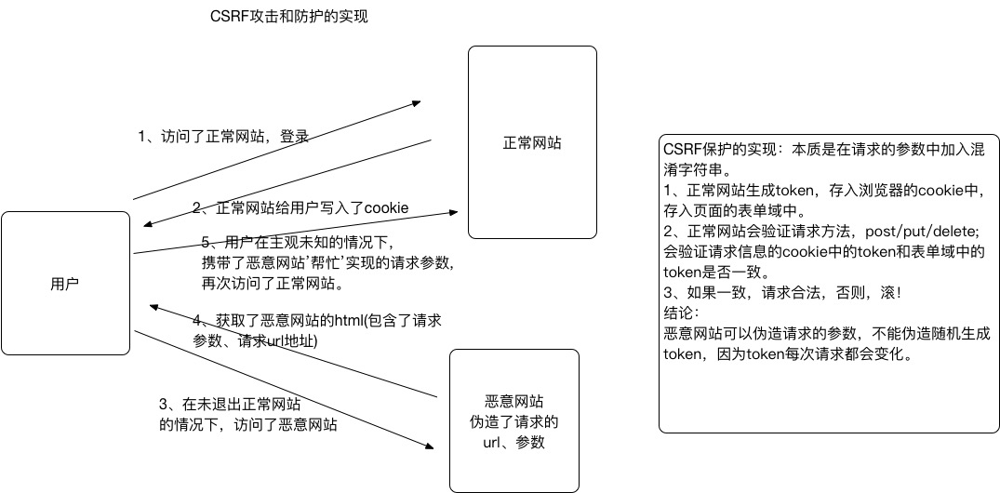

# CSRF
[**文章链接**](https://studygolang.com/articles/9925)

- `CSRF`全拼为`Cross Site Request Forgery`，译为跨站请求伪造。
- `CSRF`指攻击者盗用了你的身份，以你的名义发送恶意请求。
  - 包括：以你名义发送邮件，发消息，盗取你的账号，甚至于购买商品，虚拟货币转账......
- 造成的问题：个人隐私泄露以及财产安全。

## CSRF攻击示意图

- 客户端访问服务器时没有同服务器做安全验证

## 防止 CSRF 攻击

### 步骤

1. 在客户端向后端请求界面数据的时候，后端会往响应中的 cookie 中设置 csrf_token 的值
2. 在 Form 表单中添加一个隐藏的的字段，值也是 csrf_token
3. 在用户点击提交的时候，会带上这两个值向后台发起请求
4. 后端接受到请求，以会以下几件事件：
   - 从 cookie中取出 csrf_token
   - 从 表单数据中取出来隐藏的 csrf_token 的值
   - 进行对比
5. 如果比较之后两值一样，那么代表是正常的请求，如果没取到或者比较不一样，代表不是正常的请求，不执行下一步操作

## CSRF_TOKEN的设置过程

## CSRF_TOKEN的代码实现过程

