# 产品需求

产品：编写一个go计算器

- 加法
- 减法
- 乘法
- 除法


项目划分开发阶段：


P1:阶段

时间：2019年10 ~ 2019年12月31

功能：

1. 加法
2. 减法


P2:阶段

时间：2020年2 ~ 2020年4月

功能：

1. 乘法
2. 除法


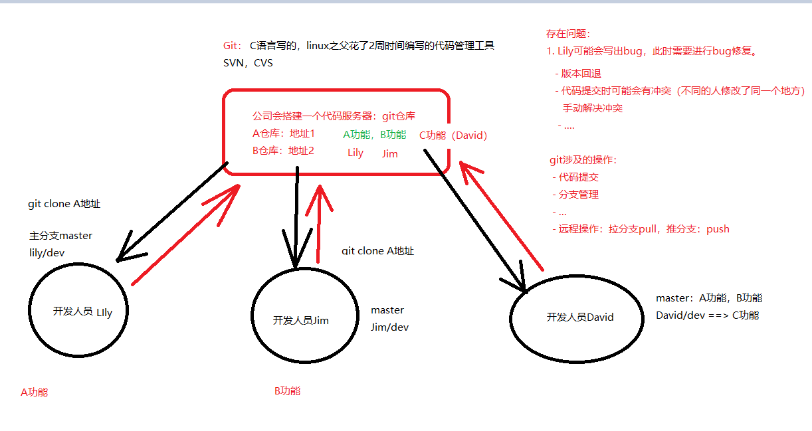


# 一、基本命令

## 1. 加法功能

calc/add.go

```go
package calc

func Add(a, b int) int {
	return a + b
}

```


main.go

```go
package main

import (
	"fmt"
	"go5期/gitTest/calc"
)

func main() {
	res := calc.Add(10, 20)

	fmt.Println("Add(10 ,20) :", res)
}

```


## 2. 创建仓库

```sh
git init
```

1. 将当前的目录变成一个代码仓库
2. 可以有很多个仓库，多个仓库之间是独立的，无法相互提交代码

> .git文件夹


## 3.查看当前状态

```sh
git status
```

此时，会看到main.go ， calc是红色标识的，说明需要处理

## 4. git追踪代码（暂存区）

```sh
git add main.go calc
```

## 5.查看当前状态

```sh
git status
```

此时，main.go，calc会变成绿色的，说明已经添加到暂存区

## 6. 提交代码到本地仓库

```sh
git commit
```

第一次提交，可能会遇到下面的提示

问题1：设置用户信息：

```go
git config --global user.email "you@example.com"
git config --global user.name "Your Name"
```

请替换为自己的名字和邮箱，告知git系统提交人的信息


问题2：编辑器不是vim，需要执行如下命令，配置成vim后，重新commit

```sh
git config --global core.editor "vim"
或
export GIT_EDITOR=vim
```


此时会弹出vim界面，需要添加本次的注释，保存退出

## 7.查看当前状态

```sh
git status
```

main.go和calc不见了，红、绿都不见了，说明本次提交成功了。


## 8.查看提交日志

```sh
git log
```


代码问责查看

```sh
git blame main.go
```

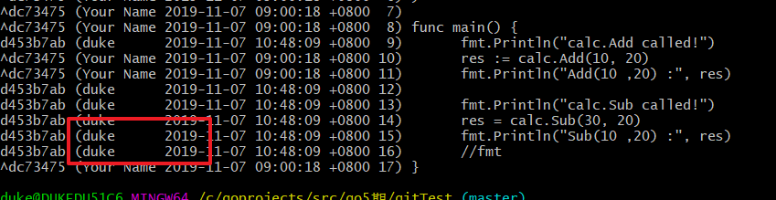


## 当前问题：

1. git命令是可以自动补全，如果不能补全，需要配置一下（git-bash-complete.sh，自己查找）

   1. 不要全部手巧
   2. 慢，容易出错

2. 如果第一次提交，会要求配置提交人的信息，这样后续可以跟踪某个代码时谁提交的，用于问责

   1. git blame <文件>

   ```sh
   git config --global user.email "duke@itcast.cn"
   git config --global user.name "duke"
   ```

3. git一般使用vim作为commit时的编辑器，如果不是，请配置一下：

   ```sh
   git config --global core.editor "vim"
   或
   export GIT_EDITOR=vim
   ```

   

4. 执行git init时，他会在当前的目录创建一个代码仓库，不同的文件夹仓库不同。多个仓库之间是相互独立的
   1. 前端仓库
   2. 后端的仓库
      1. 模块1仓库 ==》 A开发人员
      2. 模块2仓库==》  B开发人员


## 9. .gitignore忽略文件

在当前文件夹下存在.ideal的文件夹，它并不是我们的代码，我们不想提交，也不想总看见它的提示，为了避免误提交，可以将这个文件（夹）添加到一个特定的文件中：.gitignore

```sh
.idea
```

如图：

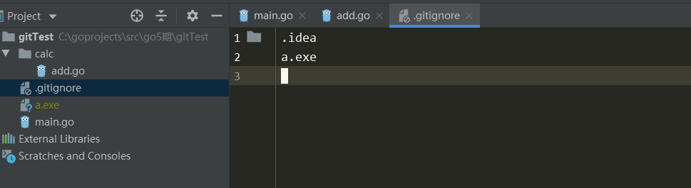

需要将.gitignore添加到仓库

1. git add  .gitignore
2. git commit .gitignore


两种添加commit备注的方式：

1. git commit ,回车，进入vim模式，填写描述 =》适合于注释较多的情况
2. git commit -m "添加.gitignore文件" ==》 适合备注较少的情况


修改后的文件：提交/丢弃

1. git add <文件>   ==>提交本次修改
2. git checkout <文件> ==》丢弃本次修改


在.gitignore中修改内容，查看文件状态，会发现提示文件被修改：

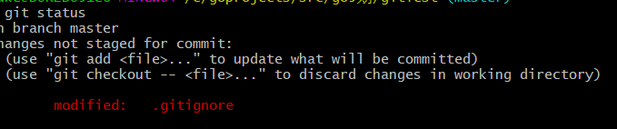


如果这是一个误操作，使用status发现文件被修改了。

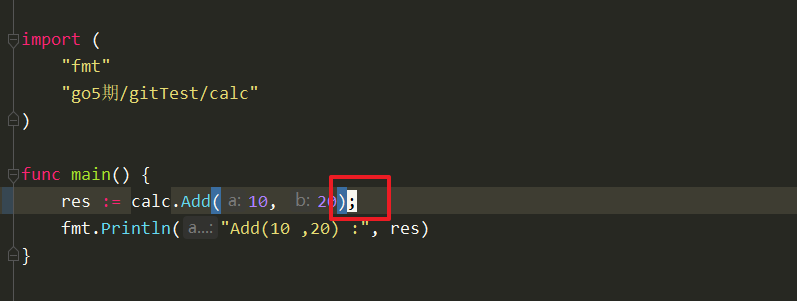

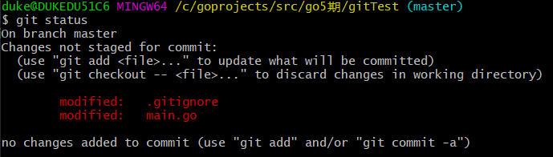


## 10.如何知道修改了哪些内容

```sh
git diff ==> 查看所有被修改的文件，打印对比信息
git diff main.go ==>指定文件查看
```

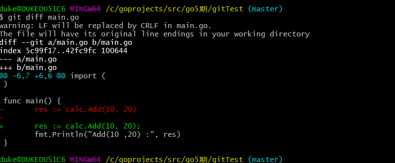


## 11.添加/丢弃修改

如果想提交本次的修改，在使用git add 提交。

```sh
git add main.go
git commit -m "xxxxx"
```


如果这是误操作，或者想将当前的修改丢弃掉，使用git checkout <文件名字>

```sh
git checkout main.go
```

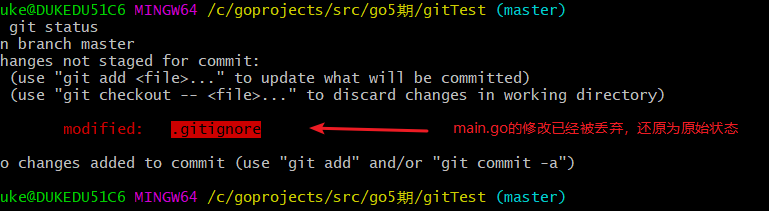


# 二、分支管理

## 1.增加加法功能

基于master分支创建一个新的分支

> 一个新功能，一个新分支 duke/add,   duke/sub , duke/multi , duke/div
>
> 一个bug，一个解决分支 duke/bug-1137


```sh
git branch duke/dev  //创建分支
git checkout duke/dev //切换分支

或者，创建的时候，直接切换
git checout -b duke/dev1 // <<=== 推荐
```


添加代码：

git checkcout -b duke/sub

calc/sub.go

```go
package calc

func Sub(a, b int) int {
	return a - b
}

```

```go
package main

import (
	"fmt"
	"go5期/gitTest/calc"
)

func main() {
	fmt.Println("calc.Add called!")
	res := calc.Add(10, 20)
	fmt.Println("Add(10 ,20) :", res)

	fmt.Println("calc.Sub called!")
	res = calc.Sub(30, 20)
	fmt.Println("Sub(10 ,20) :", res)
	//fmt
}
```

提交代码最基本的原则：

- 确保编译通过

提交代码：

1. 一次性将当前目录的所有文件提交

   ```sh
   git add .  //<<<== 强烈不推荐，可能会错误的提交一些不必要的文件
   ```

2. 建议单个文件，指定名字提交

   ```go
   git add calc/sub.go main.go //<<== 推荐
   git commit -m "添加sub函数"
   ```

   

如果不小心提交了不想提交的文件，可以使用git reset HEAD <文件>进行撤销


示例：

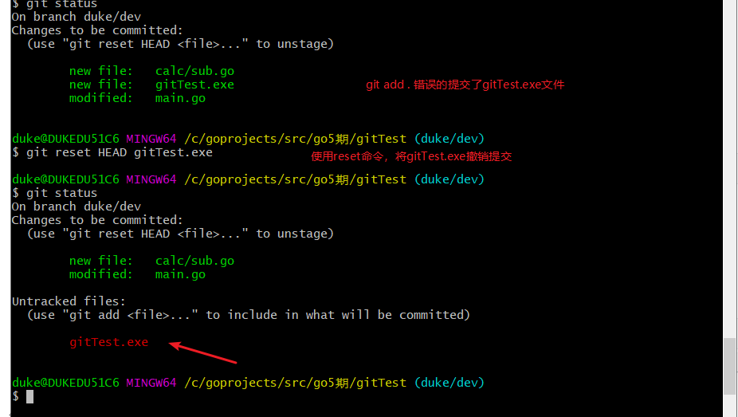


## 2. 合并分支

将duke/dev分支合并到主分支

然后执行合并动作

```go
git checkout master
git merge duke/dev //此时，将duke/dev的代码合并到master
```


查看当前已经提交的内容，

```go
git log -p //<<== 强烈推荐
```


## 3. 删除分支

如果想删除duke/dev，必须切换到其他分支，合并到master之后（2周之后再删除）

```go
git branch -d duke/dev  //由于duke/dev已经合并到了master，所以删除成功
```

如果有一个新分支duke/dev1, 我们在其中做了修改和提交，但是没有合并到其他分支。那么如果想删除，需要使用-D才可以，否则报错。git系统对我们误操作的防护。

```go
git branch -D duke/dev1 //-D用于未合并过的分支删除。
```

> 只有合并到了master之后，才能够使用-d删除，否则都是-D


## 4. 删除文件

两种方式：

方式1：

1. rm gitTest.exe文件
2. git rm  gitTest.exe 或 git add gitTest.exe
3. git commit -m "rm gitTest.exe"

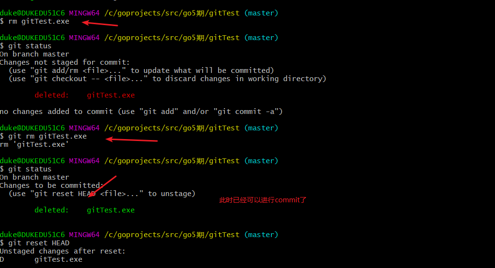


方式2：

	1. git rm gitTest.exe
 	2. git commit -m "rm gitTest.exe"


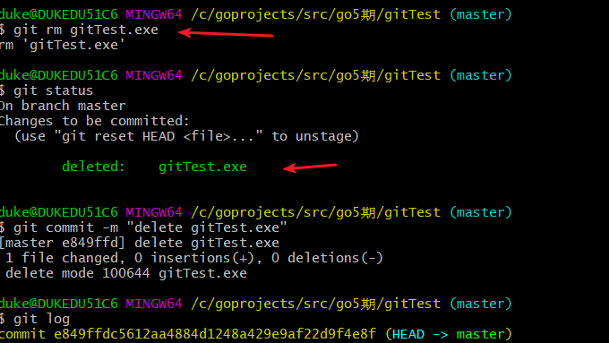


## 5. 工作区、暂存区介绍（重要）

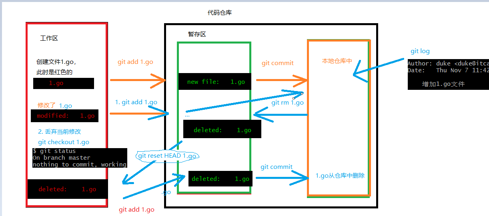


## 6. 合并冲突问题merge

duke: 乘法

lily :除法


基于master创建两个分支

```go
git branch duke/multi
git branch lily/div
```


切换到duke/multi分支

```sh
git checkout duke/muti
```

实现代码：

```go
package calc

func Multi(a, b int) int {
	return a * b
}
```

main.go

```go
package main

import (
	"fmt"
	"go5期/gitTest/calc"
)

func main() {
	fmt.Println("calc.Add called!")
	res := calc.Add(10, 20)
	fmt.Println("Add(10 ,20) :", res)

	fmt.Println("calc.Sub called!")
	res = calc.Sub(30, 20)
	fmt.Println("Sub(10 ,20) :", res)
	//fmt

	fmt.Println("calc.Multi called!")
	res = calc.Multi(30, 20)
	fmt.Println("Multi(10 ,20) :", res)
}
```


提交！


切换到lily/div分支

```go
package calc

func Div(a, b int) int {
	if b == 0 {
		panic("除数不应为0")
	}
	return a / b
}

```

main.go

```go
package main

import (
	"fmt"
	"go5期/gitTest/calc"
)

func main() {
	fmt.Println("calc.Add called!")
	res := calc.Add(10, 20)
	fmt.Println("Add(10 ,20) :", res)

	fmt.Println("calc.Sub called!")
	res = calc.Sub(30, 20)
	fmt.Println("Sub(10 ,20) :", res)
	//fmt

	fmt.Println("calc.Div called!")
	res = calc.Div(100, 20)
	fmt.Println("Div(100 ,20) :", res)
}

```

提交！

==此时，两个分支修改main函数中的同一处代码。==


切换到master分支

分别合并两个分支

```go
git merge duke/multi
```

合并成功

```sh
git merge lily/div
```

此时，会发生冲突：

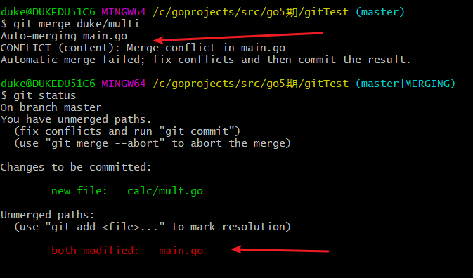


查看冲突文件：

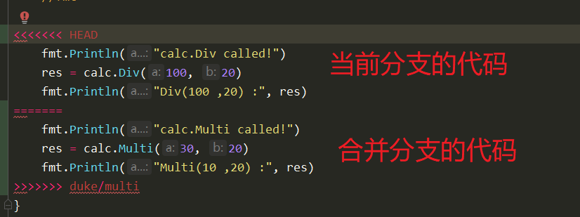


人工判断哪些该保留：全部保留


修改之后，重写提交文件

```sh
git add main.go
git commit
```


合并完成！

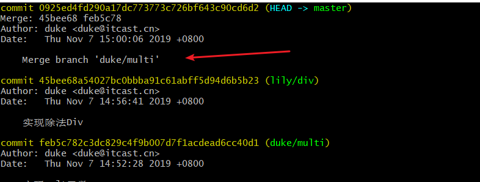


## 7.合并方式2: rebase


当多个分支合并时，尽量使用rebase命令，

1. 可以使得提交log按时间线排列
2. 减少Merge branch “duke/multi”等log日志出现，更加简洁


操作流程：

1. git rebase duke/multi
2. 如果发生冲突，需要手动解决（同merge冲突）
3. 如果不想提交，可以使用git rebase ----abort
4. 如果想提交，解决冲突后，使用git rebase --continue即可，不需要使用git commit


## 8. 暂存stash

当开发过程中，还没有办法编译的时候，可能临时出现一个需要紧急处理的bug：

1. 当前代码不能提交
2. bug还需要创建新的分支解决。


需要，将当前分支的代码暂存起来，去解决bug，解决之后，再唤醒之前的存放代码，继续开发。

git stash命令可以帮忙解决


增加mod.go

```go
package calc

import "fmt"

func mod() {
	fmt.Println("mod called")
	fmt
}
```


使用stash进行暂存

```go
git stash
```

当前分支的所有暂存区的数据会被临时存储起来，分支就像没有修改过一样。

可以基于分支解决bug，当bug解决后使用git stash pop  唤醒暂存数据

```sh
git stash pop
```


查看当前stash数据

```sh
git stash list
```


如果确定不要的stash，可以使用clear清理掉(慎用)

```sh
git stash clear
```


## 9.版本回退

1. git reset  <哈希值>

   1. 每一个提交都会有一个哈希值：1c9b43f23f48777454f288c3cddcdee122fede1d

   2. 此时会将版本回退到指定哈希版本，==但是回退中间提交的代码会保留下来==
   3. 推荐使用这个模式

2. git reset ==--hard== <哈希值>
   1. 此时会直接会推到指定版本，但是中间提交的记录，会之前删除掉。


3. git reflog，此时会显示出这个分支所有的操作

   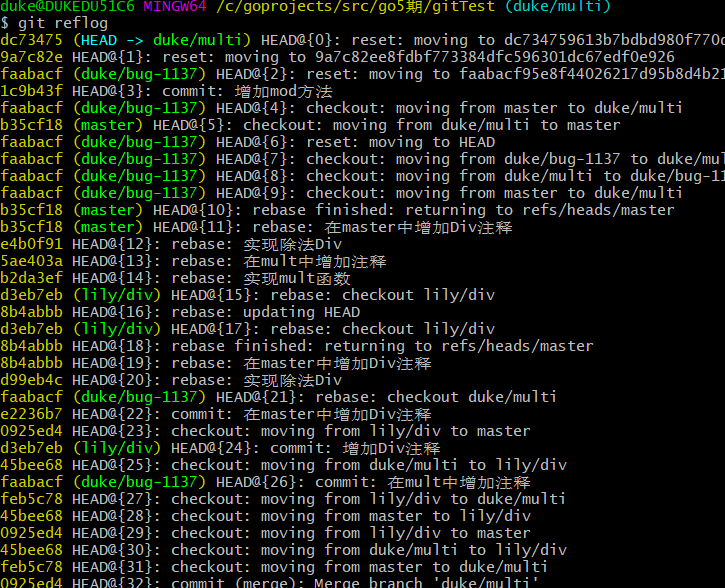


版本回退是，都是对当前的分支进行处理的。


## 10.基于历史哈希创建新分支

有时，基于当前的分支，指定某一个版本号，创建一个新的分支


场景1：临时使用

```go
git checkout e849ffdc5612aa4884d1248a429e9af22d9f4e8f
```

此时，会创建一个临时的分支，当前切换为其他分支后，这个临时分支消失

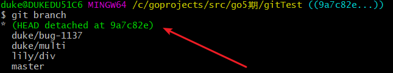


场景2：基于这个分支创建一个作为后续开发使用的分支

```go
git checkout -b duke/test e849ffdc5612aa4884d1248a429e9af22d9f4e8f
```

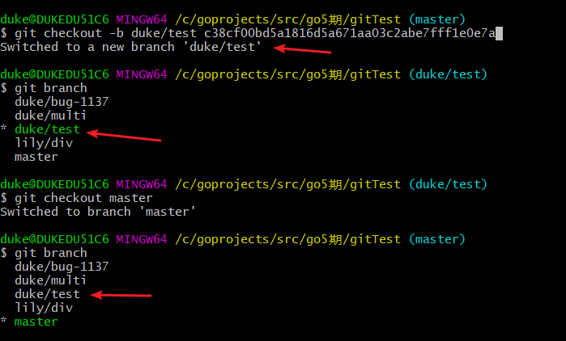


# 三、github相关

## 1. 创建仓库

1. 注册github账户

2. 创建项目，填写项目相关内容

   1. 名字
   2. Public

   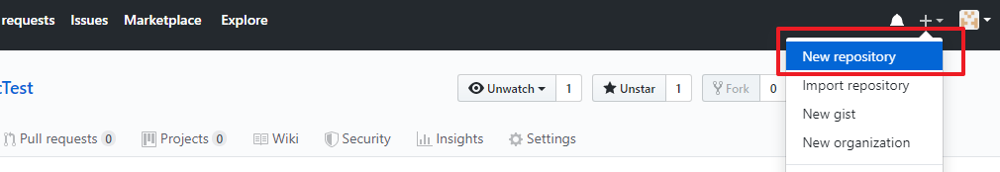

3. 关联我们的项目

   1. 查看本地项目的远程仓库地址

      ```go
      git remote -v
      #此时显示空
      ```

   2. 本地与github项目关联

      ```go
      git remote add origin <地址>
      示例：
      git remote add origin  https://github.com/hellowordlaoxu/calcTest.git
      #再次查看
      ```

      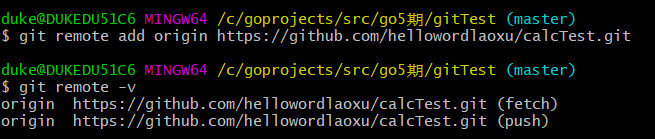

 4. 将本地代码推送到远程仓库

    ```go
    git push -u origin master:master
    ```

    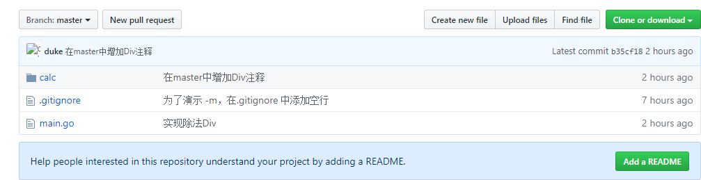


## 2. 新功能分支合并（重要）

duke: 基于master创建一个分支duke/mod

提交代码：

```go
package calc

func Mod(a, b int) int {
	return a % b
}
```


正常提交！


origin， 数据源，后面直接跟上分支的名字。

push : 往仓库推送代码，origin指的就是本地的分支

pull: 从仓库往回拉数据，origin指的就是服务器分支名字


duke将这个分支推送到仓库


```go
git push origin duke/mod:duke/mod

//往上推送代码，origin后面的名字必须是本地的分支名字，远程名字是可以重新写的
duke/mod：duke/mod-alis //<<==远程名字随便写，但是建议与本地相同
```


将分支名字，告诉leader: ==> duke/mod


leader会将duke/mod分支从远程拉取下来：

```sh
git pull 

git fetch origin duke/mod:duke/mod //<<=== 推荐
```


git pull会将分支拉取到本地，同时完成merge动作。


如果发现duke/mod代码正确，没有大问题，则主动合并到master分支

```go
git rebase duke/mod
```

提交代码

```sh
git push -u origin master
```


## 3. 删除远程分支

方式1：

```sh
$ git push origin :duke/mod-alis
To https://github.com/hellowordlaoxu/calcTest.git
 - [deleted]         duke/mod-alis
```

方式2：

```sh
$ git push origin --delete duke/mod
To https://github.com/hellowordlaoxu/calcTest.git
 - [deleted]         duke/mod
```


## 4. 基于远程分支创建一个自己的本地分支

```sh
$ git checkout -b duke/dev origin/lily/dev
Switched to a new branch 'duke/dev'
Branch 'duke/dev' set up to track remote branch 'lily/dev' from 'origin'.
```


## 5.ssh登陆

创建一个ssh登陆的秘钥对：

```sh
ssh-keygen.exe -t rsa -C "邮箱"
```


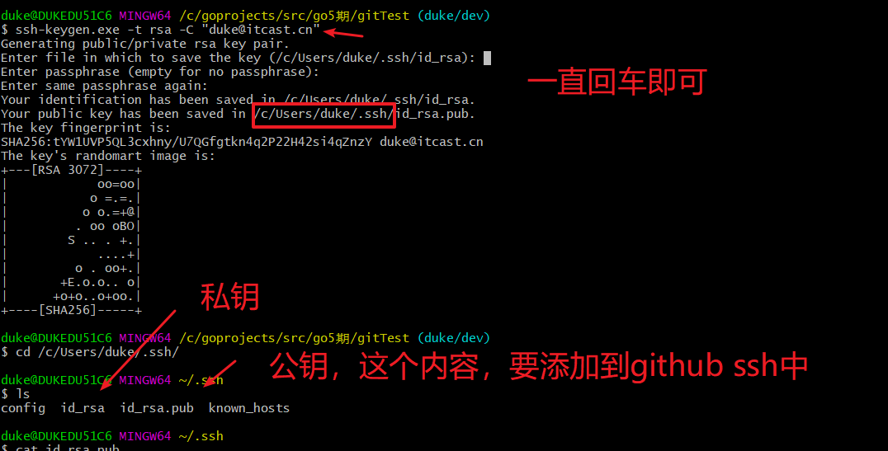


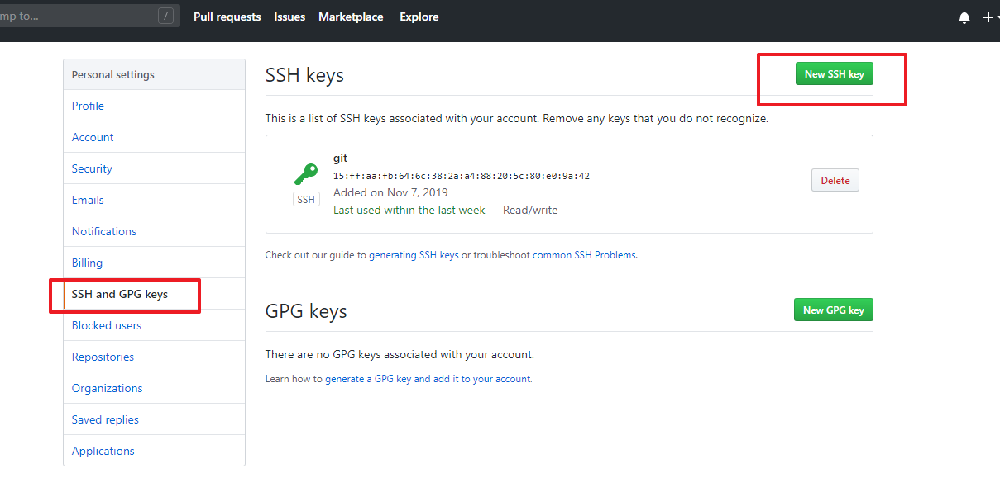


clone工程

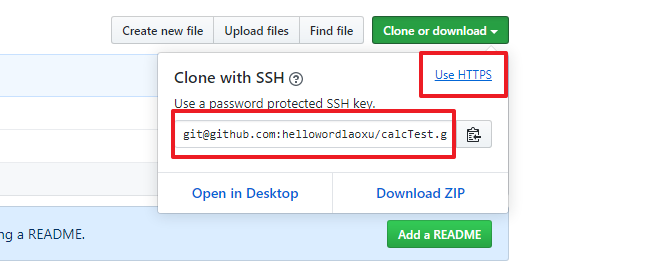


```sh
git clone git@github.com:hellowordlaoxu/calcTest.git
```

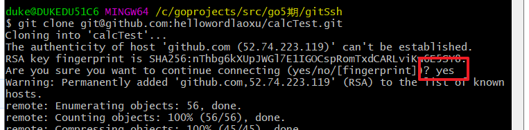


指纹会写入这个文件

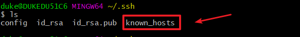


以后的操作就不需输入密码了。


# 四、其他

## 1. git tag

## 2. pr : pull request

## 3. 每个github账户可以创建一个web

## 4. 合作开发设置

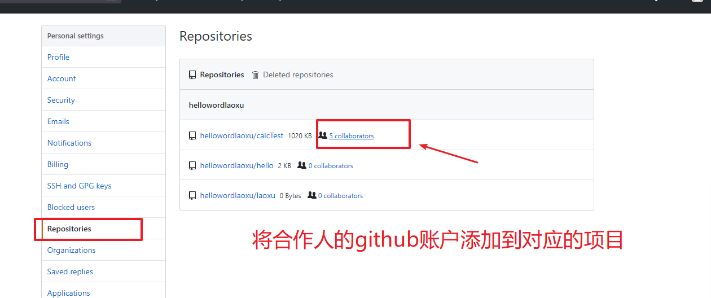


## 5. 常见错误

```sh
git clone 错误:
> server certificate verification failed. CAfile: /etc/ssl/certs/ca-certificates.crt CRLfile: none

> 解决方法：
export GIT_SSL_NO_VERIFY=1 
#or 
git config --global http.sslverify false
```

