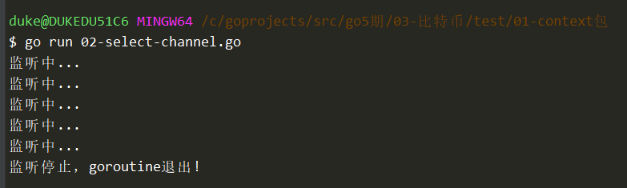
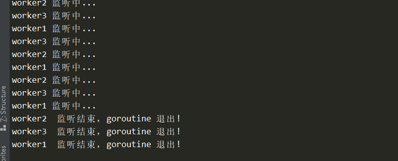

# context包

并发控制：

1. waitgroup
2. channel
3. context ==> 上下文


# waitgroup

用途：控制多个goroutinue先后完成


方法：

1. Add()  ==>添加监听的go   + 1
2. Done() ==》表示go自己结束了 -1
3. Wait()  == 0


```go
package main

import (
	"fmt"
	"sync"
	"time"
)

func main() {
	var wg sync.WaitGroup

	wg.Add(2)
	go watch("worker1", &wg)
	go watch("worker2", &wg)

	wg.Wait()
	fmt.Println("over!")
}

//使用多个go执行的函数
func watch(name string, wg *sync.WaitGroup) {
	time.Sleep(time.Second * 2)
	fmt.Println(name + ":执行完成!")
	wg.Done()
}

```


# channel + select

```go
package main

import (
	"fmt"
	"time"
)

func main() {
	stopFlag := make(chan bool)

	go func() {
		for {
			select {
			case <-stopFlag:
				fmt.Println("监听停止，goroutine退出!")
			default:
				fmt.Println("监听中...")
				time.Sleep(1 * time.Second)
			}
		}
	}()

	time.Sleep(5 * time.Second)

	stopFlag <- true
}

```





# context

如果有很多goroutine都需要控制结束的话，使用上述两种方式很难管理，使用context可以有效解决。


```go
package main

import (
	"context"
	"fmt"
	"time"
)

func main() {

	//创建一个可以手动取消的contex函数
	//func WithCancel(parent Context) (ctx Context, cancel CancelFunc)
	//参数：根context，一般出入contex.Backgroud()
	//返回值1：子context，用于向内层传递
	//返回值2：cancel函数，回调函数，我们显示调用的时候，可以出发所有context返回
	cxt, cancel := context.WithCancel(context.Background())
	go watch("worker1", cxt)
	go watch("worker2", cxt)
	go watch("worker3", cxt)

	time.Sleep(5 * time.Second)
	cancel()
	time.Sleep(2 * time.Second)
}

//使用多个go执行的函数
func watch(name string, cxt context.Context) {
	fmt.Println("context watch called")
	for {
		select {
		case <-cxt.Done():
			fmt.Println(name, " 监听结束，goroutine 退出!")
			return
		default:
			fmt.Println(name + " 监听中...")
			time.Sleep(1 * time.Second)
		}
	}
}
```




context常用：

1. context.Background() ==> 根context，用于向下传递
2. context.TODO() ==> 当不知道该传递什么context的时候，传递这个

3. 这两者本质上都是：emptyCtx
4. context类型的参数不要传递nil


# with系列函数

1. WithCancel(parent) (ctx, cancel) 
2. WithDeadline(parent, dedline) (ctx, cancel)
3. WithTimeout(parent, timeout) (ctx, cancel)
4. WithValue(parent, key, value) ctx


context像一棵树，可以向下衍生。

```go
package main

import (
	"context"
	"fmt"
	"time"
)

func main() {
	fmt.Println("222222222")
	ctx, _ := context.WithCancel(context.Background())
	valueCtx := context.WithValue(ctx, "age", 20)
	timeoutCtx, c2 := context.WithTimeout(valueCtx, time.Duration(5*time.Second))

	time.Sleep(time.Second * 3)
	
    c2() //<<==不等待超时，提前退出
	go watch("worker1", timeoutCtx)
	go watch("worker2", timeoutCtx)
	go watch("worker3", timeoutCtx)

	time.Sleep(time.Second * 10)
}

//使用多个go执行的函数
func watch(name string, ctx context.Context) {
	fmt.Println("context watch called")
	for {
		select {
		case <-ctx.Done():
			fmt.Println(name, " 监听结束，goroutine 退出!")
			return
		default:
			fmt.Println(name+" 监听中, age:", ctx.Value("age"))
			time.Sleep(1 * time.Second)
		}
	}
}

```


# 总结

1. 不要把context放到结构中，而是要使用参数的形式进行传递。
2. 如果一个函数有context字段，那么一般放在第一个参数
3. 当不知道该传递什么context时，不要传递nil，而是要传递contex.TODO()
4. WithValue要慎重使用，不要什么都传，只有与value相关的数据才传递。
5. context时线程安全，可以放心的在多个go程中使用。


# 管道操作回顾

1. 管道如果没有make，默认值是nil

2. 如何判断管道是否关闭？

   1. if v, ok := <-ch 来判断管道是否关闭
   2. 如果已经关闭，则ok是false

3. range 管道的时候，一定有要有对这个管道close的操作，否则会deadlock

   ```go
   package main
   
   import (
   	"fmt"
   	"time"
   )
   
   func main() {
   	//var c chan int
   	c := make(chan int)
   
   	go func() {
   		for i := 0; i < 10; i++ {
   			c <- i
   		}
   		close(c)
   	}()
   
   	//for v := range c {
   	//	fmt.Println("v:", v)
   	//}
   	//
   
   	for i := 0; i < 50; i++ {
   		a := <-c
   		fmt.Println("a:", a)
   	}
   	fmt.Println("over")
   
   	time.Sleep(5 * time.Second)
   }
   
   ```

   

4. 从关闭的管道读取数据，会返回零值。

5. 向关闭的管道写数据，会panic。

6. 从nil的管道读取或者写入都会阻塞。

   ```go
   package main
   
   import (
   	"fmt"
   	"time"
   )
   
   func main() {
   	var c chan int
   
   	go func() {
   		fmt.Println("11111111")
   		<-c
   	}()
   
   	//close(c)
   	//c := make(chan int)
   	go func() {
   		c <- 100
   	}()
   
   	time.Sleep(10 * time.Second)
   }
   ```

7. 重复关闭管道，会panic

8. 关闭nil的管道，会panic


