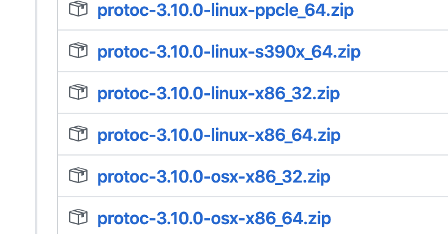
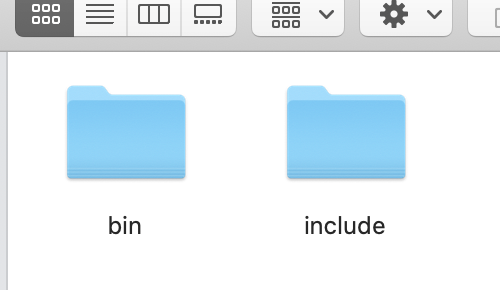

# protoc 安装及使用

[参考文献](https://juejin.im/post/5b852d476fb9a019e4505873)

## 1.protobuf下载

```json
下载地址地址：
	https://github.com/protocolbuffers/protobuf/releases/tag/v3.10.0
Mac版本:
	protoc-3.10.0-osx-x86_64.zip
```




## 2.指定文件目录

- 下载完毕后，解压 protoc-3.10.0-osx-x86_64.zip 压缩包




- 将解压文件放指定目录

  ```shell
  # 将bin目录内的protoc拷贝至/usr/local/bin文件目录下
  $ cp protoc /usr/local/bin  
  
  # 将include目录内的google文件拷贝至于/usr/local/include文件目录下
  $ cp google /usr/local/include  
  ```

  

## 3. 安装protoc-gen-go中间件

```shell
# 安装protoc-gen-go，安装路径在$GOPATH/src/github.com/目录下
$ go get -u github.com/golang/protobuf/protoc-gen-go
```


## 4.protoc使用语法

- 文件目录pb/test.proto  ** 严格执行文件目录结构 pb/xxx

```protobuf
//1. 指定proto的版本号
syntax = "proto3";

//2. 生成go语言的包名
package pb;

//3. 定义结构体
// message 关键字
message Person{
//字段必须有编号 1,2
	string Name = 1;	//注意=号后面有空格
	int32 Age = 2;
}
```


## 5.protoc编译

```shell
# go_out 输出
# 第一个. 当前文件目录下
# 第二个*.proto 编译所有的.proto文件
$ protoc --go_out=. *.proto
```


