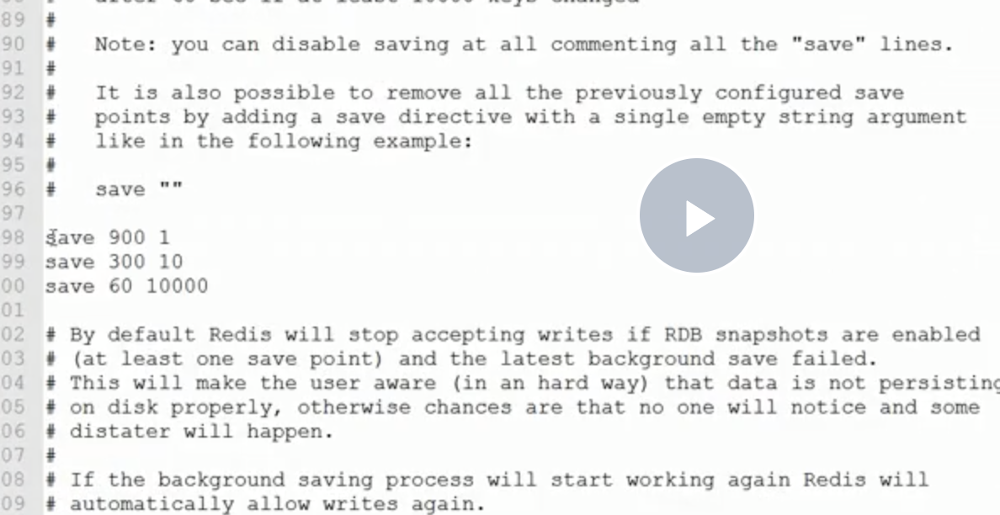
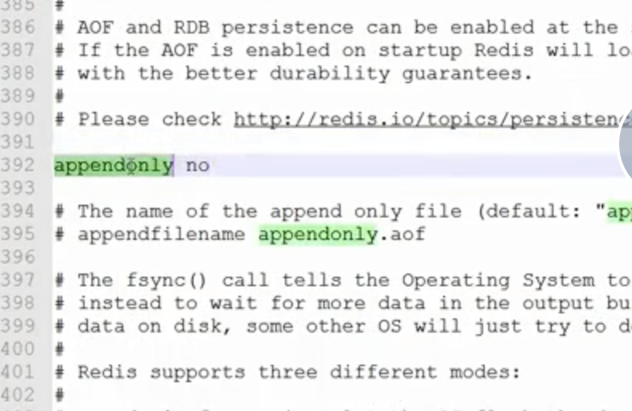
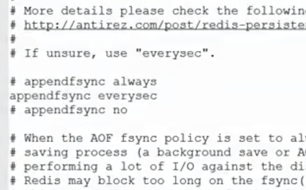

# redis持久化

## ROB 机制 

> 不需要配置，默认就使用这种配置</br>
> 机制： 在一定的间隔时间中，检测key的变化情况，然后持久化数据。</br>
> 优点：对性能影响较低



```
1.编辑配置文件 redis.conf文件  自动的机制  默认的配置是 save 60 10000
# after 900 sec 15min if at least 1 key change
save 900 1
# after 300 sec 5min if at least 10 keys change
save 300 10
# after 60 sec  if at least 10000 keys change
save 60 10000

*** 生成  dump.rdb 文件 ***
	

```


## AOF 日志记录的方式
> 可以记录每一条命令的操作，可以每一次命令操作后，持久化数据。 （像mysql一样，执行一条sql语句，io操作一次）</br>
> 缺点:对性能影响较大



## 使用AOF
```
1.打开编辑文件 redis.conf

修改：
	appendonly no  默认值 关闭AOF
	*** 将此处的no 改为yes
	
appendfsync always		/** 每运行一次操作都进行持久化
appendfsync everysec   /** 每1秒进行依一次操作都进行持久化
appendfsync no

```





# redis连接池

#### 使用

```
1.创建redisPool 连接池对象 = new(Reids)
2.调用Dial方法获取redis对象
3.close关闭，归还到连接池中。而非真的关闭 。

PoolConfi配置对象
MaxIdle:     10,      //最大空闲连接数
MaxActive: 	50  	  //最大连接数

要跟当前计算机配置复合 

eg:

//初始化redis pool
func NewRedisPool() {
	redis = new(Reids)
	redis.pool = &red.Pool{
		MaxIdle:     256,                //最大空闲连接数
		MaxActive:   0,                  //最大连接数 0表示不限制
		IdleTimeout: time.Duration(120), //应该设置一个比redis服务端超时时间更短的时间
		Dial: func() (red.Conn, error) {
			return red.Dial(
				"tcp",
				"127.0.0.1:6379",
				red.DialReadTimeout(time.Duration(1000)*time.Millisecond),    //从Redis读取数据超时时间
				red.DialWriteTimeout(time.Duration(1000)*time.Millisecond),   //向Redis写入数据超时时间。
				red.DialConnectTimeout(time.Duration(1000)*time.Millisecond), //连接Redis超时时间
				red.DialDatabase(0),             //设置redis 0-16个'表'
				red.DialPassword(RedisPassword), //设置密码
			)
		},
	}
}

eg:

//执行redis
func Exec(cmd string, key interface{}, args ...interface{}) (interface{}, error) {
	con := redis.pool.Get()
	if err := con.Err(); err != nil {
		return nil, err
	}
	defer con.Close()
	parmas := make([]interface{}, 0)
	parmas = append(parmas, key)

	if len(args) > 0 {
		for _, v := range args {
			parmas = append(parmas, v)
		}
	}
	return con.Do(cmd, parmas...)
}

```
优点:对redis更好复用和管理


