# redis数据库

是一种高性能的Key-Value数据库    NoSQL数据库        缓存型数据库     key-value型数据库   

## 1.redis介绍

### 1.1NoSQL：一类新出现的数据库\(not only sql\)

- 泛指缓存型的数据库
- 不支持SQL语法
- 存储结构跟传统关系型数据库中的那种关系表完全不同，nosql中存储的数据都是KV形式
- NoSQL的世界中没有一种通用的语言，每种nosql数据库都有自己的api和语法，以及擅长的业务场景
- NoSQL中的产品种类相当多：
  - Redis
  - Mongodb
  - Hbase hadoop
  - Cassandra hadoop

### 1.2 NoSQL和SQL数据库的比较：

- 适用场景不同：sql数据库适合用于关系特别复杂的数据查询场景，nosql反之
- **事务** 特性的支持：sql对事务的支持非常完善，而nosql基本不支持事务
- 两者在不断地取长补短，呈现融合趋势

### 1.3 Redis简介 

- Redis是一个开源的使用ANSI C语言编写、支持网络、可基于内存亦可持久化的日志型、Key-Value数据库，并提供多种语言的API。从2010年3月15日起，Redis的开发工作由VMware主持。从2013年5月开始，Redis的开发由Pivotal赞助。
- Redis是 NoSQL技术阵营中的一员，它通过多种键值数据类型来适应不同场景下的存储需求，借助一些高层级的接口使用其可以胜任，如缓存、队列系统的不同角色

### 1.4 Redis特性 

- Redis 与其他 key - value 缓存产品有以下三个特点：
- Redis支持数据的持久化，可以将内存中的数据保存在磁盘中，重启的时候可以再次加载进行使用。
- Redis不仅仅支持简单的key-value类型的数据，同时还提供list，set，zset，hash等数据结构的存储。
- Redis支持数据的备份，即master-slave模式的数据备份。

### 1.5 Redis 优势 

- 性能极高 – Redis能读的速度是110000次/s,写的速度是81000次/s 。
- 丰富的数据类型 – Redis支持二进制案例的 Strings, Lists, Hashes, Sets 及 Ordered Sets 数据类型操作。
- 原子 – Redis的所有操作都是原子性的，同时Redis还支持对几个操作全并后的原子性执行。
- 丰富的特性 – Redis还支持 publish/subscribe, 通知, key 过期等等特性。

### 1.6 Redis应用场景

- 用来做缓存\(ehcache/memcached\)——redis的所有数据是放在内存中的（内存数据库）
- 可以在某些特定应用场景下替代传统数据库——比如社交类的应用
- 在一些大型系统中，巧妙地实现一些特定的功能：session共享、购物车
- 只要你有丰富的想象力，redis可以用在可以给你无限的惊喜…….

### 1.7 推荐阅读 

- [redis中文官网](http://redis.cn/)
- [redis官方网站](https://redis.io/)

## 2.redis安装配置

### 2.1安装

- 当前ubuntu虚拟机中已经安装好了redis，以下步骤可以跳过 

- 以后自己安装过程如下:redis下载链接：**x** 指的是版本号
  [http://download.redis.io/releases/redis-x.x.x.tar.gz](http://download.redis.io/releases/redis-x.x.x.tar.gz)

- step1:下载

  > wget [http://download.redis.io/releases/redis-x.x.x.tar.gz](http://download.redis.io/releases/redis-x.x.x.tar.gz)

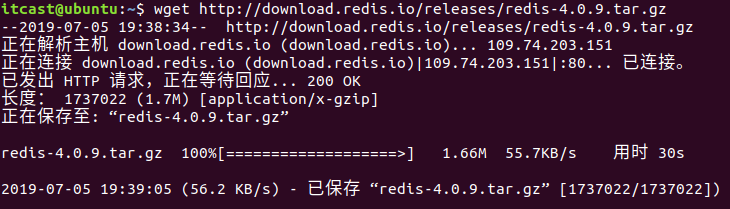

- step2:解压

  > tar xzf redis-x.x.x.tar.gz

- step3:移动，放到usr/local⽬录下

  > sudo mv ./redis-x.x.x /usr/local/redis/

- step4:进⼊redis⽬录

  > cd /usr/local/redis/

- step5:生成

  > sudo make(这一步需要提前安装gcc，如果出现`zmalloc.h:50:10: fatal error: jemalloc/jemalloc.h: 没有那个文件或目录`这种错误，用命令`sudo make MALLOC=libc`)

  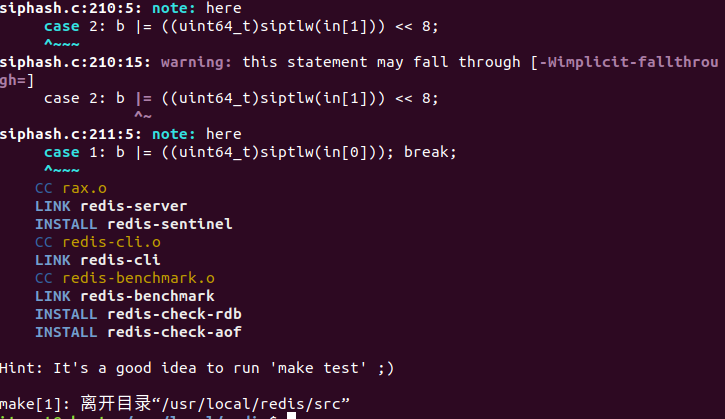

  step6:测试,这段运⾏时间会较⻓

  > sudo make test(这一步需要安装tcl)
  >
  > 安装tcl如下
  >
  > ```
  > wget http://downloads.sourceforge.net/tcl/tcl8.6.1-src.tar.gz
  > sudo tar xzvf tcl8.6.1-src.tar.gz  -C /usr/local/
  > cd  /usr/local/tcl8.6.1/unix/
  > sudo ./configure
  > sudo make（时间比较长）
  > sudo make install
  > ```

  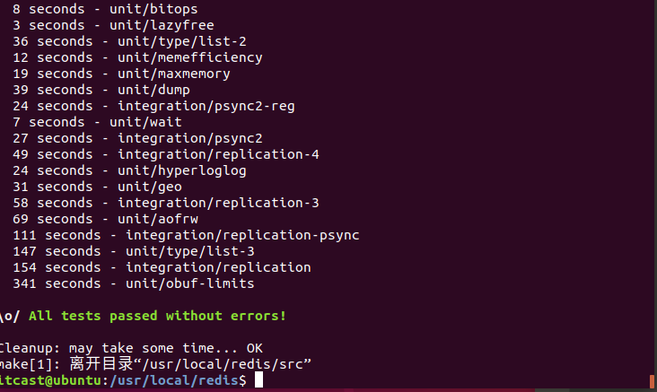

  - step7:安装,将redis的命令安装到`/usr/local/bin/`⽬录

    > sudo make install

  - step8:安装完成后，我们进入目录`/usr/local/bin`中查看

    > cd /usr/local/bin  
    > ls -all

    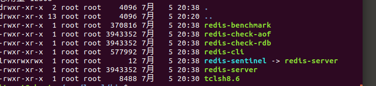

    > - redis-server redis服务器
    > - redis-cli redis命令行客户端
    > - redis-benchmark redis性能测试工具
    > - redis-check-aof AOF文件修复工具
    > - redis-check-rdb RDB文件检索工具

  - step9:配置⽂件，移动到`/etc/`⽬录下

    - 配置⽂件⽬录为`/usr/local/redis/redis.conf`

      > sudo cp /usr/local/redis/redis.conf /etc/redis/

  ## 其他补充

  - Mac 上安装 Redis:  (**要自己创建文件夹**)

    - 安装 Homebrew：

    > https://brew.sh/

    - 使用 brew 安装 Redis

    > https://www.cnblogs.com/cloudshadow/p/mac_brew_install_redis.html
### 2.2配置

- Redis的配置信息在`/etc/redis/redis.conf`下。

- 查看

  > sudo vi /etc/redis/redis.conf

**核心配置选项** 

- 绑定ip：如果需要远程访问，可将此⾏注释，或绑定⼀个真实ip

  > bind 127.0.0.1

- 端⼝，默认为6379

  > port 6379

- 是否以守护进程运⾏

  - 如果以守护进程运⾏，则不会在命令⾏阻塞，类似于服务
  - 如果以⾮守护进程运⾏，则当前终端被阻塞
  - 设置为yes表示守护进程，设置为no表示⾮守护进程
  - 推荐设置为yes

  > daemonize yes

- 数据⽂件

  > dbfilename dump.rdb

- 数据⽂件存储路径

  > dir /var/lib/redis

- ⽇志⽂件

  > logfile "/var/log/redis/redis-server.log"

- 数据库，默认有16个

  > database 16

- 主从复制，类似于双机备份。

  > slaveof

**参考资料**

redis配置信息[http://blog.csdn.net/ljphilp/article/details/52934933](http://blog.csdn.net/ljphilp/article/details/52934933)

## 3.服务端客户端命令

### 3.1服务器端

- 服务器端的命令为redis-server

- 可以使⽤help查看帮助⽂档

  > redis-server --help

- 个人习惯

  > ps aux | grep redis 查看redis服务器进程  
  > sudo kill -9 pid 杀死redis服务器  
  > sudo redis-server /etc/redis/redis.conf 指定加载的配置文件

### 3.2客户端

- 客户端的命令为redis-cli

- 可以使⽤help查看帮助⽂档

  > redis-cli --help

- 连接redis

  > redis-cli

- 运⾏测试命令

  > ping

- 切换数据库

- 数据库没有名称，默认有16个，通过0-15来标识，连接redis默认选择第一个数据库

  > select 10

  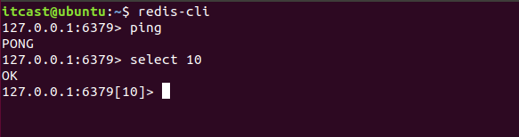

## 4.数据操作

**重要文档**

- [Redis 参考命令](http://doc.redisfans.com/)
- [Redis 官方文档](https://redis-py.readthedocs.io/en/latest/#indices-and-tables)

**数据结构** 

- redis是key-value的数据结构，每条数据都是⼀个键值对

- 键的类型是字符串

- 注意：键不能重复

  !

- 值的类型分为五种：

  - 字符串string
  - 哈希hash
  - 列表list
  - 集合set
  - 有序集合zset

**数据操作行为**

- 保存
- 修改
- 获取
- 删除

点击中⽂官⽹查看命令⽂档[http://redis.cn/commands.html](http://redis.cn/commands.html)

### 4.1string操作

**string类型**

- 字符串类型是 Redis 中最为基础的数据存储类型，它在 Redis 中是二进制安全的，这便意味着该类型可以接受任何格式的数据，如JPEG图像数据或Json对象描述信息等。在Redis中字符串类型的Value最多可以容纳的数据长度是512M。

**保存 **

如果设置的键不存在则为添加，如果设置的键已经存在则修改

- 设置键值

  > set key value

- 例1：设置键为`name`值为`itcast`的数据

  > set name itcast

  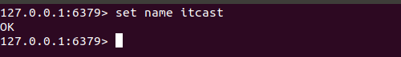

- 设置键值及过期时间，以秒为单位

  > setex key seconds value

- 例2：设置键为`aa`值为`aa`过期时间为3秒的数据

  > setex aa 3 aa

  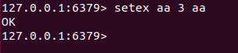

- 设置多个键值

  > mset key1 value1 key2 value2 ...

- 例3：设置键为`a1`值为`golang`、键为`a2`值为`java`、键为`a3`值为`c`

  > mset a1 golang a2 java a3 c

  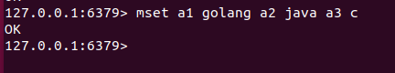

- 追加值

  > append key value

- 例4：向键为`a1`中追加值`haha`

  > append a1 haha

  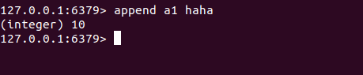

**获取**

- 获取：根据键获取值，如果不存在此键则返回`nil`

  > get key

- 例5：获取键`name`的值

  > get name

- 根据多个键获取多个值

  > mget key1 key2 ...

- 例6：获取键`a1、a2、a3`的值

  > mget a1 a2 a3

  > 中文乱码问题解决
  >
  > a)      退出redis客户端
  >
  > `Exit`
  >
  > b)      再次进图redis客户端
  >
  > ==Redis-cli --raw==

  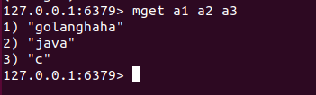

**删除**

详⻅下节键的操作，删除键时会将值删除

### 4.2键命令

- 查找键，参数⽀持正则表达式

  > keys pattern

- 例1：查看所有键

  > keys \*

  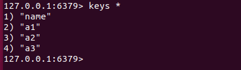

- 例2：查看名称中包含`a`的键

  > keys a*

  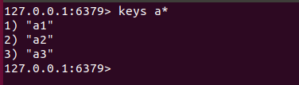

- 判断键是否存在，如果存在返回`1`，不存在返回`0`

  > exists key1

- 例3：判断键`a1`是否存在

  > exists a1

  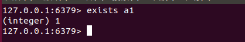

- 查看键对应的`value`的类型

  > type key

- 例4：查看键`a1`的值类型，为redis⽀持的五种类型中的⼀种

  > type a1

  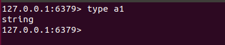

- 删除键及对应的值

  > del key1 key2 ...

- 例5：删除键`a2、a3`

  > del a2 a3

  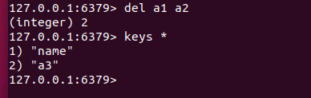

- 设置过期时间，以秒为单位

- 如果没有指定过期时间则⼀直存在，直到使⽤`DEL`移除

  > expire key seconds

- 例6：设置键`a1`的过期时间为3秒

  > expire a1 3

  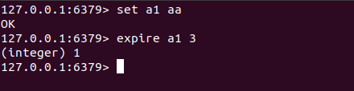

- 查看有效时间，以秒为单位

  > ttl key

- 例7：查看键`bb`的有效时间

  > ttl bb

  

### 4.3hash操作

- **hash**⽤于存储对象，对象的结构为属性、值
- **值**的类型为**string**

**增加、修改**

- 设置单个属性

  > hset key field value

- 例1：设置键 `user`的属性`name`为`itheima`

  > hset user name itheima

  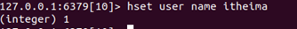

- 设置多个属性

  > hmset key field1 value1 field2 value2 ...

- 例2：设置键`u2`的属性`name`为`itcast`、属性`age`为`11`

  > hmset u2 name itcast age 11

  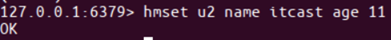

**获取**

- 获取指定键所有的属性

  > hkeys key

- 例3：获取键u2的所有属性

  > hkeys u2

  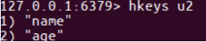

- 获取⼀个属性的值

  > hget key field

- 例4：获取键`u2`属性`name`的值

  > hget u2 name

  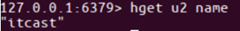

- 获取多个属性的值

  > hmget key field1 field2 ...

- 例5：获取键`u2`属性`name`、`age`的值

  > hmget u2 name age

  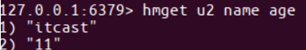

- 获取所有属性的值

  > hvals key

- 例6：获取键`u2`所有属性的值

  > hvals u2

  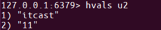

-  获取一个hash有多少个属性

  hlen key

-  例7：获取键'u2'有多少个属性

  Hlen u2

**删除**

- **删除整个hash键及值，使⽤del命令**

- 删除属性，属性对应的值会被⼀起删除

  > hdel key field1 field2 ...

- 例7：删除键`u2`的属性`age`

  > hdel u2 age

  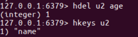

### 4.4list操作

- 列表的元素类型为string
- 按照插⼊顺序排序

**增加**

- 在左侧插⼊数据

  > lpush key value1 value2 ...

- 例1：从键为`a1`的列表左侧加⼊数据`a 、 b 、c`

  > lpush a1 a b c

  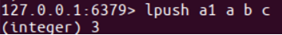

  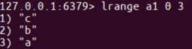

- 在右侧插⼊数据

  > rpush key value1 value2 ...

- 例2：从键为`a1`的列表右侧加⼊数据`0、1`

  > rpush a1 0 1

  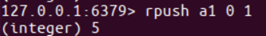

  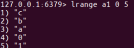

- 在指定元素的前或后插⼊新元素

  > linsert key before或after 现有元素 新元素

- 例3：在键为`a1`的列表中元素`b`前加⼊`3`

  > linsert a1 before b 3

  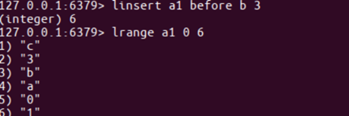

**获取**

- 返回列表⾥指定范围内的元素

  - `start`、`stop`为元素的下标索引
  - 索引从左侧开始，第⼀个元素为0
  - 索引可以是负数，表示从尾部开始计数，如`-1`表示最后⼀个元素

  > lrange key start stop

- 例4：获取键为`a1`的列表所有元素

  > lrange a1 0 -1

  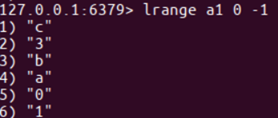

**设置指定索引位置的元素值**

- 索引从左侧开始，第⼀个元素为0

- 索引可以是负数，表示尾部开始计数，如`-1`表示最后⼀个元素

  > lset key index value

- 例5：修改键为`a1`的列表中下标为`1`的元素值为`z`

  > lset a1 1 z

  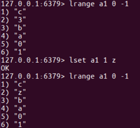

**删除**

- 删除指定元素

  - 将列表中前`count`次出现的值为`value`的元素移除
  - count 
    &gt;
     0: 从头往尾移除
  - count 
    &lt;
     0: 从尾往头移除
  - count = 0: 移除所有

  > lrem key count value

- 例6.1：向列表`a2`中加⼊元素`a、b、a、b、a、b`

  > lpush a2 a b a b a b

  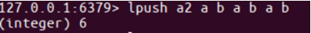

- 例6.2：从`a2`列表右侧开始删除2个`b`

  > lrem a2 -2 b

- 例6.3：查看列表`a2`的所有元素

  > lrange a2 0 -1

  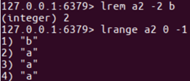

**截取修剪**

- 修剪(截取) 在[start stop]区间内的元素,区间外的元素全部删除

  > ltrim key start stop


### 4.5set操作

- ⽆序集合
- 元素为string类型
- 元素具有唯⼀性，不重复
- 说明：对于集合没有修改操作

**增加**

- 添加元素

  > sadd key member1 member2 ...

- 例1：向键`a3`的集合中添加元素`zhangsan`、`lisi`、`wangwu`

  > sadd a3 zhangsan sili wangwu

  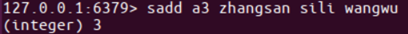

**获取**

- 返回所有的元素

  > smembers key

- 例2：获取键`a3`的集合中所有元素

  > smembers a3

  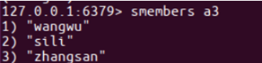

**删除**

- 删除指定元素

  > srem key

- 例3：删除键`a3`的集合中元素`wangwu`

  > srem a3 wangwu

  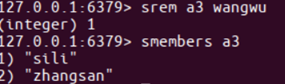


### 4.6zset操作

- sorted set，有序集合
- 元素为string类型
- 元素具有唯⼀性，不重复
- 每个元素都会关联⼀个double类型的score，表示权重，通过权重将元素从⼩到⼤排序
- 说明：没有修改操作

**增加**

- 添加

  > zadd key score1 member1 score2 member2 ...

- 例1：向键`a4`的集合中添加元素`lisi`、`wangwu`、`zhaoliu`、`zhangsan`，权重分别为`4、5、6、3`

  > zadd a4 4 lisi 5 wangwu 6 zhaoliu 3 zhangsan

**获取**

- 返回指定范围内的元素

- start、stop为元素的下标索引

- 索引从左侧开始，第⼀个元素为0

- 索引可以是负数，表示从尾部开始计数，如`-1`表示最后⼀个元素

  > zrange key start stop

- 例2：获取键`a4`的集合中所有元素

  > zrange a4 0 -1

  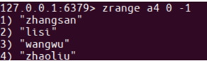

- 返回`score`值在`min`和`max`之间的成员

  > zrangebyscore key min max

- 例3：获取键`a4`的集合中权限值在`5和6之间`的成员

  > zrangebyscore a4 5 6

  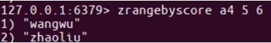

- 返回成员`member`的`score`值

  > zscore key member

- 例4：获取键`a4`的集合中元素`zhangsan`的权重

  > zscore a4 zhangsan

  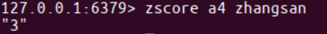

**删除**

- 删除指定元素

  > zrem key member1 member2 ...

- 例5：删除集合`a4`中元素`zhangsan`

  > zrem a4 zhangsan

  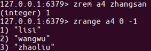

- 删除权重在指定范围的元素

  > zremrangebyscore key min max

- 例6：删除集合`a4`中权限在`5、6之间`的元素

  > zremrangebyscore a4 5 6

  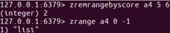

## 5.与go语言交互

### 5.1安装测试

安装go操作redis的包，命令如下：

```
go get -u -v github.com/gomodule/redigo/redis
```

安装完成后，回到家目录创建test.go,把下面代码复制到test.go里面，编译执行test.go，之后在redis中查找到键c1值为hello，说明安装成功

```go
package main
import ( "github.com/gomodule/redigo/redis")
func main(){
        conn,_ := redis.Dial("tcp", ":6379")
        defer conn.Close()
        conn.Do("set", "c1", "hello")
}
```

###  5.2操作方法

redigo包的使用文档`https://godoc.org/github.com/gomodule/redigo/redis`

**连接数据库**

```go
Dial(network, address string)（conn,err）
```

**执行数据库的命令**

```go
Send(commandName string, args ...interface{}) error
Flush() error
Receive() (reply interface{}, err error)
```

> Send函数发出指令，flush将连接的输出缓冲区刷新到服务器，Receive接收服务器返回的数据 

示例：

```go
c.Send("SET", "foo", "bar")
c.Flush()//把缓冲区命令发到服务器
v, err = c.Receive() // 接收set请求传输的数据
```

**另一种执行数据库操作命令（常用）**

```go
Do(commandName string, args ...interface{}) (reply interface{}, err error)
```

**reply helper functions（回复助手函数）** 

Bool，Int，Bytes，map，String，Strings和Values函数将回复转换为特定类型的值。为了方便地包含对连接Do和Receive方法的调用，这些函数采用了类型为error的第二个参数。如果错误是非nil，则辅助函数返回错误。如果错误为nil，则该函数将回复转换为指定的类型： 

```go
exists, err := redis.Bool(c.Do("EXISTS", "foo"))
if err != nil {
//处理错误代码
}
reflect.TypeOf(exists)//打印exists类型
```

**Scan函数**

```go
func Scan(src [] interface {},dest ... interface {})([] interface {},error)
```

> Scan函数从src复制到dest指向的值。
>
> Dest参数的值必须是整数，浮点数，布尔值，字符串，[]byte，interface{}或这些类型的切片。Scan使用标准的strconv包将批量字符串转换为数字和布尔类型。

示例：

```go
var value1 int
var value2 string
reply, err := redis.Values(c.Do("MGET", "key1", "key2"))
if err != nil {
    //处理错误代码
}
 if _, err := redis.Scan(reply, &value1, &value2); err != nil {
    // 处理错误代码
}
```

### 5.3与案例结合

**序列化与反序列化**

序列化

```go
var buffer bytes.Buffer//容器
enc :=gob.NewEncoder(&buffer)//编码器
err:=enc.Encode(dest)//编码

//文件读写
```

反序列化

```go
dec := gob.NewDecoder(bytes.NewReader(buffer.bytes()))//解码器
dec.Decode(src)//解码
```

## 6.搭建主从

**redis三种集群策略：**https://blog.csdn.net/q649381130/article/details/79931791

### 6.1**主从概念**

- ⼀个master可以拥有多个slave，⼀个slave⼜可以拥有多个slave，如此下去，形成了强⼤的多级服务器集群架构

- master用来写数据，slave用来读数据，经统计：网站的读写比率是10:1

- 通过主从配置可以实现读写分离

  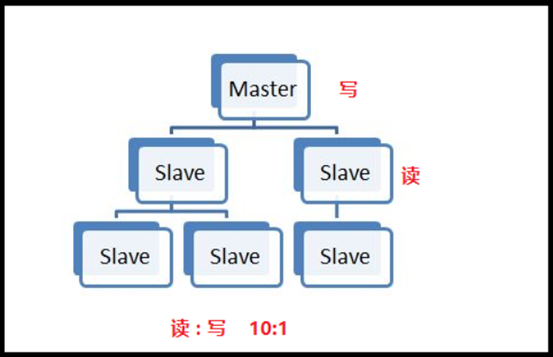

- master和slave都是一个redis实例\(redis服务\)

- 

### **6.2主从配置**

**配置主**

- 查看当前主机的ip地址

  > ifconfig

  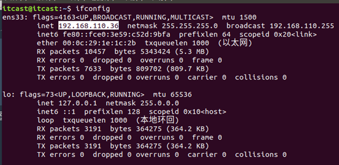

- 修改`/etc/redis/redis.conf`文件

  > sudo vi redis.conf  
  > bind 192.168.26.128

- 重启redis服务

  > ps aux | grep redis

  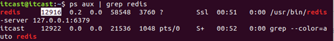

  > Sudo kill -9 12916
  >
  > Sudo redis-server /etc/redis/redis.conf

**配置从**

- 复制`/etc/redis/redis.conf`文件

  > sudo cp redis.conf ./slave.conf

- 修改`redis/slave.conf`文件

  > sudo vi slave.conf

- 编辑内容

  > bind 192.168.26.128  
  > slaveof 192.168.26.128 6379  
  > port 6378

- redis服务

  > sudo redis-server slave.conf

- 查看主从关系

  > redis-cli -h 192.168.26.128 info Replication

  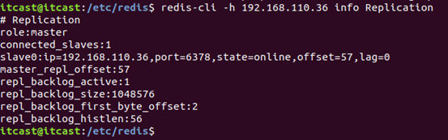

### 6.3在主从服务器上操作数据

- master和slave分别执⾏info命令，查看输出信息 进入主客户端

  > redis-cli -h 192.168.26.128 -p 6379

- 进入从的客户端

  > redis-cli -h 192.168.26.128 -p 6378

- 在master上写数据

  > mset a1 11 a2 22 a3 33 

  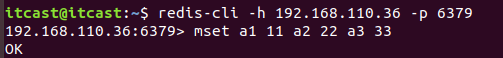

- 在slave上读数据

  > get aa

  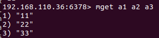


## 7.搭建集群 

###   7.1集群介绍

**为什么要有集群**

- 之前我们已经讲了主从的概念，一主可以多从，如果同时的访问量过大\(1000w\),主服务肯定就会挂掉，数据服务就挂掉了或者发生自然灾难
- 大公司都会有很多的服务器\(华东地区、华南地区、华中地区、华北地区、西北地区、西南地区、东北地区、台港澳地区机房\)

  **集群的概念**

集群是一组相互独立的、通过高速网络互联的计算机，它们构成了一个组，并以单一系统的模式加以管理。一个客户与集群相互作用时，集群像是一个独立的服务器。集群配置是用于提高可用性和可缩放性。 

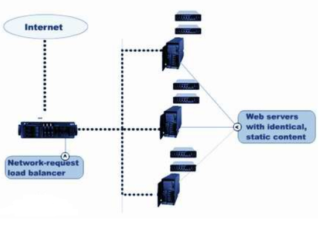

当请求到来首先由负载均衡服务器处理，把请求转发到另外的一台服务器上。 

> 百度的ip地址  `119.75.217.109/`
>
> ​                        `61.135.169.121/`

### 7.2搭建redis集群

- 分类
  - 软件层面
  - 硬件层面
- 软件层面：只有一台电脑，在这一台电脑上启动了多个redis服务。

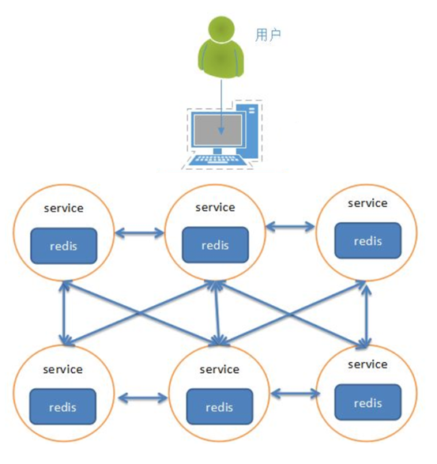

- 硬件层面：存在多台实体的电脑，每台电脑上都启动了一个redis或者多个redis服务。

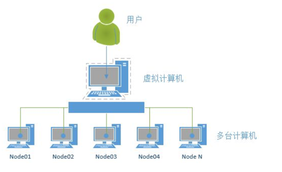

> 参考阅读
>
> Redis搭建集群<http://www.cnblogs.com/wuxl360/p/5920330.html>
>
> go语言redis-cluster开源客户端<https://github.com/gitstliu/go-redis-cluster>

#### 7.2.1配置机器1

- 在演示中，172.16.179.130为当前ubuntu机器的ip

- 在172.16.179.130上进⼊Desktop⽬录，创建conf⽬录

- 在conf⽬录下创建⽂件7000.conf，编辑内容如下

  ```
  port 7000
  bind 172.16.179.130
  daemonize yes
  pidfile 7000.pid
  cluster-enabled yes
  cluster-config-file 7000_node.conf
  cluster-node-timeout 15000
  appendonly yes
  
  ```

- 在conf⽬录下创建⽂件7001.conf，编辑内容如下

  ```
  port 7001
  bind 172.16.179.130
  daemonize yes
  pidfile 7001.pid
  cluster-enabled yes
  cluster-config-file 7001_node.conf
  cluster-node-timeout 15000
  appendonly yes
  ```

- 在conf⽬录下创建⽂件7002.conf，编辑内容如下

  ```
  port 7002
  bind 172.16.179.130
  daemonize yes
  pidfile 7002.pid
  cluster-enabled yes
  cluster-config-file 7002_node.conf
  cluster-node-timeout 15000
  appendonly yes
  ```

- 总结：三个⽂件的配置区别在port、pidfile、cluster-config-file三项

- 使⽤配置⽂件启动redis服务

  ```
  redis-server 7000.conf
  redis-server 7001.conf
  redis-server 7002.conf
  ```

- 查看进程如下图
  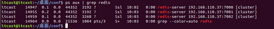

#### 7.2.2配置机器2

- 在演示中，172.16.179.131为当前ubuntu机器的ip

- 在172.16.179.131上进⼊Desktop⽬录，创建conf⽬录

- 在conf⽬录下创建⽂件7003.conf，编辑内容如下

  ```
  port 7003
  bind 172.16.179.131
  daemonize yes
  pidfile 7003.pid
  cluster-enabled yes
  cluster-config-file 7003_node.conf
  cluster-node-timeout 15000
  appendonly yes
  
  ```

- 在conf⽬录下创建⽂件7004.conf，编辑内容如下

  ```
  port 7004
  bind 172.16.179.131
  daemonize yes
  pidfile 7004.pid
  cluster-enabled yes
  cluster-config-file 7004_node.conf
  cluster-node-timeout 15000
  appendonly yes
  
  ```

- 在conf⽬录下创建⽂件7005.conf，编辑内容如下

  ```
  port 7005
  bind 172.16.179.131
  daemonize yes
  pidfile 7005.pid
  cluster-enabled yes
  cluster-config-file 7005_node.conf
  cluster-node-timeout 15000
  appendonly yes
  
  ```

- 总结：三个⽂件的配置区别在port、pidfile、cluster-config-file三项

- 使⽤配置⽂件启动redis服务

  ```
  redis-server 7003.conf
  redis-server 7004.conf
  redis-server 7005.conf
  
  ```

- 查看进程如下图
  

#### 7.2.3创建集群

- redis的安装包中包含了redis-trib.rb，⽤于创建集群

- 接下来的操作在172.16.179.130机器上进⾏

- 将命令复制，这样可以在任何⽬录下调⽤此命令

  ```
  sudo cp /usr/share/doc/redis-tools/examples/redis-trib.rb /usr/local/bin/
  ```

- 安装ruby环境，因为redis-trib.rb是⽤ruby开发的

  > sudo apt-get install ruby

- 在提示信息处输⼊y，然后回⻋继续安装
  

- 运⾏如下命令创建集群

  ```
  从github上redis源码中把redis-trib.rb放在本地某个目录下然后执行下面命令
  
  redis-trib.rb create --replicas 1 172.16.179.130:7000 172.16.179.130:7001 172.16.179.130:7002 172.16.179.131:7003 172.16.179.131:7004 172.16.179.131:7005
  ```

- 执⾏上⾯这个指令在某些机器上可能会报错,主要原因是由于安装的 ruby 不是最 新版本!
  [

- 天朝的防⽕墙导致⽆法下载最新版本,所以需要设置 gem 的源

- 解决办法如下

  ```
  -- 先查看⾃⼰的 gem 源是什么地址
  gem source -l -- 如果是https://rubygems.org/ 就需要更换
  -- 更换指令为
  gem sources --add https://gems.ruby-china.com/ --remove https://rubygems.org/
  -- 通过 gem 安装 redis 的相关依赖
  sudo gem install redis
  -- 然后重新执⾏指令
  sudo redis-trib.rb create --replicas 1 172.16.179.130:7000 172.16.179.130:7001 172.16.179.130:7002 172.16.179.131:7003 172.16.179.131:7004 172.16.179.131:7005
  ```

  

  

- 提示如下主从信息，输⼊yes后回⻋
  

- 提示完成，集群搭建成功

#### 7.2.4数据验证 

- 根据上图可以看出，当前搭建的主服务器为7000、7001、7003，对应的从服务器是7004、7005、7002

- 在172.16.179.131机器上连接7002，加参数-c表示连接到集群

  > redis-cli -h 172.16.179.131 -c -p 7002

- 写⼊数据

  > set name itheima

- ⾃动跳到了7003服务器，并写⼊数据成功
  

- 在7003可以获取数据，如果写入数据又重定向到7000\(负载均衡\)
  

#### 7.2.5在哪个服务器上写数据：

- redis cluster在设计的时候，就考虑到了去中⼼化，去中间件，也就是说，集群中 的每个节点都是平等的关系，都是对等的，每个节点都保存各⾃的数据和整个集 群的状态。每个节点都和其他所有节点连接，⽽且这些连接保持活跃，这样就保 证了我们只需要连接集群中的任意⼀个节点，就可以获取到其他节点的数据
- Redis集群没有并使⽤传统的⼀致性哈希来分配数据，⽽是采⽤另外⼀种叫做哈希 槽 \(hash slot\)的⽅式来分配的。redis cluster 默认分配了 16384 个slot，当我们 set⼀个key 时，会⽤CRC16算法来取模得到所属的slot，然后将这个key 分到哈 希槽区间的节点上，具体算法就是：CRC16\(key\) % 16384。所以我们在测试的 时候看到set 和 get 的时候，直接跳转到了7000端⼝的节点
- Redis 集群会把数据存在⼀个 master 节点，然后在这个 master 和其对应的salve 之间进⾏数据同步。当读取数据时，也根据⼀致性哈希算法到对应的 master 节 点获取数据。只有当⼀个master 挂掉之后，才会启动⼀个对应的 salve 节点，充 当 master
- 需要**注意**的是：**必须要3个或以上的**主节点，否则在创建集群时会失败，并且当**存 活的主节点数⼩于总节点数**的⼀半时，整个集群就**⽆法提供**服务了