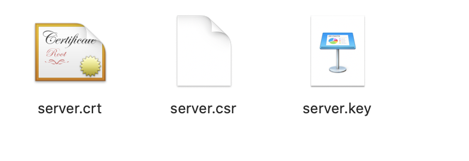
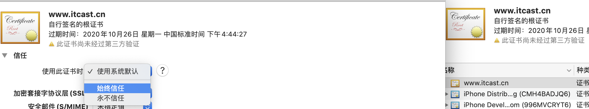

# 

# 1.密码学

 ## 1.对称加密与非对称加密的区别

- 对称的意思：是指加密和解密的==钥匙==是相同的

- 非对称的意思：是指加密和解密的==钥匙==是不相同


## 2.对称加解密三要素


- 明文	
  - hello world
- 秘钥
  - 3
- 算法
  - 向右移动


# 2.证书

## 1.生成自签名证书

- ==自签名证书，自己颁发给自己，自己验证自己。==

```shell
# 创建CA的私钥
$ openssl genrsa -out server.key 1024
# 或者
$ openssl genrsa -des3 -out server.key 1024 # 使用des3加密

# 生成CSR（证书签名请求）
$ openssl req -new -key server.key -out server.csr

# 查看CSR证书请求信息
$ openssl req -in server.csr -text

# 生成自签名证书
$ openssl x509 -req -days 365 -in server.csr -signkey server.key -out server.crt

# 查看自签名证书
$ openssl x509 -in server.crt -text
```

- 生成效果图


- 点击server.crt ，添加证书



## 2.==创建CA证书，给第三方签发证书==

```shell
# 第一步：创建CA私钥
$ openssl genrsa -out ca.key 1024

# 第二步：生成CA的自签名证书
$ openssl req -new -x509 -days 365 -key ca.key -out ca.crt

# 第三步：生成需要的颁发证书私钥
$ openssl genrsa -out server.key 

# 第四步：生成要颁发证书的签名请求
$ openssl req -new -key server.key -out server.csr

# 第五步：用第二步创建的CA证书给第四步生成的签名请求进行签名
$ openssl x509 -req -days 365 -in server.csr -CA ca.crt -CAkey ca.key -set_serial 01 -out server.crt
```


## 3. 证书编码格式

==PEM和DER两种编码格式。两者查看时唯一区别就是`-inform der==

- PEM(openssl生成格式)
  - Privacy Enhanced Mail(信封)
  - 查看内容，以"-----BEGIN..."开头，以"-----END..."结尾。
  - 查看PEM格式证书的信息：

```shell
# Apache和*NIX服务器偏向于使用这种编码格式。
openssl x509 -in certificate.pem -text -noout
```

- DER(windows导出)
  - Distinguished Encoding Rules
  - 打开看是二进制格式，不可读。
  - Java和Windows服务器偏向于使用这种编码格式。
  - 查看DER格式证书的信息

```shell
# der是格式，与证书的后缀名没有直接关系
openssl x509 -in certificate.der -inform der -text -noout  `请试试-pubkey参数
```


# 3.Openssl命令生成秘钥对

```shell
# 进入openssl
$ openssl

# 生成私钥
$ OpenSSL> genrsa -out rsa_private_key.pem

# 私钥生成公钥
$ OpenSSL> rsa -in rsa_private_key.pem -pubout -out rsa_public_key.pem 
```


# 4.base64编解码

- 解释：使用64个特定字符，对目标内容进行编码的算法

```shell
# 注释: 正常Base64 字符
# 具体字符（64个字符）：
1. 0~9
2. a-z
3. A~Z
4. +, /  (注意：没有等号=)

# 注释： URLBase64字符
1. 0~9
2. a-z
3. A~Z
4. -,_  (注意：-,_ 符号)
```

- Base64 编码数据变大的原因

 ```shell
# base64算法安装6比特进行切割计算
# 正常编码 1个字符占 8个位
# Base64编码后 1个字符占6个位
# 当不足的时，会用=填充
 ```


# 5. HTTP 认证流程

 [数字证书-原版.html](数字证书-原版.html) 