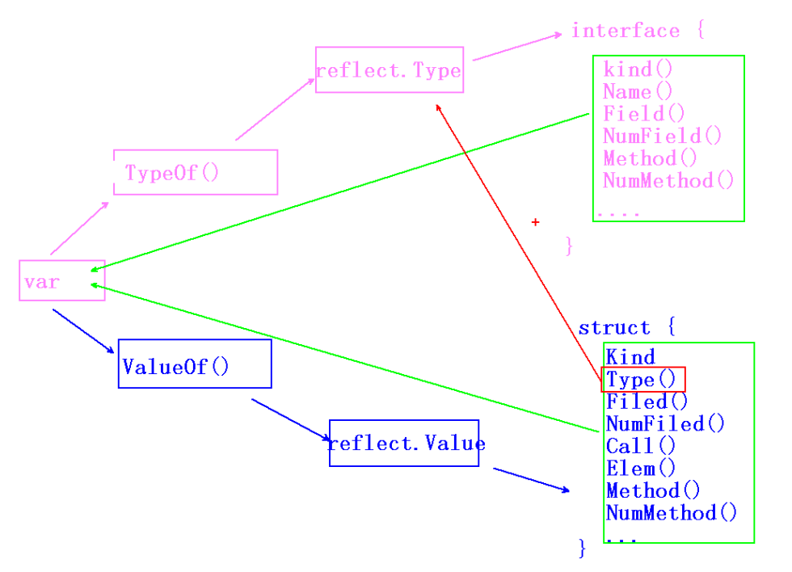
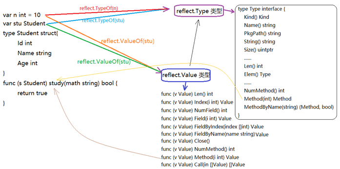
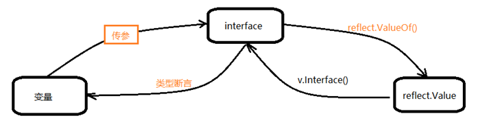

## 反射简介

### 反射概述

- Go语言提供的反射机制，**运行时**反射。 只工作于 程序运行期。
- 使用的技术：
    - 静态类型 interface{}
    - reflect.Type 类型。--- TypeOf()
    - reflect.Value 类型。 --- ValueOf()

### 反射的应用场景

1. Go语言 API实现。（fmt.Printf）
2. 框架的封装和实现。
3. 适配器（桥连接）函数实现。

### 反射的基本应用

1. 可以在运行时，动态获取变量信息：类型（type）、类别（kind）
2. 可以获取结构体类型的 成员信息（字段、域）。
3. 可以修改变量值，调用类方法。

实现上述应用。主要借助两大类：reflect.Type类（本质：interface ），reflect.Value类 (本质：struct)。

> ```go
> type Type interface {
>    Kind()
>    Name()
>    NumField()
>    Field()
>    NumMethod()
>    Method()
>    }
> ```

>```go
>type Value struct {
>    // 隐藏
>}
>Kind()
>Type()
>Elem()
>Call()
>NumField()
>Field()
>NumMethod()
>Method()
>SetXxx()
>```


## ==反射的基本原理==

- 变量 —— reflect.TypeOf() —— reflect.Type类型 —— interface{ kind() Field() Method() ...}
- 变量 —— reflect.ValueOf() —— reflect.Value类型 —— struct { Kind()Elem()Call() ...}






## ==反射实际编程中的应用==

### 总体用法

- 总体：变量 、 interface 、 reflect.Value 相互转换
- 变量 —— 传参 —— interface —— 调用reflect.ValueOf() —— reflect.Value 类型 —— 调用 Interface() —— interface —— 类型断言 —— 变量




### 基础数据类型转换

```go
// 定义一个空接口类型的 函数
func reflectTrans(i interface{})  {
	// 使用 reflect 包下面 的 ValueOf方法,获取 reflect.Value 类型
	reVal := reflect.ValueOf(i)		// interface -- reflect.Value

	//n := reVal + 100		// reflect.Value 不能与 int 类型进行 运算
	fmt.Printf("type=%T\n", reVal)

	iVal := reVal.Interface()
	fmt.Printf("type=%T, iVal=%v\n", iVal, iVal)
	//n := iVal + 100			// interface 不能与 int 类型进行 运算

	// 通过类型断言,得到 int 类型数据
	val := iVal.(int)	// interface -- int
	fmt.Printf("type=%T, iVal=%v\n", val, val)
	n := val + 100
	fmt.Println("n=", n)
}

func main() {
	var a int = 10

	// 调用参数为空接口的函数
	reflectTrans(a)   // 变量 -- interface
}
```


### ==自定义（结构体）类型转换==

- 结构变量 —— 传参 —— interface —— 调用reflect.ValueOf() —— reflect.Value 类型 —— 调用 Interface() —— interface —— 结构体类型断言 —— 结构体变量

```go
// 定义结构体类型
type Student struct {
	Name string
	Age int
	Addr string
}
// 封装函数,使用反射机制
func reflect4strcut(i interface{})  {
	reType := reflect.TypeOf(i)
	fmt.Printf("%v\n", reType)
	// 获取 reflect.Value
	reVal := reflect.ValueOf(i)  // interface -- reflect.Value
	//fmt.Printf("reType1 = %T, reType=%v, reVal=%v\n", reType, reType, reVal)
	//name := reVal.Name // reflect.Value 不能直接获取Student类型成员

	// reflect.Value --- interface
	iVal := reVal.Interface()
	//name := iVal.Name 	//interface 不能直接获取Student类型成员

	// 类型断言
	val := iVal.(Student)
	fmt.Printf("reVal=%v, iVal=%v, val=%v, name=%v\n",
		reVal, iVal, val, val.Name)
}
func main() {
	stu := Student{"马连良", 80, "北京"}

	reflect4strcut(stu)  // 结构体 -- interface
}

```


### ==获取基础数据类型（不用断言）==

- 使用 reflect.Value 类型的方法， 操作对应的基础数据类型 { Int()/string()/Bool()/Float() ....}

- 使用 reVal.Kind() 获取 reflect.常量列表。

- 对于自定义数据类型（结构体），只能使用类型断言。

    > ```
    > const (
    >     Invalid Kind = iota
    >     Bool
    >     Int
    >     Int8
    >     Int16
    >     Int32
    >     Int64
    >     Uint
    >     Uint8
    >     Uint16
    >     Uint32
    >     Uint64
    >     Uintptr
    >     Float32
    >     Float64
    >     Complex64
    >     Complex128
    >     Array
    >     Chan
    >     Func
    >     Interface
    >     Map
    >     Ptr
    >     Slice
    >     String
    >     Struct
    >     UnsafePointer
    > )
    > ```

    

```go
func reflect4Kind(i interface{}) {
	// 获取 Value
	reVal := reflect.ValueOf(i)

	// 获取 数据类型对应的 kind, 比对
	if reVal.Kind() == reflect.Int {
		n := reVal.Int() + 100
		fmt.Printf("这是一个int数据:%d\n", n)
	}
	if reVal.Kind() == reflect.String {
		fmt.Printf("这是一个sting数据:%s\n", reVal.String() + " world")
	}
	if reVal.Kind() == reflect.Bool {
		fmt.Printf("这是一个bool数据:%v\n", reVal.Bool())
	}
	if reVal.Kind() == reflect.Float64 {
		fmt.Printf("这是一个Float64数据:%f\n", reVal.Float())
	}
}

func main() {
	var a int = 10
	var str string = "hello"
	var bl bool = false
	var f float64 = 3.14

	reflect4Kind(a)
	reflect4Kind(str)
	reflect4Kind(bl)
	reflect4Kind(f)
}


```

### kind 和 type 区别

- kind：表示类别。范畴更大一些。（家用电器）
- type：( 不是reflect.Type类型 ) 表示类型。范畴较小。（电视机）

```go
type Student4 struct {
	Name string
	Age int
	Addr string
}

func reflect4typeKind(i interface{})  {
	reVal := reflect.ValueOf(i)
	fmt.Printf("kind=%v\n",reVal.Kind())
}
func main() {
	var a int = 10
	reflect4typeKind(a)
	fmt.Printf("type=%T\n", a)
	
	var stu Student4
	reflect4typeKind(stu)
	fmt.Printf("type=%T\n", stu)
}
```


### ==设置变量的值==

1. 传变量的地址给 反射函数 （&变量）传引用。
2. 使用 kind 判断，是否为指针类型（reflect.Ptr）。 进一步 借助 Elem() 判断是何种指针类型。
3. 借助 Elem() 使用 SetXxx() 设置对应类型的数据值。reVal.Elem().SetXxx()

>Elem() 的作用，类似于如下 3 步：
>
>​			var a int = 10
>
>​			var p *int 
>
>​			p = &a
>
>SetInt(666), 相当于，如下一步：
>
>​			*p = 666

```go
// 封装反射函数
func reflect4SetInt(iptr interface{})  {
	reVal := reflect.ValueOf(iptr)

	// 获取类型
	fmt.Println("kind=", reVal.Kind())
	fmt.Println("kind=", reVal.Elem().Kind())

	if reVal.Kind() == reflect.Ptr && reVal.Elem().Kind() == reflect.Int {
		reVal.Elem().SetInt(666)
	}
	//reVal.SetInt(666)  // 无法修改 a 变量
}

func main() {
	var a int = 10
	reflect4SetInt(&a)
	fmt.Println("a =", a)
}
```


## 反射操作结构体

### 使用反射获取结构体标签

#### 操作函数

- 获取字段个数：

    ```go
     reflect.Type.NumField() int	// 获取字段数量
     reflect.Value.NumField() int	// 获取字段数量
    ```

- 获取字段信息：

    ```go
    reflect.Type.Field(i int) StructField
    参数：第几个字段。（从0计数）
    返回值：StructField。 字段信息（字段名、字段类型、字段标签（key:value））
    
    type StructField struct {
        Name    string		// 字段名
        PkgPath string		// 包路径
        Type      Type      // 字段的类型
        Tag       StructTag // 字段的标签
        。。。
    }
    ```

- 结构体标签类型

    ```go
    type StructTag string		// 类
    
    func (tag StructTag) Get(key string) string
    
    传入 tag 的 key（已知值） ， 得到对应的value
    ```


- 获取字段值：

    ```go
    func (v Value) Field(i int) Value
    参：字段序号（从0计数）
    返回值：字段值。
    ```

#### 实现流程

1.  创建带有tag标签结构体。 （tag 的 key 已知）
2.  创建结构体对象test。初始化。
3.  获取 reflect.Type 类对象。reType := reflect.TypeOf(test)
4.  获取 reflect.Value类对象。reVal := reflect.ValueOf(test)
5. 获取结构体的字段数。reType.NumFiled()  /  reVal.NumFiled()
6. 使用 字段数做循环上限，依次每个字段信息  for i:=0; i<reType.NumFiled();i ++
7. 获取字段信息：structFiled := reType.Field(i) 。  type structFiled struct { Name, Type, Tag }
8. 获取字段名：structFiled.Name
9. 获取字段类型：structFiled.Type
10. 获取字段tag值：
    1. Tag的 key 已知值。const tagKey = "Testing"
    2. 获取Tag对象。structFiled.Tag
    3. 使用Tag对象，调用Get方法，传入tagKey， 得到 tagVal
    4. 上述3步，编码：tagVal := structFiled.Tag.Get(tagKey)
11. 获取字段值：reVal.Field(i)
12. 打印输出：字段名、字段类型、字段值、字段tag值


#### 编码实现

```go
const tagKey = "Testing"

type Test struct {
	Name string `Testing:"-"`             //“-”作用是不进行序列化，效果和将结构体字段写成小写一样。
	Age  int    `Testing:"age,omitempty"` // “omitempty”作用是在序列化的时候忽略0值或空值。
	Id   int    `Testing:"idx,string"`    // 序列化时，类型转化为string
	Sex  string `Testing:"sex"`
}
func main() {
	// 创建结构体对象
	test := Test{"李逵", 20, 100, "male"}

	// 获取 reflect.Type
	reType := reflect.TypeOf(test)
	// 获取 reflect.Value
	reVal := reflect.ValueOf(test)

	// 获取 结构体的字段, 循环提取每一个字段信息
	for i := 0; i < reType.NumField(); i++ {
		// 获取每个字段对应的的结构体信息
		structField := reType.Field(i)
		// 获取字段标签,对象. 调用 Get方法,传入 标签的key 值,得到对应的value
		tagVal := structField.Tag.Get(tagKey)

		// 按格式,输出字段信息-- 1. Name(string):"李逵" Tag:'-'
		fmt.Printf("%d.%s(%s):%v Tag:'%v'\n",
			i+1, structField.Name, structField.Type, reVal.Field(i), tagVal)
	}
}
```


### ==反射使用结构体标签==

#### 实现流程

1. 创建带有标签的结构体

    ```go
    type Person struct {
       Name        string `label:"Person Name: " uppercase:"true"`
       Age         int    `label:"Age is: "`
       Sex         string `label:"Sex is: "`
       Description string
    }
    ```

2. 初始化结构体实例
3. 封装反射函数，传实例的地址（引用）reflect4Tag（&person）
4. 获取 reflect.Type。 结合 Kind() 、Elem() 校验用户输入的数据 == Ptr、 == Struct
5. 获取 reflect.Value。结合Elem() 得到 reVal := reflect.ValueOf().Elem()
6. 获取结构体字段个数 NumField()。 for 循环 提取每一个字段信息
7. 使用Type 提取字段类型信息。structField := reVal.Type().Field(i)
8. 组织输出的 标签名：
    1. 获取 Tag 标签。
    2. 按 key 为 “label” 提取 Tag 的 value， 用作标签名
    3. 如果 Tag 没有 value。 使用 字段名 + “：” 拼接 标签名  （针对 Description 字段）
9. 组织输出的 标签值：
    1. 使用 reVal 获取字段值。reVal.Field(i)
    2. 不管 reVal.Field(i) 提取的数据是何种类型，统一转换为 string。 val := Sprintf()
    3. 按 key 为 “uppercase” 提取 Tag 的 value。
    4. 如果为 “true”：转大写。ToUpper()。 赋值回给 val 
    5. 如果不为 “true”：转小写。ToLower()。赋值回给 val 
10. 拼接标签名、标签值，打印。


#### 编码实现

```go
type Person struct {
	Name        string `label:"Person Name: " uppercase:"true"`
	Age         int    `label:"Age is: "`
	Sex         string `label:"Sex is: "`
	Description string
}

// 封装反射函数, 处理待tag的结构体
func reflect4Tag(iptr interface{}) {
	// 获取 reflect.Type
	reType := reflect.TypeOf(iptr)

	// 借助 Kind()/Elem() 做简单的校验
	if reType.Kind() != reflect.Ptr || reType.Elem().Kind() != reflect.Struct {
		fmt.Println("传入的参数必须为结构体指针类型!")
		return
	}

	// 获取 reflect.Value  借助 Elem()
	reVal := reflect.ValueOf(iptr).Elem()

	// 获取 字段个数 NumFiled(). for
	for i := 0; i < reVal.NumField(); i++ {
		// 获取每一个字段的详细信息 structFiled
		structField := reVal.Type().Field(i)

		// 获取 tag 对象,
		tag := structField.Tag

		// 使用Get方法,获取 label 对应的value.
		labelVal := tag.Get("label")

		// 判断,如果 value == "" , 将字段名 + ":"
		if labelVal == "" {
			labelVal = structField.Name + ":"
		}
		// -------------------------------以下处理字段值
		// 获取每一个字段的值, reflect.Value.Field(i)  --- Sprintf()
		value := fmt.Sprintf("%v", reVal.Field(i))

		// 使用Get方法,获取 uppercase 对应的value
		if tag.Get("uppercase") == "true" {
			// 判断 如果是 "true" : 转大写.
			value = strings.ToUpper(value)
		} else {
			// 如果不是 "true": 转小写
			value = strings.ToLower(value)
		}
		// 拼接 label名 +  value值
		fmt.Println(labelVal + value)
	}
}

func main() {
	// 初始化结构体对象
	person := Person{"tom", 66, "FeMale", "BeauTiFul"}
	// 调用反射处理函数. 传地址.
	reflect4Tag(&person)
}

```


#### 课后作业：

- 参照“07-使用结构体标签.go” 实现 json.Marshal()


## 反射调用结构体方法

#### 操作方法

- NumMethod()： 获取结构体类方法个数

    ```go
    func (v Value) NumMethod() int
    ```

    

- Method(): 选定方法。计数从 0开始。 按方法名的 ASCII 码排序。

    ```go
    func (v Value) Method(i int) Value
    参数：选定的方法序号
    返回：reflect.Value
    ```

    

- Call(): 调用 结构体类方法。

    ```go
    func (v Value) Call(in []Value) []Value
    参数：要调用的那个方法的 参数列表。 给call 传参时，需要将 所有的数据类型转换为reflect.Value，保存至 切片中， 再传参。
    返回值：要调用的那个方法的返回值列表。
    
    []Value：代表任意类型、任意个数 参数、返回值。
    ```

#### demo

```go
package main

import (
	"fmt"
	"reflect"
)

type Student8 struct {
	Id    int    `json:"index"`
	Name  string `json:"name"`
	Age   int    `json:"学员年龄"`
	Score float32
}

func (stu Student8) Print() {
	fmt.Println("------------stu:", stu)
}

// 注意：方法名，首字母必须大写。否则 reflect.Value 的 Method 找不到该方法。
func (stu Student8) Add(a, b int) int {
	return a + b
}

func (stu Student8) ResetInfo(id int, name string, age int, score float32) {
	stu.Id = id
	stu.Name = name
	stu.Age = age
	stu.Score = score
}

func useReflect(ref interface{}) {
	reType := reflect.TypeOf(ref)
	reVal := reflect.ValueOf(ref)

	reKind := reVal.Kind()
	if reKind != reflect.Struct {
		fmt.Println("Kind err!")
		return
	}
	numField := reVal.NumField()
	fmt.Println("Student 结构体包含字段数为：", numField)

	for i := 0; i < numField; i++ {
		tagVal := reType.Field(i).Tag.Get("json")
		if tagVal != "" {
			fmt.Printf("%d. %v (%v) : %v, Tag : '%v'\n",
				i+1, reType.Field(i).Name, reType.Field(i).Type, reVal.Field(i), tagVal)
		} else {
			fmt.Printf("%d. %v (%v) : %v\n",
				i+1, reType.Field(i).Name, reType.Field(i).Type, reVal.Field(i))
		}
	}

	numMethod := reVal.NumMethod()
	fmt.Printf("Student 结构体含有 %d 个方法。\n", numMethod)

	// 调用一个方法
	reVal.Method(1).Call(nil)

	var params []reflect.Value
	params = append(params, reflect.ValueOf(123))
	params = append(params, reflect.ValueOf(543))

	sum := reVal.Method(0).Call(params)
	fmt.Println("sum =", sum[0].Int())
}

func main() {
	stu := Student8{9527, "Andy", 18, 90.5}
	useReflect(stu)
}

```


### 课后作业：

- 参照 call 调用 print、Add 的实现。 调用 有 多个参数的 ResetInfo 方法。