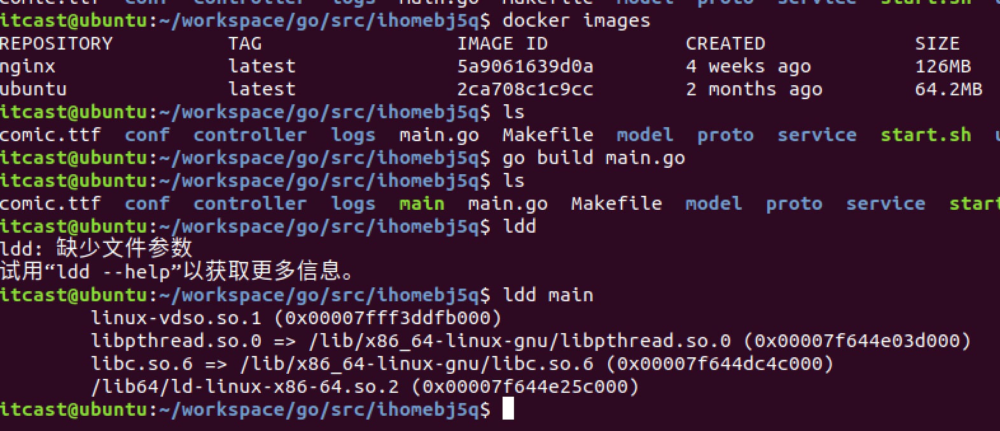

## 微服务部署

### 1. 编译项目



```shell
# 编译项目
$ go build main.go
# 查看依赖动态库
$ lld main
```

- Linux-vdso.so.1 : ==动态库的后缀一般用.so.1==  .1**表示版本**
- Libpthread.so.0 : ==线程库==,lib是库的前缀
- Libc.so.6 : C语言库
- /lib64/ld-liunx-x84-64.so.2 : ==操作系统库==

### 2. 将库打包到可依赖文件

```shell
# 参数解析 
# CGO_ENABLED=0：表示关掉C语言库
# GOOS ：表示操作系统
# GOPATH： 设置GoPath
# GOROOT: /usr/local/go/bin/go 绝对路径
# -a :表示全部 all
# -installsuffix: 输出目录与编译目录分离
# cgo ：手动调用cgo工具
# '-w' ：忽略警告
# -i -o: 生成文件叫什么
$ sudo CGO_ENABLED=0 GOOS=linux GOPATH=/home/itcast/workspace/go  /usr/local/go/bin/go build -a -installsuffix cgo -ldflags '-w' -i -o homeweb-web main.go


#编译需要在root账户下进行
#指明cgo工具是否可用的标识在这里表示禁用
CGO_ENABLED=0 
#目标平台（编译后的目标平台）的操作系统（darwin、freebsd、linux、windows）
GOOS=linux  
#设置gopath路径，默认情况下gopath和goroot路径一致
GOPATH=/home/itcast/workspace/go
#由于没有在root下安装go所以我们需要使用go的绝对路径进行使用
/usr/local/go/bin/go build 
#强制重新编译所有涉及的go语言代码包
-a 
#为了使当前的输出目录与默认的编译输出目录分离，可以使用这个标记。此标记的值会作为结果文件的父目录名称的后缀。
-installsuffix 

cgo
# 给 cgo指定命令 
-ldflags 
#关闭所有警告信息
'-w'
#标志安装目标的依赖包。
-i 
#命名
-o ihomeweb 
#编译的main.go地址
./main.go
```

> $ sudo CGO_ENABLED=0 ==GOOS=linux==  ==GOPATH=/home/itcast/workspace/go==  ==/usr/local/go/bin/go==build -a -installsuffix cgo -ldflags '-w' -i -o ==homeweb-web== main.go

**黄色标识的都是需要根据自己的环境进行修改的内容**

### 3. 服务docker部署

```shell
# 拉取镜像
$ docker pull alpine
# 查看镜像
$ docker images
```

> sudo CGO_ENABLED=0 GOOS=linux GOPATH=/home/itcast/workspace/go  /usr/local/go/bin/go build -a -installsuffix cgo -ldflags '-w' -i -o getUser main.go

**服务的dockerfile:**

```dockerfile
FROM alpine # alpine轻量级liunx
ADD getUser/getUser # 服务的dockerfile
WORKDIR /
ENTRYPOINT [ "/getUser" ]
```

**Web的dockerfile：**

```dockerfile
FROM alpine
ADD ihomebj5q/ihomebj5q
ADD view/view  #增加静态资源
WORKDIR /
ENTRYPOINT [ "/ihomebj5q" ]
EXPOSE 8080  # 暴露端口号
```

==借助docker-Compose部署：==

```shell
# 搜索consul
$ docker search consul
# 拉取consul
$ docker pull consul
```

```yaml
consul:
	#consul启动命令  借助consul镜像开启consul
	command: agent -server -bootstrap-expect=1  -node=node1 -client 0.0.0.0 -ui -bind=0.0.0.0 -join 127.0.0.2
	  #command: agent -server -bootstrap -rejoin -ui
	 #镜像：镜像名称:版本号
	 image: consul:latest
	 # 主机名
	 hostname: "registry"
	 # 暴露端口
	 ports:
	 - "8300:8300"
	 - "8400:8400"
	 - "8500:8500"
	 - "8600:53/udp"
	 
# web开启 web注册到consul上
web:
	# 覆盖启动后的执行命令
	command: --registry_address=registry:8500 --register_interval=5 --register_ttl=10 web
	# 镜像构建的dockerfile文件地址
	build:./ihomebj5q
	links:
	- consul
	ports:
	- "8080:8080"
	
#获取地区
getarea:
  #覆盖启动后的执行命令
  command: --registry_address=registry:8500 --register_interval=5 --register_ttl=10 srv
  #镜像构建的dockerfile文件地址
  build: ./getArea
  links:
  - consul
```

**执行docker -compose build**

```she
$ docker-compose up -d 
$ docker-conpose ps
```

