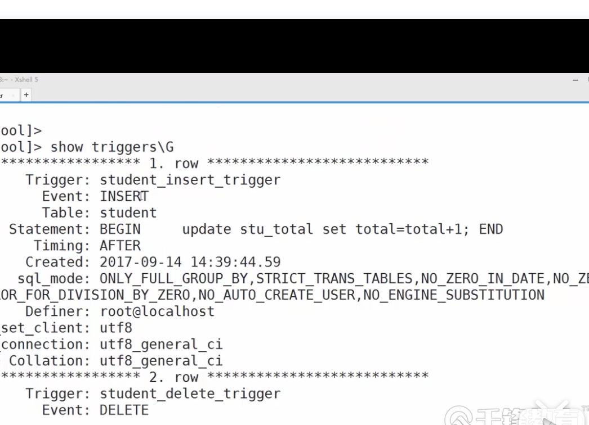
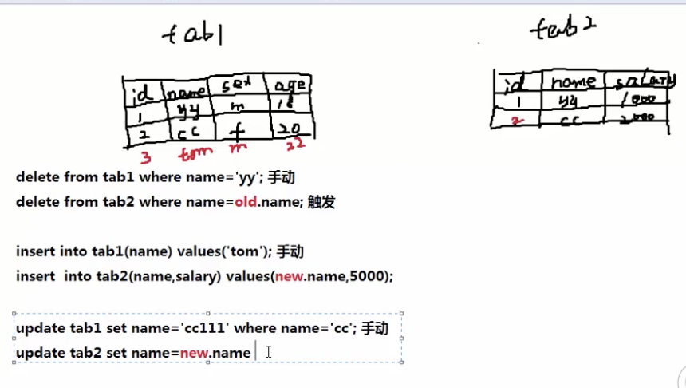

# Mysql知识补漏

## 1. 修改密码

```mysql
$ vim /etc/my.conf
# 结尾加上
skip-grant-tables # 跳过密码
# 重启mysql服务器
$ service mysqld restart

# mysql 里面有个user表
$ select user,host,authentication_string from mysql.user;
# 修改mysql密码
$ update mysql.user set authentication_string=password('123456') where user='root';
# 密码方式进入mysql
$ vim /etc/my.conf
# 删掉 skip-grant-tables 
# 重新启动mysql
```

## 2. Triggers触发器

 ### 2.1 Triggers语法

```mysql
mysql> \d$$ # 定义结束符
mysql> create trigger 触发器名称 before|after 触发事件delete ,update insert 
mysql> on 表名 for each row #触发影响的row
mysql> BEIGIN 
mysql> 触发器程序体; 比如update ,delete 
mysql> END$$
```


### 2.2 创建Triggers

```mysql
# 创建学生表
mysql> create table student(
	id int unsigned auto_increment primary key,
  name varchar(50)
);
# 创建学生总数表
mysql> create table stu_total(
	total int
);
# 插入初值
mysql> insert into stu_total values(0);
# 创建触发器 ，让学生表插入一个学生，学生总数表随之增加
mysql> \d$$ # 定义结束符
mysql> create trigger student_insert_trigger after insert on student 
		> for each row 
		> BEIGIN
		> update stu_total set totol=total+1; # stu_total 必须有值
		>END$$
# 在创建一个触发器
mysql> create trigger student_delete_trigger after delete on student
		 > for each row 
     > BEIGIN
     > update stu_total set total=total-1;
     > END$$
 # 查看触发器
 mysql > show triggers\G
 
 # 插入添加触发器
 mysql> insert into student(name) values('jsack');
 mysql> select *from stu_total;
 # 插入多个值 查看触发器
 mysql> insert into student(name) values('jsack'),('tom'),('ali');
 mysql> select *from stu_total; # 4
 
 # 测试删除触发器
 mysql> delete from student where name='tom';
 mysql> select *from stu_total; # 3
 
 ### 注意要点
 #1. stu_total 必须要有值 否则无法运算
```

- 效果图




### 2.3 触发器案例1

```tex
案例:
	A表中某人死掉以后，B表中的某人也应该死掉
	或者
	A表中的某个用户名字改了以后，B表中的也要改
```


```mysql
#创建表tabl
mysql> drop table if exists table1;
mysql> create table table1(
	id int primary key auto_increment,
  name varchar(50),
  sex enum('m','f'),
  age int
);

# 创建表table2
mysql> drop table if exists table2;
mysql> create table table2(
	id int primary key auto_increment,
  name varchar(50),
  salary double(10,2) #薪水
);

# 查看
mysql>desc table1;
mysql>desc table2;

# 触发器 删除 tabl_after_delete_trigger
# 当table1表删除记录后，自动删除table2表中对应的记录
mysql> \d$$
mysql> create trigger tabl_after_delete_trigger after delete on table1
mysql> for each row 
mysql> BEIGIN
 # mysql> delete from table2 where name=old.name;	#old.name 
mysql> delete from table2 where id=old.id;	 # 删除一定要使用主键 primary key 
mysql> END$$

# 触发器 更新 tabl_after_update_trigger
# 当table1更新后，自动更新table2
mysql> \d$$
mysql> create trigger tabl_after_update_trigger after update on table1
mysql> for each row 
mysql> BEIGIN
# mysql> update from table2 set name=new.name    # 这样写有问题 删除一定要使用主键 primary key 
# mysql> where name= old.name  # 更新的时候一定要全部更新
mysql> update from table2 set id=new.id,name=new.name,sex=new.sex,age=new.age   # 修改后
mysql> where id= old.id 
mysql> END$$


# 触发器 增加table_after_insert_trigger
# 当table1增加记录后，自动增加到table2中
mysql> \d$$
mysql> create trigger table_after_insert_trigger insert into on table1
mysql> for each row
mysql> BEIGIN
mysql> insert into table2(name,salary) values(new.name,5000)
mysql> END$$

# 测试
mysql> insert into table1(name,sex,age) values('tom','m',20);
mysql> select *from table1;
mysql> insert into table1(name,sex,age) values('ajx','f',20);
mysql> update table1 set name='ajxcc' where name='ajx'; 
mysql> select *from table2;
mysql> delete from table1 where name='ajxcc';
mysql> select *from table2;

# 演示删除问题
mysql> select * from table1;
mysql> insert into table1(name,sex,age) values('tom','m',20);
mysql> insert into table1(name,sex,age) values('tom','m',10);
mysql> insert into table1(name,sex,age) values('tom','m',15); #插入很多tom
# 删除
mysql> delete from table1 where id=6;
mysql> select * from table2;
# 结果表2 中的tom 全部被删除了，清光了 严重问题
# 删除一定要根据主键 ===**
```



### 2.4 触发器案例2


```mysql
# 创建表1
mysql> create table t1(
	id int primary key auto_increment,
  name varchar(50),
  salary float(10,2)
);
# 创建表2
mysql> create table t2(
	id int primary key auto_increment,
  total_num int,			//员工总数
  total_salary float(10,2)	//员工总薪水
);
# 创建触发器
mysql> \d$$
mysql> create trigger t1_after_insert_trigger 
mysql> after insert on t1 
mysql> for each row # each row 每一行都会触发
mysql> BEIGIN
mysql> update t2 set total_num=total_num+1,total_salary=total_salary+new.salary;
mysql> END$$

# 必须给个初始值
mysql> insert into t2(total_num,total_salary) values(0,0);
mysql> select * from t2;

# 使用测试
mysql> insert into t1(name,salary) values('tian',6000),('tom',5000);

# 还要做update，delete 触发器
# 仿照 案例1 书写 before 发生在事件触发之前，after 发生在事件触发之后
```


## 3. 存储过程Procedure

### 3.1 概述

> 描述: 存储过程和函数是实现经过编译并存储在数据库中的一段SQL语句的集合。

- 优点： 
  - 存储过程注释在创建时编译
  - 而SQL语句没执行一次就编译一次，所以使用存储过程可以提高数据库执行速度
  - 简化复杂操作，结合事务一起封装
  - 复用性好
  - 安全性高，可指定存储过程的使用权
- 说明
  - 并发量少的情况下，很少使用存储过程
  - 并发量高的情况下，为了提高效率，用存储过程比较多

### 3.2 语法

```mysql
//创建存过过程语法:
create procedure sp_name(参数列表)
	[特性 ...]过程体
	
	存储过程的参数形式：[IN] [OUT] [INOUT] 参数名 类型
	IN 			输入参数
	OUT 		输出参数
	INOUT  	输入输出参数
	
# demon
delimiter $$
create procedure 过程名（形式参数列表）
beigin 
	SQL语句
end $$
delimiter;

调用
call 存储过程名（实参列表）
```


### 3.3创建

- none 没有参数的情况下

```mysql
# none 没有参数的情况下
mysql> \d $$
mysql> create procedure p1()
mysql> BEIGIN
mysql> select count(*) from mysql.user;
mysql> END $$

# 调用
mysql> \d $$
mysql> call p1();

```

- 没有参数传递

```mysql
mysql> create table t11(
	id int,
  cc varchar(50)
);

# 定义储存过程  
mysql> \d $$
mysql> create procedure autoinsert_t11()	//没有定义形参 autoinsert_t11()
mysql> BEIGIN
mysql> declare i int defaut 1;		//定义变量i 初始值 1 
mysql> while(i<=20)do		//while 判断语句
mysql> insert into t11 values(i,md5(i));	//sql插入语句
mysql> set i=i+1;			
mysql> end while;
mysql> END $$

# 类似shell 脚本没有变量
```


- 有参数传递 IN

```mysql
#  IN  方向类型 
mysql> \d $$
mysql> create procedure autoinsert_t112(IN a int) # a int  , ch varchar(50)
mysql> BEIGIN 
mysql> declare i int default 1;
mysql> while(i<=a)do
mysql> insert into t11 values(i,md5(i));
mysql> end while
mysql> END $$

# 调用
mysql> \d $$
mysql> call autoinsert_t112(40);		#传参
mysql> select * from t11;

# mysql定义变量
# set @num=20 #定义变量
mysql>select @num;
mysql>set @num=20; #变量赋值 定义变量
mysql>call autoinsert_t112(@num);

#调用
mysql> set @num=100;
mysql> call autoinsert_t112(@num);
```


- 传出 OUT

```mysql
mysql> \d $$
mysql> create procedure p2(OUT param1 INT) # OUT 传出参数
mysql> BEIGIN
mysql> select count(*) INTO param1 from mysql.user; # INTO param ：表示吧count 的结果into 到param1
mysql> END $$

# 调用
mysql> call p2(@a);
mysql> select @a;
```


- IN 和OUT 

```mysql
# 统计指定部门员工数 案例1：
mysql> \d $$
mysql> create procedure count_num(INT p1 varchar(50),OUT p2 int)
mysql> BEIGIN
mysql> select count(*) into p2 from company.employerr
mysql> where post=p1;
mysql> END $$

# 调用
mysql> \d $$
mysql> call count_num('hr',@a);
mysql> select @a;
mysql> END $$

# 统计指定部门工资超过5000的总人数 案例2：
mysql> \d $$
mysql> create procedure count_num5(IN p1 varchar(50),IN p2 float(10,2),OUT p3 int)
mysql> BEIGIN
mysql> select count(*) into p3 from employer
mysql> where post=p1 and salary>=p2;
mysql> END $$

# 手动查询一下 
mysql> select count(*) from employer where post='hr' and salary>=2000;

# 输入查询
mysql> \d $$
mysql> call count_num5('hr',2000,@a);
mysql> select @a;
mysql> END $$
```


- INOUT

```mysql
mysql> \d $$
mysql> create procedure proce_param_inout(INOUT p1 int)
mysql> BEIGIN
mysql> if(p1 is not null)then
mysql> 		set p1=p1+1;
mysql> else 
mysql> 		select 100 into p1;
mysql> end if;
mysql> END $$

# 调用
mysql> \d $$
mysql> call proce_param_inout(@a);
mysql> select @a;
mysql> END $$

```

