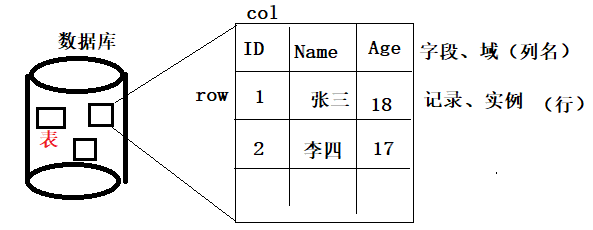

## 数据库简介

### 数据库结构

- 数据库：用来存储数据的仓库。按照 数据库、表、表数据组织数据信息。
- 表：由行（记录、实例）、列（字段、域）组成。



### MySQL的安装

- sudo apt install mysql-server    ( 整个mysql数据的操作过程，是CS模型通信 )
- mysql -V 查看版本号
- 初次安装的MySQL数据库，登录密码存放位置，参照安装提示信息。

### ==MySQL的启动==

- 方式1：
    - sudo /etc/init.d/mysql  start/stop/restart/status				( mysql 是一个shell脚本文件。)
- 方式2：
    - sudo service mysql start/stop/restart/status
- 查看启动是否成功：
    1. sudo service mysql status		--- 绿点： 代表启动成功。 白点：未启动
    2. sudo /etc/init.d/mysql status
    3. ps xua | grep mysql    -----看到 mysqld 守护进程正在运行。

/* 注意Mac 电脑下:mysql.server start/restart/stop/status;*/

 ### ==MySQL 设置密码===
 
 - mysql密码文件: 
 	- sudo vim /etc/mysql/debian.cnf
 
 - 输入.cnf password密码:
   - mysql -u debian-sys-maint -p 
  
 - 修改密码:
  - update mysql.user set authentication_string=password('password') where user='root'and Host = 'localhost';
  - ALTER USER 'root'@'localhost' IDENTIFIED WITH mysql_native_password BY '123456';
 
 - 千万别退出 ： 还没保存密码
 -  mysql> flush privileges;
	 mysql> exit;

### 使用 MySQL客户端登录MySQL服务器

1. 完整登录语法：mysql -h服务器IP地址 -P服务器端口号 -u用户名 -p密码。
    1. mysql -h192.168.6.108 -P3306 -uroot -p123456
2. 本地登录忽略 IP、Port
    1. mysql -uroot -p123456
    2. mysql -uroot -p 回车。 不显示登录密码。
3. 退出：quit、exit、\q

### ==常见的数据库==

- 关系型数据：
    - MySQL 、SQL server、Oracle、SQLite、PostgreSQL、DB2、infomix ....
- 非关系型数据。
    - noSQL： MongoDB、redis


## 数据库的CURD


### 查询

- show databases： 查看当前MySQL中，有哪些数据库
- show create database 数据库名 ： 查看创建 该数据库的 语法。

### ==创建==

- 完整语法：create database [if not exists] \`数据库名` [字符集编码]

    ```sql
    create database if not exists `mydb1` charset=utf8
    create database if not exists `mydb1` character set utf8
    ```

- 简写:

    ```sql
    create database `mydb1`; 
    
    如果 mydb1 已经存在，报错，不会继续向后执行。
    默认的字符集为：latin1（只能存储 字母、阿拉伯数字）不推荐。 推荐utf8
    常见字符集：GBK（全部中文）、GB2312（简体中文）、utf8（全部语言）、utf8mb4（全部语言+emoji）
    ```

    

### 删除

- 语法：drop database [if exists] \`数据库名`

    ```go
    drop database if exists mydb2;
    ```


### 修改

- 语法：alter database  [if exists] \`数据库名` 字符集

    ```sql
    show create database mydb1;
    可以大小写混用
    SHOW Create DATABASE mydb1;
    ```

- 默认认为数据库名 不能修改。


## ==表的CURD==

### 查询

1. 查询数据库的表

    1. 必须先指定使用的 数据库：  use 数据库名。
    2. show tables；

2. 查询创建数据库表的语句：

    - 语法： show create table [if exists] \`表名` ;

        ```sql
        show create table t1;
        ```

    - 语法： show create table [if exists] \`表名`\G

        ```go
        show create table t1\G  按行显示创建表的信息。
        ```

3. 查询表结构：

    - 语法：desc 表名

        ```sql
         desc t1;
        ```

        

### 创建

- 创建简单表

    ```go
    语法：
    create table [if not exists] `表名` (
        字段名  字段类型,
        字段名  字段类型,
        ....
    )
    e.g.
    create table if not exists `t1` (
        id  int,
        name  varchar(20) 
    );
    create table `t1` (
        id  int,
        name  varchar(20) 
    );
    ```

    

- 创建复杂表

    ```sql
    语法：
    create table [if not exists] `表名` (
        字段名  字段类型 [null|not null][auto_increment][primary key][comment],
        字段名  字段类型 [default][comment],
        ....
    )engine=引擎名 charset=字符编码
    
    null | not null   	空|非空
    default	          	默认值
    auto_increment    	自动增长
    primary key       	主键
    comment           	备注
    engine           	引擎 innodb(默认) 、myisam 引擎决定数据存储的方式
    
    e.g.
    create table if not exists `t2` (
        id  int auto_increment primary key comment '主键',
        name  varchar(20) not null comment '姓名',
        phone varchar(13) not null comment '电话',
        `add` varchar(100) default '地址不详' comment '地址'
    )engine=innodb charset=utf8;
    ```

- 在 A 数据库中，向B数据库中创建表：

    - 语法：create table 数据库名.表名 （ 字段名 字段类型，字段名 字段类型 。。。）；

        ```go
        create table mydb1.t5( id int, name varchar(20) );
        ```

### 删除

- 语法：

    - drop table [if exists] 表名1，表名2 。。。;

        ```go
        drop table if exists t3, t4;
        ```

### 修改

- 总体的语法特性：alter table 表名 关键字 。。。

#### 添加一个新字段

- 语法： alter table 表名 add[column] 新字段名 数据类型 [位置]；

    ```sql
    alter table t2 add column age int(9);	将新字段添加到 最后一列
    alter table t2 add column age int(9) first;	将新字段添加到 第一列
    alter table t2 add column age int(9) after phone;	将新字段添加到 phone列后
    ```

#### 删除字段

- 语法：alter table 表名 drop[column] 字段名；

    ```sql
    alter table t2 drop column age;
    ```

#### 修改列名、列类型

- 语法：alter table 表名 change[column] 旧列名 新列名 新数据类型；

    ```sql
    alter table t2 change column name Fullname char(10);
    ```

#### 修改列类型

- 语法：alter table 表名 modify[column] 列名 新数据类型；

    ```sql
    alter table t2 modify column name varchar(18);
    change 也可以完成：
    alter table t2 change column name name varchar(40);
    ```

#### 重命名

- 语法1： rename table 旧表名 to 新表名；

- 语法2： alter table 旧表名 rename to 新表名；

    ```sql
    rename table t2 to mytable2;
    alter table mytable2 rename to t2;
    ```

#### 修改引擎

- 语法： alter table 表名 engine=新引擎名

    ```sql
    alter table t2 engine=myisam;
    ```

#### 修改字符集

- 语法： alter table 表名 charset=新字符集;

    ```sql
    alter table t2 charset=GBK;
    ```

    

### ==复制表==

- 只复制表数据，不复制表属性

    - 语法：create table 新表名 select 字段名，字段名 from 表名。

        ```sql
         create table t4 select id, Fullname, `add` from t2;-- 复制部分表字段，创建新表
         或
          create table t4 select * from t2; -- 复制全部表字段，创建新表。
        ```

- 复制表属性，不复制表数据

    - 语法：create table 新表名 like 表名。

        ```sql
        create table t5 like t2; 
        -- t5表与t2具有完全相同的属性（auto_increment primary key not null）
        ```

- 复制表数据、属性，产生新表

    1. 先复制表属性，产生新表：

        ```sql
        create table t6 like t2; 
        ```

    2. 查询原表的所有数据，插入到新表中。

        ```sql
        insert into t6 select * from t2;
        ```

        

## ==表数据的CURD==

### 插入

- 插入全部列

    - 语法1： insert into 表名（全部字段名）values(字段名对应的值)；

        ```sql
         insert into t2 (id, name, phone, `add`) values(1, 'zhangsan', '12345', 'beijing')
        ```

    - 语法2： insert into 表名 values(所有字段名对应的值)；

        ```sql
         insert into t2 values(1, 'zhangsan', '12345', 'beijing')
        ```

- 插入部分列

    - 语法： insert into 表名（字段名1，字段名2）values(字段名1的值， 字段名2的值)；

        ```sql
        insert into t2(id, phone) values(1, '12345')
        没有指定的字段，会隐式插入空值。
        ```

    - 显示插入null：

        - insert 的 value中写入 null
            - 对于 auto_increment 列：会自动增长。
            - 对于 default 列：会写入null

    - 隐式插入null：

        - insert时，不插入该列数据，默认隐式插入 null
            - 对于 auto_increment 列：会自动增长。
            - 对于 default 列：会写入默认值。

- 一次插入多条

    - 插入全部列:

        - 语法： insert into 表名  values(所有字段的值)，(所有字段值),（所有字段值）；

        ```sql
        insert into t2 values(1,'AA','12','beijing'),(2,'BB','34','shanghai'),(3,'CC','56','changsha')
        一次向t2表中，添加 3 行数据。
        ```

    - 插入指定列：

        - 语法： insert into 表名（选定字段名）values(选定字段对应值)，(选定字段对应值)，（选定字段对应值）；

        ```sql
        insert into t2(id, name, phone) values(1,'李白','123'),(2,'杜甫','456'),(3,'陆游','789');
        ```

### 更新

- 语法：update 表名 set 字段名=字段值，字段名=字段值，。。。 [where 条件];

    ```sql
    update t2 set Fullname='杜甫',phone='666' where id>5 or id <2;
    ```

### 删除 

- 语法：delete from 表名 [where 条件];

    ```sql
    delete from t2 where Fullname='杜甫';
    ```

- 清空表：

    - 方法1： delete from 表名； 
        - 此种方法，不会摧毁，继续插入数据时，延续原来的自动增长计数 。
        - 不会释放表空间。效率低。
    - 方法2： truncate 表名；
        - 此种方法，摧毁表，再按表结构重建。重置自动增长计数。
        - 会释放表空间。效率高。

### 查询

- 查询全部列；

    - select * from 表名;

- 查询指定列，指定数据。

    - 语法：select 列名，列名... from 表名 [where 条件]；

        ```sql
        select Fullname, `add` from t2 where id=2 or id=4;
        ```

        

## SQL语句分类

- DML语句：

    - insert、update、delete、select

- DDL语句：

    - create、truncate、alter、drop ...

- DCL语句：

    - commit、rollback

    

## MySQL数据库的数据管理方式--引擎

- 当创建新的 数据库， 会在 /var/lib/mysql 目录中，自动生成新的 同名目录。
- InnoDB：
    - 表名.frm: 记录当前表架构。
    - 表名.ibd: 表数据的索引。
    - InnoDB引擎的表数据 ，存放在 /var/lib/mysql 目录中的 ibdata1 文件中。 该文件会有MySQL 系统自动管理，扩容。 ibdata1 达到存储数据上限， 会自动生成 ibdata2、ibdata3 。。。

- myisam：
    - 表名.frm：记录当前表架构。
    - 表名.MYD:  存储表数据。
    - 表名.MYI: 存储表的索引。
- ==MySQL数据库默认使用的引擎为 Innodb 引擎（ 支持事务—— 关系型数据库 ）==


## 字符集

```sql
show variables like 'char%'; --查看MySQL系统在一次 SQL语句执行过程中，涉及的字符集。
+--------------------------+----------------------------+
| Variable_name            | Value                      |
+--------------------------+----------------------------+
| character_set_client     | utf8                       |
| character_set_connection | utf8                       |
| character_set_database   | latin1                     |
| character_set_filesystem | binary                     |
| character_set_results    | utf8                       |
| character_set_server     | latin1                     |
| character_set_system     | utf8                       |
+--------------------------+----------------------------+
```


- 结论：要保证一次 SQL语句执行 成功（不出现乱码）。 至少要保证如下的4处采用一致的字符编码。

    ****

character_set_client：客户端（文字版）字符集。（受 Linux 系统影响）

character_set_connection ：客户端与服务器建立的连接的字符集。

character_set_database：在MySQL系统中，创建的数据库的字符集。

 character_set_results： MySQL服务器应答客户端请求sql语句采用的字符集。m