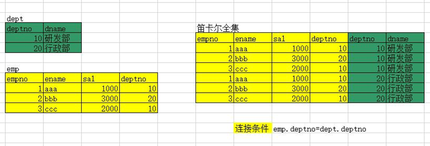

## 查询语句

- 语法：select
    [选项] 列名 [from 表名] [where 条件] [group by 分组] [having 条件] [order by 排序] [limit 限制]

### 字段表达式：

```sql
select '锄禾日当午';
select 10 * 10;
```

### ==别名==

完整语法：表达式 as “别名”

```sql
select 10 * 10 as "乘法";
```

省略：“”。要求别名中没有 关键字或特殊字符。

```sql
select 10 * 10 as 乘法;
```

省略 as 关键字

```sql
select 10 * 10 乘法;
```

### dual 表

- 伪表：不是一张真正的表，存在的目标是为了凑SQL语法。

    ```sql
    select '锄禾日当午' as "字符串", 10*10 as 加法, 10-3 减法, 10/5 as "除 法" from dual;
    ```

- MySQL 不强制要求使用。

 

### ==导入sql脚本==

1. 登录MySQL客户端。

2. 将脚本文件存放在 MySQL服务器所在系统。提取绝对路径

3. 在MySQL客户端中使用命令：source 脚本文件的绝对路径。

    ```sql
    mysql> source /home/itcast/mysql.sql
    ```

    

### ==where 子句==

#### in not in

- 单值操作符：

    - \> >= < <= =(没有==) !=

- 多值操作符：

    - in ： 在集合中
    - not in ： 不在集合中

    ```sql
    mysql> select * from stu where stuAddress in ('北京','上海','河南','天津');
    ```

    

#### between ... and   not between ... and 

- 在 。。。 范围之内。闭区间。小值在前，大值在后。

    ```sql
    mysql> select * from stu where stuAge not between 17 and 22;
    +--------+-----------+--------+--------+---------+------------+------+------+
    | stuNo  | stuName   | stuSex | stuAge | stuSeat | stuAddress | ch   | math |
    +--------+-----------+--------+--------+---------+------------+------+------+
    | s25302 | 罗况      | 男     |     31 |       3 | 上海       |   77 |   76 |
    | s25304 | 杜子腾    | 男     |     28 |       4 | 天津       | NULL |   74 |
    | s25318 | 郭迪辉    | 男     |     26 |       6 | 天津       |   86 |   92 |
    | s25319 | 拎壶冲    | 女     |     23 |       5 | 河北       |   74 |   67 |
    | s25320 | Tom       | 男     |     24 |       8 | 北京       |   65 |   67 |
    | s25321 | Tabm      | 女     |     23 |       9 | 河北       |   88 |   77 |
    +--------+-----------+--------+--------+---------+------------+------+------+
    ```


#### is null  is not null

- MySQL中 比较 null 值，不能使用 = 和 != 。 必须使用 is null 和 is not null

    ```sql
    查找缺考的学生：
    select * from stu where math is null or ch is null;
    
    查询没有缺考的学生：
    select * from stu where math is not null and ch is not null;
    ```

    

#### 通配符、模糊查询

- 通配符：

    - ’_’ : 匹配任意一个字符。
    - ‘%’：匹配任意多个字符 （包括0）。

- 模糊查询：like 

    ```sql
    查询姓史的同学
    select * from stu where stuname like '史%';
    
    查询 以 char 开头的 变量
    show variables like 'char%';
    
    ```

    

### ==order by 排序==

- 排序操作，是在查询到的结果集基础上进行排序。 不是直接操作数据库数据。
- order by 作用于 后面的所有列。
- asc：按升序排【默认】。作用于前面的一列。
- desc：按降序排序。作用于前面的一列。

```sql
-- 语文成绩降序排列
select * from stu order by ch desc;

-- 按年龄升序，语文成绩降序排列
select * from stu order by stuage asc, ch desc;

-- 按年龄降序，总成绩升序排列
select *, (ch+math) as "总成绩" from stu order by stuage desc, 总成绩 asc;
-- 分析：给表达式 (ch+math) 创建别名“总成绩”。在查询的结果集上，当年龄相同时，按 总成绩 升序排序。

mysql> select stuno, stuname, stuage, (ch+math) 总成绩 from stu order by stuage desc, 总成绩 asc;
+--------+-----------+--------+-----------+
| stuno  | stuname   | stuage | 总成绩    |
+--------+-----------+--------+-----------+
| s25318 | 郭迪辉    |     26 |       178 |
| s25320 | Tom       |     24 |       132 |
| s25321 | Tabm      |     23 |       165 |
| s25301 | 范建      |     22 |      NULL |
| s25304 | 杜子腾    |     22 |      NULL |
| s25303 | 申晶冰    |     22 |       137 |
| s25319 | 拎壶冲    |     22 |       141 |
| s25302 | 罗况      |     22 |       153 |
| s25305 | 史泰香    |     17 |       128 |
+--------+-----------+--------+-----------+
9 rows in set (0.00 sec)
```

- MySQL中所有的null值 运算结果均为 null。

- ifnull 函数 可以处理null 值：

    - 语法 ifnull(参1， 参2)： 当 参1 为 null的时候， 函数 ifnull 的调用结果为 参2。否则返回 参1；

        ```sql
        mysql> select stuno, stuname, ifnull(ch,0) ch, ifnull(math,0) math, 
            -> ifnull(ch,0)+ifnull(math,0) as "总成绩"
            -> from stu;
        +--------+-----------+----+------+-----------+
        | stuno  | stuname   | ch | math | 总成绩    |
        +--------+-----------+----+------+-----------+
        | s25301 | 范建      | 80 |    0 |        80 |
        | s25302 | 罗况      | 77 |   76 |       153 |
        | s25303 | 申晶冰    | 55 |   82 |       137 |
        | s25304 | 杜子腾    |  0 |   74 |        74 |
        | s25305 | 史泰香    | 72 |   56 |       128 |
        | s25318 | 郭迪辉    | 86 |   92 |       178 |
        | s25319 | 拎壶冲    | 74 |   67 |       141 |
        | s25320 | Tom       | 65 |   67 |       132 |
        | s25321 | Tabm      | 88 |   77 |       165 |
        +--------+-----------+----+------+-----------+
        9 rows in set (0.00 sec)
        
        ```


- 缺考的科目成绩为 0， 求总成绩。按年龄降序、总成绩升序 排序。

```sql
mysql> select stuno, stuname, stuage, ifnull(ch,0)+ifnull(math,0) as "总成绩"
    -> from stu
    -> order by stuage desc, 总成绩 asc;
+--------+-----------+--------+-----------+
| stuno  | stuname   | stuage | 总成绩     |
+--------+-----------+--------+-----------+
| s25318 | 郭迪辉     |     26 |       178 |
| s25320 | Tom       |     24 |       132 |
| s25321 | Tabm      |     23 |       165 |
| s25304 | 杜子腾     |     22 |        74 |
| s25301 | 范建       |     22 |        80 |
| s25303 | 申晶冰     |     22 |       137 |
| s25319 | 拎壶冲     |     22 |       141 |
| s25302 | 罗况       |     22 |       153 |
| s25305 | 史泰香     |     17 |       128 |
+--------+-----------+--------+-----------+

```


### ==组函数==

- 单行函数：
    - 对数据表中的单行数据进行变换，最终产生 一个结果。 如：ifnull()
- 多行函数(组函数)： 自动滤空
    - 对数据表中的多行数据进行变换，最终产生 一个结果。
    - 常用函数
        - sum() 求和：自动滤空
        - avg() 求平均值：自动滤空
        - max() 求最大值：自动滤空
        - min() 求最小值：自动滤空
        - count() 统计记录数： 自动滤空。但！在使用时，通常选择主键，或非空字段。或者使用 count(*): MySQL 系统自动选择非空字段来进行统计。

### ==分组查询==

- 使用 group by 关键字对 查询结果进行分组。

- 语法限定：
    - select 之后的查询列表中，所有没有出现在组函数中的列，都必须出现在 group by 之后。

```sql
-- 按性别分组，求平均年龄
select stusex, avg(stuage)
from stu
group by stusex
```

```sql
-- 求各个地区，男性平均年龄 和 女性平均年龄。
select stuaddress, stusex, avg(stuage)
from stu
group by stuaddress, stusex
```


### ==having 分组过滤==

- having 是在 group by 分组查询结果集上，再进行筛选。
- where 和 having 区别：
    1. 能对 having使用组函数。 where 不能使用组函数。
    2. where 是直接对数据库进行过滤。having 对查询结果集进行过滤。
- SQL语句的实现，既能使用where也能使用 having，首选 where

```sql
-- 查询平均年龄大于 25 的地区：
select stuaddress, avg(stuage)
from stu
group by stuaddress
having avg(stuage) > 22  -- 正确实现方法

select stuaddress, avg(stuage)
from stu
where avg(stuage) > 22   -- where 子句不允许使用 组函数。
group by stuaddress

```


### limit 限定

- 语法： limit 起始位置（从0开始），数量。

```sql
-- 找出班级总分前三名
select *, (ifnull(ch,0)+ifnull(math,0)) 总分
from stu
order by 总分 desc
limit 0,3;
```

- 也可以使用在 update 和 delete 中。

```sql
-- 将表中默认存储序下，前2个北京地区的学员，语文成绩 + 10分。
update stu set ch = ch+10 where stuaddress='北京' limit 2;  -- 不能写成 0,2
```


## 多表查询

### ==笛卡尔集==

- 也叫笛卡尔全集。—— 一定包含错误信息。
    - 笛卡尔集行 = 表1行 x 表2行
    - 笛卡尔集列 = 表1列 + 表2列



- 使用多表查询，必须要滤除笛卡尔集错误信息。使用 两张表的公共字段。
    - 表1的公共字段 =  表2的公共字段。

### ==内连接==

- 语法1： 

    ```sql
    select 表名.字段名, 表名.字段名, .... 
    from 表名1 别名 , 表名2 别名  
    where 表名1.公共字段 = 表名2.公共字段。
    
    -- 查询 stuinfo 表和 stumarks 表  的 姓名、学号、性别、笔试成绩、上机成绩：
    select stuname, i.stuno, stusex, writtenExam, labExam
    from stuinfo i, stumarks m
    where i.stuno = m.stuno
    ```

    

- 语法2： where --> on        “，” ---> inner join

    ```sql
    select 表名.字段名, 表名.字段名, .... 
    from 表名1 别名 inner join 表名2 别名  
    on 表名1.公共字段 = 表名2.公共字段。
    
    -- 查询 stuinfo 表和 stumarks 表  的 姓名、学号、性别、笔试成绩、上机成绩：
    select stuname, i.stuno, stusex, writtenExam, labExam
    from stuinfo i inner join stumarks m
    on i.stuno = m.stuno
    ```

    

### ==外连接==

- 外连接使用的场景：
    
- 对应 多表查询结果中， 包含某一个表中不满足笛卡尔集滤除条件的信息。
    
- 左外连接： 包含左边表的信息。

    - 语法：

        ```sql
        select 字段名
        from 表1 left join 表2 
        on 表1.公共字段 = 表2.公共字段
        -- 最终包含表1的全部信息。
        
        -- 查询 stuinfo 表和 stumarks 表 的 姓名、笔试成绩、上机成绩。要包含 stuinfo 表的所有数据。
        select i.stuno, stuname, writtenExam, labExam
        from stuinfo i left join stumarks m
        on i.stuno = m.stuno
        ```

        

- 右外连接 ：包含右边表的信息。
    - 语法：

        ```sql
        select 字段名
        from 表1 right join 表2 
        on 表1.公共字段 = 表2.公共字段
        -- 最终包含表2的全部信息。
        
        -- 查询 stuinfo 表和 stumarks 表 的 姓名、笔试成绩、上机成绩。要包含 stuinfo 表的所有数据。
        select m.stuno, stuname, writtenExam, labExam
        from stuinfo i right join stumarks m
        on i.stuno = m.stuno
        ```

### 交叉连接

- cross join
- 没有连接条件，就是笛卡尔集（包含错误数据）
- 有有连接条件，相当于 内连接。


### ==自然连接==

- 不是连接方式的一种。只是简化连接的书写方式。

- 自然内连接 ： natural join

    ```sql
    select * from stuinfo natural join stumarks;
    ```

    

- 自然左外连接： natural left join

    ```sql
    select * from stuinfo natural left join stumarks;
    ```

    

- 自然右外连接：natural right join

    ```sql
    select * from stuinfo natural right join stumarks;
    ```

特性：

1. 表连接通过同名的字段来连接的
2. 如果没有同名的字段返回笛卡尔全集
3. 会对结果进行整理，整理的规则如下
    1. 连接字段保留一个 
    2. Select * 查询时，连接字段放在最前面
    3. 左外连接左表在前，右外连接右表在前


## 子查询

### 基础子查询

- 子查询就是 sql 语句的 嵌套。外层查询称之为 “父查询”， 内层查询语句为“子查询”。 通常是子查询给父查询传参。

```sql
-- 查找笔试最高分的学生. 
-- 方法1：
select * 		-- 第三步
from stuinfo
where stuNo = (
	select stuno 			-- 第二步
	from stumarks
	where writtenExam = (
		SELECT max(writtenExam)			-- 第一步
		from stumarks
	)
)
-- 方法2：
select * 			-- 第二步
from stuinfo
where stuno = (
	select stuno			-- 第一步
	from stumarks
	order by writtenExam desc
	limit 1
)

```


### in 和 not in

-  当子查询返回结果集 为 多个时，使用 in 和 not in

```sql
-- 查找笔试成绩及格的同学
select *			-- 第二步
from stuinfo
where stuno in (
	select stuno			-- 第一步
	from stumarks
	where writtenExam >= 60 
)

-- 查询笔试成绩没有通过的同学（不及格，缺考）
select *			-- 第二步
from stuinfo
where stuno not in (
	select stuno			-- 第一步
	from stumarks
	where writtenExam >= 60 
)
```


### exists 和 not exists 

- exists  判断存在。通常结合 where

    ```sql
    -- 如果有人笔试超过80分，就显示所有学生信息
    select *
    from stuinfo
    where exists (
        select *			-- 第一步
    	from stumarks
    	where writtenExam > 80 
    )		-- 没有输出
    ```

    

- not exists 判断不存在。通常结合 where

    ```sql
    -- 如果没有人笔试超过80分，就显示所有学生信息
    select *
    from stuinfo
    where not exists (
        select *			-- 第一步
    	from stumarks
    	where writtenExam > 80 
    )    	-- 有输出。
    ```

    

### 子查询分类

1. 标量子查询：子查询返回一个结果。父查询可以使用单行操作符。 
2. 列子查询：子查询返回一列上的一个或多个结果。
3. 行子查询：子查询返回一行上的一个或多个结果。
4. 表子查询：子查询返回一个结果集（当成表看待）。

- 行子查询：

    ```sql
    -- 查询语文成绩最高的男生和女生 的学生信息
    
    select * 	-- 第二步
    from stu
    where (stusex, ch) in (
        select stusex, max(ch)	-- 第一步
        from stu
        group by stusex
    )
    ```

    

- 表子查询：

    ```sql
    -- 题目：填空 select * _______ 只查询 stu表的 姓名、学号、性别、地址
    
    select * 	-- 第二步
    from (
    	select stuno, stuage, stusex, stuaddress	-- 第一步：按指定列查询，得到结果集，当表看待。
        from stu
    ) as mystu;  -- 查询结果当成表使用时，必须指定别名。
    ```

    

- 课后练习题：
    - 更新stu表，将总成绩前3名的学生的语文成绩各+1分。

