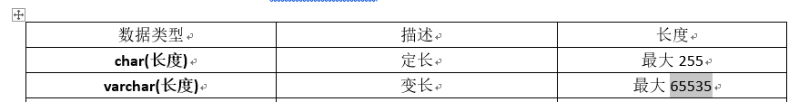
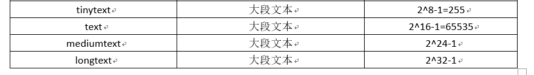

## =MySQL数据类型

### ==整型==


- 显示宽度：语法： 字段名 数据类型 (宽度)
    - 当插入表数据 不足 “宽度” 时， 如果在创建表时指定了 zerofill 。 会自动添加前导0.
    - 实际插入表的数据，受 数据类型的取值范围影响。不受显示宽度影响。

```sql
mysql> create table t6(
    -> id int(5),
    -> age int(5) zerofill
    -> );
    
mysql> select * from t6;
+------+-------+
| id   | age   |
+------+-------+
|   11 | 00022 |
+------+-------+

```


### ==浮点型==


- 语法：float(总位数，小数位数)   double(总位数，小数位数)   
    - 整数位数 = 总位数 - 小数位数： 如果超出 报错！！
    - 小数位数：默认四舍五入。

```sql
mysql> create table t7(
    -> num1 float(5,2),
    -> num2 double(7,4)
    -> );
mysql> insert into t7 values(3.14159265, 48.64765219);
Query OK, 1 row affected (0.01 sec)

mysql> select * from t7;
+------+---------+
| num1 | num2    |
+------+---------+
| 3.14 | 48.6477 |
+------+---------+

mysql> insert into t7 values(346.14159265, 1489.64765219);
ERROR 1264 (22003): Out of range value for column 'num2' at row 1

```

- 如果使用 浮点数 存储数据。默认允许有精度丢失。

### 定点数

- 没有取值范围。因为：按 整数、小数部分，分开存储方式。
- 定义语法：decimal(总位数，小数位数) 

```sql
mysql> create table t8(
    -> num double(20,19)
    -> );
mysql> insert into t8 values(1.1234567890123456789);

mysql> select * from t8;
+-----------------------+
| num                   |
+-----------------------+
| 1.1234567890123457000 |
+-----------------------+

mysql> create table t9( num decimal(20,19) );
mysql> insert into t9 values(1.1234567890123456789);
Query OK, 1 row affected (0.00 sec)

mysql> select * from t9;
+-----------------------+
| num                   |
+-----------------------+
| 1.1234567890123456789 |
+-----------------------+

```


### ==字符串==



- ==char== ：定长字符串类型。
    - char（长度）：就是数据存储的 字符个数上限。 不区分中英文。
    - 对于剩余的空间，不回收，执行效率高。
- ==varchar==: 变长字符串类型。
    - varchar(长度）：就是数据存储的 字符个数上限。不区分中英文。
    - 对于剩余的空间，会回收，执行效率低。
    - 特性：
        - 存储的数据上限为 65535 字节。
        - 存储的字符个数（长度）受 字符集编码影响（utf8: 一个字符3字节。 gbk：一个字符2字节）
        - MySQL系统要求，一条记录（一行数据）不允许超过 65535 字节。

```sql
mysql> create table t10(
    -> name varchar(5),
    -> addr char(5));
Query OK, 0 rows affected (0.08 sec)

mysql> insert into t10 values('abc', 'efg'); 
Query OK, 1 row affected (0.00 sec)

mysql> insert into t10 values('abcdef', 'efg');		-- 超出字符数上限
ERROR 1406 (22001): Data too long for column 'name' at row 1

mysql> insert into t10 values('中国人民共', 'efg');		-- 汉字与英文字符等同
Query OK, 1 row affected (0.00 sec)

mysql> insert into t10 values('中国人民共和', 'efg');
ERROR 1406 (22001): Data too long for column 'name' at row 1	-- 超出字符数上限

mysql> create table t11(
    -> name varchar(65535));
ERROR 1074 (42000): Column length too big for column 'name' (max = 21845); use BLOB or TEXT instead  -- 默认字符集为 utf8 。 一个字符占3字节

mysql> create table t11( name varchar(65535)) charset=gbk;
ERROR 1074 (42000): Column length too big for column 'name' (max = 32767); use BLOB or TEXT instead	 -- 指定字符集为 gbk，一个字符占2字节。

mysql> create table t11( name varchar(21844));
Query OK, 0 rows affected (0.07 sec)

mysql> create table t12(name varchar(21844), id tinyint);
ERROR 1118 (42000): Row size too large. The maximum row size for the used table type, not counting BLOBs, is 65535. This includes storage overhead, check the manual. You have to change some columns to TEXT or BLOBs
-- MySQL系统，规定，一条记录不允许超过 65535 字节。
```


- 文件类型



- 对于文本类型的字段，数据库中存储的是数据值存储的 “地址”。而不是实际数据。因此不会打破 一条记录不允许超过 65535 特性。


### 枚举型（enum）

- 从数据集中，选择一条数据（单选）

- 语法： enum(枚举值1， 枚举值2， 枚举值3 。。。)
- 特性：
    - 枚举值都是 数值。计数从 1 开始。
- 优点：
    1. 效率高（数值类型运算比字符串快）
    2. 节省存储空间
    3. 限制用户输入，保证数据库的完整性。

```sql
mysql> create table t12(
    -> name varchar(20),
    -> sex enum('男性','女生','未知'));
Query OK, 0 rows affected (0.07 sec)

mysql> desc t12;
+-------+----------------------------------+------+-----+---------+-------+
| Field | Type                             | Null | Key | Default | Extra |
+-------+----------------------------------+------+-----+---------+-------+
| name  | varchar(20)                      | YES  |     | NULL    |       |
| sex   | enum('男性','女生','未知')       | YES  |     | NULL    |       |
+-------+----------------------------------+------+-----+---------+-------+

mysql> insert into t12 values('AAA', '女');
ERROR 1265 (01000): Data truncated for column 'sex' at row 1
mysql> insert into t12 values('AAA', '女生');
Query OK, 1 row affected (0.00 sec)

mysql> select sex+0 from t12;
+-------+
| sex+0 |
+-------+
|     2 |
|     3 |
+-------+
2 rows in set (0.00 sec)

```


### 集合型（set）

- 从数据集中，选择多条数据（多选）

- 语法： set(列举值1， 列举值2， 列举值3 。。。)
- 特性：
    - 枚举值都是 数值。计数从 2^0 开始。2^1 / 2^2 / 2^3 。。。
- 优点：
    1. 效率高（数值类型运算比字符串快）
    2. 节省存储空间
    3. 限制用户输入，保证数据库的完整性。


### ==日期和时间类型==


- 所有日期类型表现形式 都是 字符串。 使用 ‘ ’
- datetime：日期时间：
    - 年：1-9999 
    - 月：1-12 
    - 日：1-31 （MySQL系统自动运算闰年）
- date :日期：
    - 年：1-9999 
    - 月：1-12 
    - 日：1-31 （MySQL系统自动运算闰年）
- timestamp：时间戳：
    - 范围：1970-1​-1 00:00:00  ~  2038-1-19 11:14:07
    - 时间戳类型的字段，默认值 不为 null ，获取系统当前时间填充。
- time：时间：
    - 范围：-838:59:59 ~ 838:59:59

```sql
mysql> create table t14(
    -> t1 datetime,
    -> t2 date,
    -> t3 timestamp,
    -> t4 time);

```


## ==列属性==

### auto_increment

- 特性：
    1. 字段计数从1， 必须为无符号的整数。每次自增1
    2. MySQL 系统中，auto_increment 必须为 主键 primary key。（ 主键可以不是 自动增长。）
    3. 显示、隐式插入 null 都会自动增长
    4. 已经删除的记录， 自动增长值，不会在被使用。

```sql
mysql> create table t15(
    -> id int auto_increment primary key,
    -> name varchar(20) not null comment '姓名');
Query OK, 0 rows affected (0.06 sec)   -- 成功创建自动增长列

mysql> desc t15;
+-------+-------------+------+-----+---------+----------------+
| Field | Type        | Null | Key | Default | Extra          |
+-------+-------------+------+-----+---------+----------------+
| id    | int(11)     | NO   | PRI | NULL    | auto_increment |
| name  | varchar(20) | NO   |     | NULL    |                |
+-------+-------------+------+-----+---------+----------------+

mysql> create table t16( id int auto_increment, name varchar(20) not null comment '姓名');
ERROR 1075 (42000): Incorrect table definition; there can be only one auto column and it must be defined as a key -- 没有指定 primary key 不能创建自动增长列。
```


### Primary key

#### 创建表指定主键

```sql
方法1：
mysql> create table t16(
    -> classid int,
    -> stuid int,
    -> primary key(classid),
    -> );
方法2：    
mysql> create table t16(
    -> classid int primary key,
    -> stuid int,
    -> );
```

- 一张表只能有一个主键。

```sql
mysql> create table t17(
    -> classid int,
    -> stuid int,
    -> primary key(classid),
    -> primary key(stuid)
    -> );
ERROR 1068 (42000): Multiple primary key defined  --- 错误示例

```

- 组合主键：

```sql
mysql> create table t17(
    -> classid int,
    -> stuid int,
    -> primary key(classid, stuid)
    -> );
Query OK, 0 rows affected (0.07 sec)

mysql> desc t17;
+---------+---------+------+-----+---------+-------+
| Field   | Type    | Null | Key | Default | Extra |
+---------+---------+------+-----+---------+-------+
| classid | int(11) | NO   | PRI | NULL    |       |
| stuid   | int(11) | NO   | PRI | NULL    |       |
+---------+---------+------+-----+---------+-------+
2 rows in set (0.00 sec)

```

#### 修改表指定主键

```sql
-- 创建无主键表
mysql> create table t18( classid int, stuid int);
Query OK, 0 rows affected (0.08 sec)

mysql> desc t18;
+---------+---------+------+-----+---------+-------+
| Field   | Type    | Null | Key | Default | Extra |
+---------+---------+------+-----+---------+-------+
| classid | int(11) | YES  |     | NULL    |       |
| stuid   | int(11) | YES  |     | NULL    |       |
+---------+---------+------+-----+---------+-------+
2 rows in set (0.00 sec)

```

- 修改表， 使用 add 关键字添加主键

```sql
mysql> alter table t18 add primary key(classid);
```


- 修改表， 使用 change 关键字添加主键

```sql
mysql> alter table t18 change stuid stuid int primary key;
```


- 修改表，删除主键 drop

```sql
mysql> alter table t18 drop primary key;
```


#### 主键特性

1. 非空、唯一。
2. 一张表只有一个主键。

#### 主键作用：

1. 保证数据完整性。
2. 提高查询效率。

#### 主键的应用原则：

1. 最少性：尽量选择一个列，作为主键。
2. 稳定性：尽量选择更新少的类，作为主键。
3. 尽量选择数值类型的列做主键。


### unique

#### 创建表指定唯一键

```sql
方法1：
mysql> create table t19(
    -> id int primary key,
    -> name varchar(20) unique,
    -> phone varchar(13) unique
);
mysql> create table t19(
    -> id int primary key,
    -> name varchar(20),
    -> phone varchar(13),
    -> unique(name),
    -> unique(phone)
);
```


#### 修改表指定唯一键

```sql
方法1语法： alter table 表名 add unique 唯一键键名(字段名)
mysql> alter table t20 add unique UQ_id(`id`)

方法2语法： alter table 表名 change 字段名 字段名 字段类型 unique;
mysql> alter table t20 change name name varchar(20) unique;

```

#### 删除唯一键：

- 查看唯一键键名。

```sql
show create table 表名;
```

- 删除

```sql
mysql> alter table t20 drop index UQ_id;
-- index 关键字 不能省略！！！
```

#### 唯一键特性：

1. 可以为空，唯一。
2. 一张表可以有多个唯一键。


## 数据完整性


- 实体完整性：

    - 表中的一条记录，出现歧义，实体完整性缺失。
    - 解决方法：
        1. 主键约束
        2. 自动增长列
        3. 唯一键约束。

    

- 域完整性：

    - 表中的一个字段值，出现歧义，域完整性缺失。

    - 解决方法：

        1. 非空字段
        2. 使用数据类型约束
        3. 默认值

        

- 引用完整性：

    - 表与表之前，数据产生歧义， 引用完整性缺失。
    - 主表（数据量较全面、重要），从表（数据量较少、非重要数据）
    - 解决方法：
        - 外键约束。

    

## ==外键约束==

### 创建表指定外键约束

```sql
mysql> create table stuinfo(
    -> stuno char(4) primary key,
    -> name varchar(20) not null
    -> );

mysql> create table stumarks(
    -> stuid char(4) primary key,
    -> score int not null,
    -> foreign key(stuid) references stuinfo(stuno)
    -> );
```

### 修改表指定外键约束

- 创建没有外键约束的两张表

    ```sql
    mysql> create table stuinfo(
        -> stuno char(4) primary key,
        -> name varchar(20) not null
        -> );
    mysql> create table stumarks(
        -> stuid char(4) primary key,
        -> score int not null);
    Query OK, 0 rows affected (0.08 sec)
    
    ```
    
- 向从表中添加，外键约束，指向主表。

    ```sql
    alter table stumarks add foreign key (stuid) references stuinfo(stuno);
    ```

### 查看外键约束

​    

```sql
mysql> show create table stumarks;

|stumarks | CREATE TABLE `stumarks` (
  `stuid` char(4) NOT NULL,
  `score` int(11) NOT NULL,
  PRIMARY KEY (`stuid`),
  CONSTRAINT `stumarks_ibfk_1` FOREIGN KEY (`stuid`) REFERENCES `stuinfo` (`stuno`)
) ENGINE=InnoDB DEFAULT CHARSET=utf8 |
 -- `stumarks_ibfk_1` 就是外键约束名
```


### 删除外键约束

```sql
语法：alter table 表名 drop foreign key 外键约束名

mysql> alter table stumarks drop foreign key stumarks_ibfk_1;
```


### 外键约束特性

1. 主表中没有的数据，从表不允许插入。
2. 从表中有的数据，主表不允许删除。
3. 不允许修改主表中的数据，使从表孤立存在。
4. 先删从表，再删主表。


### 外键操作

- 级联置空：on delete set null
- 级联动作：on update cascade


## 注释：

### 单行注释

- #
- -- 空格

### 多行注释

- /* 注释内容 */


## 数据库表的设计

### 实体间关系

- 1：N： 主键和非主键 建立关系。
- 1：1：主键和主键 建立关系。
- N：N：非主键 和 非主键  建立关系【错】！！！
    - 需要借助第三张表，描述实体间关系。


### 数据库设计步骤：

1. 信息采集：相关人员交流，获取数据库的设计目标任务。
2. 数据建模：获取实体对象。
3. 数据建模：找寻实体属性。
4. 数据建模：找寻实体和实体间关系，绘制 E-R 图。
5. 根据E-R图转换成数据库表信息。
6. 数据库表的规范化。


### E-R 图绘制：

- 矩形：实体对象。（名词）
- 椭圆：实体属性。（名词）
- 菱形：实体间关系。（动词）

- E-R图转换为表的准则：
    - 实体转换为表， 属性转换为表字段。
    - 如果没有合适的列做主键。添加自动增长列，作为主键。


### 数据库设计3范式：

- 3范式性价比最高。 程递进式使用。

### 第一范式：

- 原子性：确保表中的字段都是不可再分的字段。
    - 实际使用时，要根据也业务需求调整。

### 第二范式：

- 非键字段依赖键字段： 一张表描述一件事。

### 第三范式：

- 消除传递依赖：一张表的一个字段和其他字段不存在重复信息。
    - 跟据实际情况，当性能和规范化产生冲突时，首选性能。—— 反三范式。