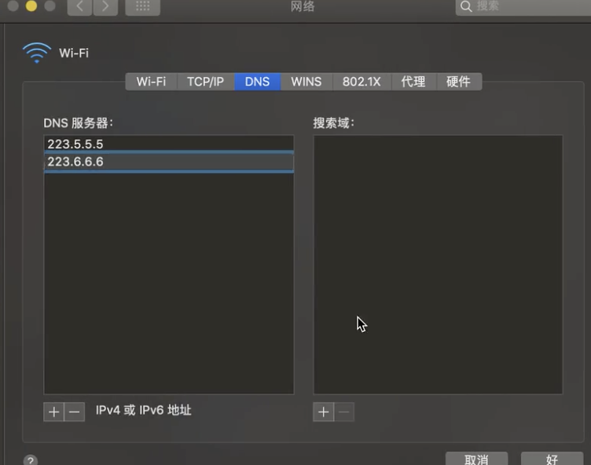
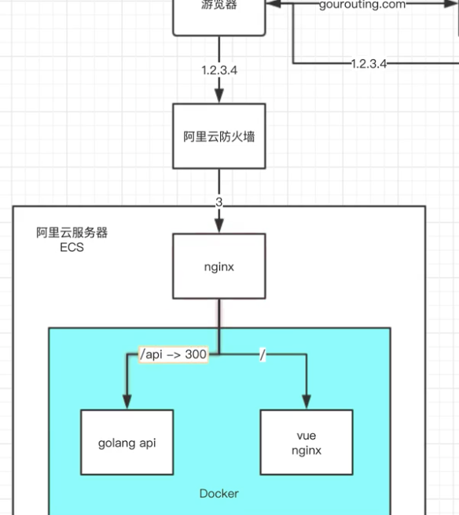
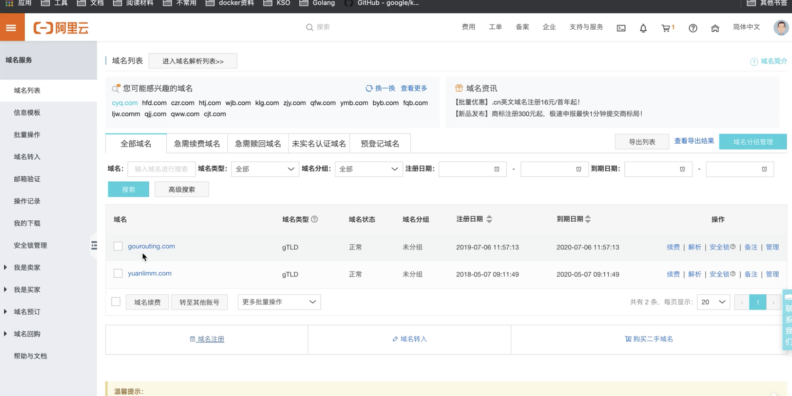
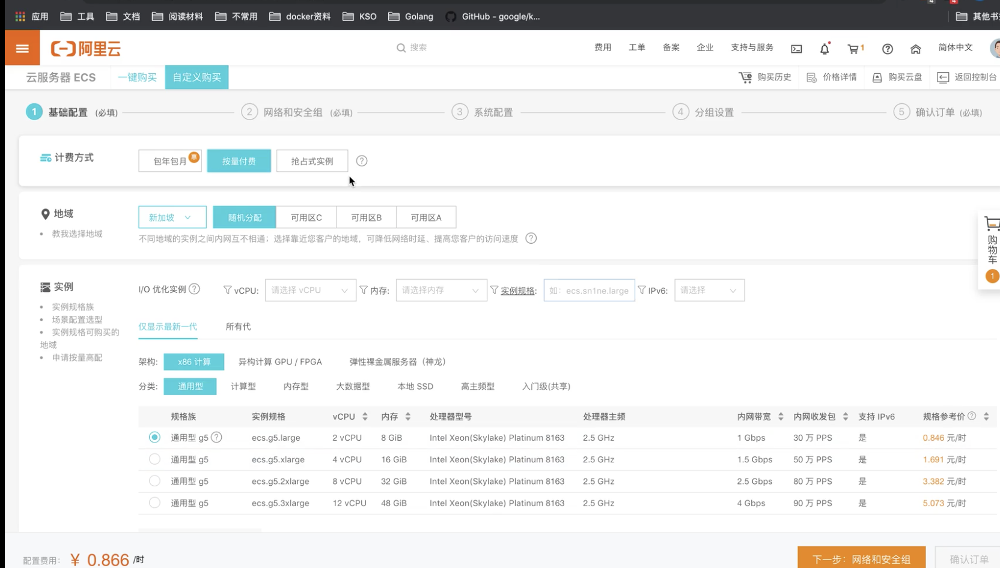
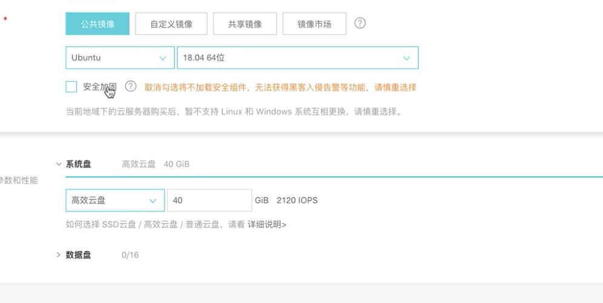

# Docker云端部署

## 1.DNS设置

- 阿里云公共DNS


```json
http://www.alidns.com/
```
- 电脑设置DNS





## 2.阿里云服务器

- 流程




- 购买域名



- 购买服务器



- 选择ubuntu 18.04  原因：与docker很友好



## 3. Docker

- Nginx 配置

```json
server {
    # 设置80 端口
    listen 80;

    location / {
        # 访问/ 的时候等于访问 /usr/share/nginx/html文件夹内
        root /usr/share/nginx/html;
        index index.html;
    }
}
```

