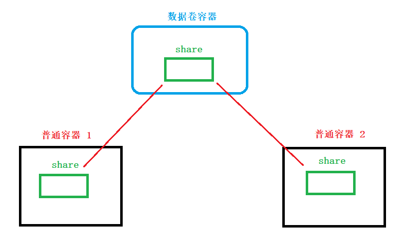
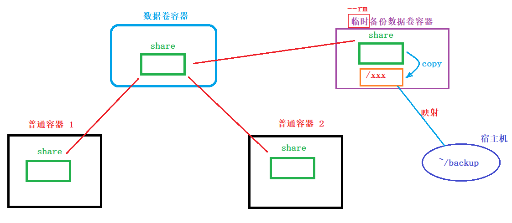
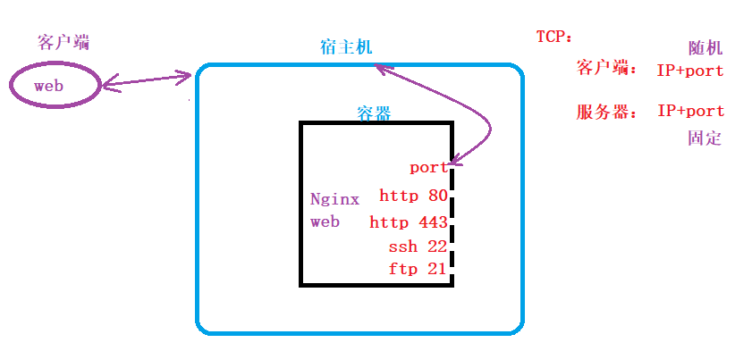

## 0. 导出镜像的两种方式

- 第一种： 基于镜像, 导出镜像 —— 不能修改镜像

  ```shell
  # 导出
  $ docker save -o 镜像名.tar.img  依赖镜像[:tag]
  # 导入
  $ docker load -i 镜像名.tar.img  或  $ docker load < 镜像名.tar.img
  ```
  
- 第二种：==基于容器, 导出镜像== —— 可修改镜像后在导出。

  ```shell
  # 创建和启动容器
  $ docker run -itd --name c-ubt1 ubuntu bash
  $ docker exec -it c-ubt1 bash
  # 对容器进行修改， 
  	$ touch file 
  	$ echo $PATH >> file
  	$ echo hello,world >> file
  	修改后，退出容器 exit
  	
  # 导出
  $ docker export --help
  $ docker export 容器名 > 镜像名.tar.img
  $ docker export c-ubt1 > ubt1.tar.img
  
  # 导入
  $ docker import --help
  $ cat 镜像名.tar.img | docker import - 新镜像名称[:tag]
  $ cat ubt1.tar.img | docker import - myubt:v1.0
  ```

- ==区别==

  - 导出
    - export
        - 导出的镜像文件，缺少了历史日志信息。比源镜像大小小。
        - 生成的镜像文件 权限 -rw-r--r--
        - 生成的本地镜像仓库镜像，没有历史信息
    - save
        - 导出的镜像文件，与源镜像大小一致。
        - 生成的镜像文件 权限 -rw-------
        - 生成的本地镜像仓库镜像，包含历史信息
  - 导入
    - import
        - 可以修改源镜像的镜像名称
    - load
        - 不可以修改镜像名。


## 1. docker数据管理


### 1.0 数据拷贝

```shell
# 容器 --> 宿主机：
$ docker cp --help
$ docker cp 容器名:目录位置 主机目录
$ docker cp test1:/testCP ./		# 如果主机目录不存在，会自动创建

# 宿主机 --> 容器：
$ docker cp 主机目录 容器名:目录位置
$ docker cp ./xxx/ test1:/abc		# 如果容器目录不存在，自动创建

# 上述使用场景在 docker 中不推荐，较少使用。
```


### 1.1 数据卷和使用

- 数据卷

  - 就是宿主机共享给 docker 容器的 ==目录==。

- ==挂载数据卷==

  ```shell
  # 挂载的时机:
  	- create 创建容器时
  	- run 创建、运行容器时
  	
  # 语法：
  $ docker run -itd --name 容器名 -v 宿主机目录名:容器目录名 镜像名 shell命令
  $ docker run -it --name test2 -v ~/docker_test/testCP:/shareTestCP ubuntu bash
  	-v, --volume: 指定挂载的目录。 推荐使用绝对路径。
  ```
  
- ==权限==

  ```shell
  # 默认 容器挂载了宿主机目录后，履行 rw 权限。
  
  # 修改为 ro 权限
  $ docker run -itd --name 容器名 -v 宿主机目录名:容器目录名:ro 镜像名 shell命令
  $ docker run -it --name test3 -v ~/docker_test/testCP:/shareTestCP:ro ubuntu bash
  # 容器 添加了 ro 之后，不能再写 共享目录。但是可以读。 宿主机可以对共享目录rw操作。
  ```

- 挂载方式：

    - ==挂载目录==

      ```shell
      $ docker run -it --name test4 -v ~/docker_test/abc:/xyz ubuntu bash
      # 挂载时，宿主机目录和容器目录都可以不存在， 自动创建。
      ```
    
  -  挂载文件


```shell
# 挂载文件时，要求文件必须存在，否则 docker 就当成 目录处理。
$ docker run -it --name test5 -v ~/docker_test/testFile:/opq/t.sh ubuntu bash
```


### 1.2 ==数据卷容器==

- 概念

  - 数据卷容器就是一个普通的容器，该容器内部特供了可供挂载的数据卷（目录）
  
  
  
- ==特性、创建语法==：

  ```shell
  #特性：不要求数据卷容器运行 只要存在即可。
  	- create
  	- run -itd
  	
  #创建1
  $ docker create -it --name 数据容器名 -v 共享的目录 镜像名 shell命令
  $ docker create -it --name dataVolumeC -v /share ubuntu bash
  
  #创建2
  $ docker run -it --name 数据容器名 -v 共享的目录 镜像名 shell命令
  $ docker run -itd --name dataVolumeC -v /share ubuntu bash
  ```

- ==数据卷容器的挂载使用==

  ```shell
  # 挂载数据卷容器的参数
  	--volumes-from 数据卷容器的名字/数据卷容器的ID
  	
  #1.创建数据卷容器
  $ docker create -it --name dataVolumeC -v /share ubuntu bash
  #2.启动测试容器1，挂载到数据卷容器
  $ docker run -itd --name container1 --volumes-from dataVolumeC ubuntu bash
  #3.启动测试容器2，挂载到数据卷容器
  $ docker run -itd --name container2 --volumes-from dataVolumeC ubuntu bash
  
  #4.测试数据是否共享
  	container1 中 创建文件，写入数据。
  	container2 中 可以查看的到。
  ```


### 1.3 ==数据卷容器数据备份==

图示：



```shell
# 备份步骤

# 1. 创建一个临时新容器, 挂载到数据卷容器上, 同时和宿主机建立映射
$ docker run -itd --rm --name backupC --volumes-from dataVolumeC -v ~/docker_test/backup/:/xxx ubuntu bash
# 2. 进入backup容器中
$ docker exec -it backupC bash
# 3. 备份数据
$ cp -r /share /xxx   
或
$ tar zcvf /xxx/backup.tar.gz /share
# 4. 删除backup容器即可
exit

# 将上述 4 步合并为一步执行。
$ docker run --rm --name backupC --volumes-from dataVolumeC -v ~/docker_test/backup/:/xxx ubuntu tar zcvf /xxx/backup.tar.gz /share
```


### 1.4 ==备份数据还原到数据卷容器==

```shell
# 核心思想，就是将备份包 放回到数据卷容器中。
$ docker run --rm --name recoverC --volumes-from dataVolumeC -v ~/docker_test/backup/:/xxx ubuntu tar zxvf /xxx/backup.tar.gz -C /
```


## 2. docker网络管理


### 2.1 docker 端口映射

- 图示：

    

- 端口开放方式
  
  
  - 随机端口映射 —— 测试环境适用
    
	  ```shell
    # 语法：
    $ docker run --name 容器名 -P 镜像名 shell脚本
    	-P（大写）, --publish-all：产生一个随机映射端口
    # 测试：
    $ docker run -itd --name ng2 -P nginx:latest bash  ---- 错误！！
    	# bash 会覆盖 nginx 容器启动后执行的第一条 命令。 nginx服务器不能正常工作
    $ docker run -itd --name ng2 -P nginx:latest   ---- 正确！！
    ```
    
  - ==手动指定端口映射== ——生产环境适用
  
      ```shell
      # 语法：
      $ docker run --name 容器名 -p xxx 镜像名 shell脚本
      	-p（小写）, --publish
      	“xxx”语法：  1. 完整 宿主机IP:宿主机port:容器port
      				2. 精简 宿主机port:容器port
    # 测试：			
    $ docker run -itd --name ng3 -p 9999:80 nginx:latest
    
    # 多个端口映射：
    $ docker run -itd --name ng5 -p 8765:80 -p 8724:81 -p 9527:82 nginx:latest
    	# 有几个映射端口，添加几个 -p参数
    ```
  
- 查看端口映射

    ```shell
    $ docker port 容器名/容器ID
    
  	82/tcp -> 0.0.0.0:9527
		80/tcp -> 0.0.0.0:8765
		81/tcp -> 0.0.0.0:8724
  ```


### 2.2 docker 网络管理

- ==网络管理命令==

  ```shell
  # 多个docker容器想进行数据通信。前提：这些docker容器须在同一个网络中。
  $ docker network --help
  Usage:	docker network COMMAND
  
  Manage networks
  
  Commands:
    connect     将一个容器加入到网络中
    create      创建一个网络
    disconnect  将容器从网络中移除
    inspect     查看网络的详细信息
    ls          查看网络列表
    prune       删除所有未使用的网络 --- 慎用！！！
    rm          删除指定的一个或多个网络
  
  # ls ：
  	$ docker network ls
          - NETWORK ID： 网络ID
          - NAME： 网络名称
          - DRIVER： 驱动名称
          - SCOPE： 范围
   	# 常用网络模式：bridge  host  none
  # rm：
  	$ docker network rm 网络名/网络ID [网络名/网络ID ...]
  	
  # inspect:
  	$ docker network insepect 网络名/网络ID
  	$ docker network insepect bridge
  		- "Subnet": "172.17.0.0/16": 子网网段/子网掩码
  		- "Gateway": "172.17.0.1": 网关
  		- "Containers": {}, 加入到 bridge 网络模式中的容器。（默认加入 bridge）
  ```
  
  
  
- docker常用网络模式

    - bridge
    - host
    - none
    - container
    - overlay

### 2.3 ==bridge 网络模式==

- 创建bridge网络：—— 只指定名字

  ```shell
  # 语法：
  $ docker network create --help
  $ docker network create -d 驱动名 网络名
  
  # 测试：
  $ docker network create -d bridge mybridge
  	# host 网络不能手动创建。 只能 使用默认docker 自带的模式。
  ```
  
- 自定义网段与网关：—— 指定名字同时，指定网关、网段。

  ```shell
  # 语法：
  $ docker network create --help
  $ docker network create -d 驱动名 --subnet 子网网段 --gateway 网关 网络名
  	--gateway：网关
  	--subnet：子网网段。必须同时指定掩码		划分网段，判断区域网
  	
  # 测试：
  $ docker network create -d bridge --subnet 180.18.10.0/24 --gateway 180.18.10.1 mybridge2
  
  ```
  
- 在自定义网络中启动容器：

  ```shell
  # 语法：
  $ docker create -it --name 容器名 --network 网络名 镜像 shell
  $ docker run -itd --name 容器名 --network 网络名 镜像 shell
  
  # 测试：
  $ docker run -itd --name test1 --network mybridge nginx 
  	# 可以查看 docker network inspect mybridge
  	# 可以查看 docker inspect test1
  	# 如果没有指定 --network ，容器默认加入 bridge 中。
  ```
  
- 容器断开网络：disconnect

  ```shell
  # 语法：
  $ docker network disconnect --help
  $ docker network disconnect 网络名 容器名
  
  # 测试：
  $ docker network disconnect mybridge1 test1
  ```
  
- 容器连接网络：connect

  ```shell
  # 语法：
  $ docker network connect 网络名 容器名
  
  # 测试：
  $ docker network connect mybridge2 test1
  	# 同一个容器，可以同时加入到多个 bridge 网络中。	
  ```


### 2.4 host 网络

```shell
# 特性： 共享主机的网络属性。
1. 可以在创建容器时，指定加入到 host 网络中。 该容器没有IP、网段、网关、mac地址。。。
2. 已经加入到host网络中的容器，不能使用 disconnect 断开。
3. 即使没有加入任何网络的容器，也不能 在后期加入到 host网络中。

# 测试：
1. 
	$ docker run -itd --name --network host test2 nginx	 # 成功加入 host 网络
2.
	$ docker network disconnect host test2		# 断开失败
3. 
	$ docker run -itd --name test3 nginx		# 默认处于 bridge 中
	$ docker network disconnect bridge test3 	# 从 bridge 断开， test3没有加入网络
	$ docker network connect host test3 		# 加入失败
```


## 3. Dockerfile语法

-  Dockerfile本质：

   -  就相当于一个脚本文件。将一系列的 docker名组织在一起，批量执行。生成镜像。

- Dockerfile作用：

  -  创建镜像。
-  命名要求：Dockerfile 

### 3.1 Dockerfile预览

```shell
# 编写Dockerfile，构建一个基于ubuntu的docker定制镜像
# 基础镜像
FROM ubuntu:v1.0

# 镜像作者
MAINTAINER panda kstwoak47@163.com

# 执行命令
RUN mkdir hello
RUN mkdir world
RUN sed -i 's/archive.ubuntu.com/mirrors.ustc.edu.cn/g' /etc/apt/sources.list
RUN sed -i 's/security.ubuntu.com/mirrors.ustc.edu.cn/g' /etc/apt/sources.list
RUN apt-get update  
RUN apt-get install nginx -y

# 对外端口
EXPOSE 80
```

- ==导出镜像==：

  ```shell
  $ docker build -t 新镜像名:版本 Dockerfile文件所在目录
  	-t, --tag: 指定构建出的镜像的名字
  	
  # 建议，将 Dockerfile 存放到一个空目录中。	
  ```


### 3.2 基础指令

- FROM

  ```dockerfile
  FROM 镜像名
  FROM 镜像名:tag
  # FROM必须要出现Dockerfile的第一行(除注释), 可以连续写多个FROM创建多个镜像.
  # 如果指定的镜像名本地仓库没有, 会从远程仓库pull到本地, 远程仓库也没有 -> 报错.
  
  ```

- MAINTAINER

  ```Dockerfile
  dockerfile维护者信息
  MAINTAINER 维护人员信息
  ```

- RUN

  ```dockerfile
  # 构建镜像时候执行的shell命令, 如果命令有确认操作, 必须要加 -y
  # 如果命令太长需要换行, 行末尾需要加 \
  RUN shell命令
  	RUN mkdir /home/go/test -p
  RUN ["mkdir", "/home/go/test", "-p"]
  ```

- EXPOSE

  ```dockerfile
  # 设置对外开放的端口
  # 容器和外部环境是隔离的, 如何向从外部环境访问到容器内部, 需要容器开发端口
  # 在使用的时候, 让宿主机端口和容器开放端口形成一个映射关系, 就可以访问了
  #     docker run -itd -p 8888:80
  EXPOSE 80
  ```


### 3.3  运行时指令

- CMD

  ```dockerfile
  # 新镜像已经被制作完毕, 启动新镜像-> 得到一个容器
  # 容器启动后默认执行的命令
  # 一个dockerfile文件只能指定一个CMD指令
  # 如果指定多个, 只有最后一个有效
  # 该CMD会被 docker run指定的shell命令覆盖
  CMD shell命令
  CMD ["shell命令", "命令参数1", "命令参数2"]
  ```

  

- ENTRYPOINT

  ```dockerfile
  # docker容器启动之后执行的命令, 该命令不会被docker run指定的shell指令覆盖
  # ENTRYPOINT只能指定一个, 指定多个, 只有最后一有效
  # ENTRYPOINT 和 CMD可以同时指定
  # 如果想被docker run覆盖, 启动docker容器时可使用docker run --entrypoint
  ENTRYPOINT shell命令
  ENTRYPOINT ["shell命令", "命令参数1", "命令参数2"]
  ```

  

- CMD ENTRYPOINT 综合使用

  ```dockerfile
  docker run -itd ubuntu 
  # 任何docker run设置的命令参数或者CMD指令的命令，都将作为ENTRYPOINT 指令的命令参数，追加到ENTRYPOINT指令之后
  
  ```


### 3.4  文件编辑指令

- ADD

  ```dockerfile
  # 将宿主机文件拷贝到容器目录中
  # 如果宿主机文件是可识别的压缩包, 会进行解压缩 -> tar
  ADD 宿主机文件 容器目录/文件
  # 实例
  ADD ["宿主机文件", "容器目录"]
   - 宿主机文件一般放到Dockerfile对应的目录中
   - 容器目录, 有可能存在, 有可能不存在
    	- 存在: 直接拷贝到容器目录
      - 不存在: 先在容器中创建一个, 再拷贝
  ADD ["a.txt", "/home/go/a.txt"]
   - 第二个参数如果指定的是一个文件名
     - 这个文件存在: 直接覆盖
     - 不存在: 直接拷贝
  ```

  

- COPY

  ```dockerfile
  # COPY 指令和ADD 指令功能和使用方式类似。只是COPY 指令不会做自动解压工作。
  # 单纯复制文件场景，Docker 推荐使用COPY
  COPY ["a.tar.gz", "/home/"]
  ```

  

- VOLUME

  ```dockerfile
  # 数据卷容器创建, 挂载点为/backup
  docker create -it --name contains -v /backup ubuntu bash
  # 其他容器挂载到数据卷容器上
  docker run -itd --volumes-from contains ubuntu bash
  
  # VOLUME 指令可以在镜像中创建挂载点，这样只要通过该镜像创建的容器都有了挂载点
  # 通过VOLUME 指定挂载点目录是自动生成的。
  VOLUME ["/data"]
  
  ```


### 3.5  环境指令

- ENV

  ```dockerfile
  # 设置环境变量，可以在RUN 之前使用，然后RUN 命令时调用，容器启动时这些环境变量都会被指定
  ENV <key> <value>                    （一次设置一个环境变量）
  ENV <key>=<value> ...                （一次设置一个或多个环境变量）
  ENV HELLO 12345
  ENV HELLO=12345
  ENV HELLO=12345 WORLD=12345 NIHAO=12345
  ```

  

- WORKDIR

  ```dockerfile
  # 切换目录，为后续的RUN、CMD、ENTRYPOINT 指令配置工作目录。相当于cd
  # 可以多次切换(相当于cd 命令)，
  # 也可以使用多个WORKDIR 指令，后续命令如果参数是相对路径，则会基于之前命令指定的路径。
  WORKDIR /path/to/workdir
  RUN a.sh
  WORKDIR /path
  WORKDIR to	# 相对路径
  WORKDIR workdir
  RUN pwd
  /path/to/workdir
  ```

  

- USER 

  ```dockerfile
  # 指定运行容器时的用户名和UID，后续的RUN 指令也会使用这里指定的用户。
  # 如果不输入任何信息，表示默认使用root 用户
  USER daemon
  ```

  


### 3.6  触发器指令


- ONBUILD

  ```dockerfile
  # 当一个镜像A被作为其他镜像B的基础镜像时，这个触发器才会被执行，
  # 新镜像B在构建的时候，会插入触发器中的指令。
  ONBUILD [command]
  
  # 原始镜像 -> 纯净版
  	-> 修改 ONBUILD ["echo", "hello,linux"]
  	   
  # 基于原始镜像制作新镜像 -> 镜像A
  	-> 启动镜像A -> 不会输出hello, linux
  	
  # 基于镜像A制作了镜像B
  	-> 启动镜像B -> 会输出 hello, linux
  ```