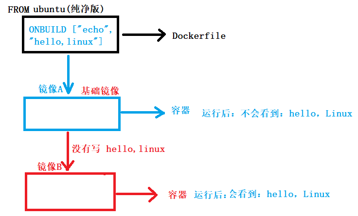

## 1. Dockerfile

注意事项:

- 文件名首字母大写

- 存储Dockerfile的目录, 尽量是空目录

- dockerfile中的注释使用: #

- 制作的镜像功能尽量单一

- 制作步骤要尽可能精简

  ```shell
  RUN mkdir /home/go/hello
  RUN mkdir /home/go/world
  
  RUN mkdir /home/go/hello && mkdir /home/go/world
  ```


### 1.1 Dockerfile基础指令

- FROM

  ```dockerfile
  FROM 镜像名
  FROM 镜像名:tag
  # FROM必须出现在Dockerfile第一行(除注释), 可以连续写多个FROM创建多个镜像.
  # 如果指定的镜像名本地仓库没有, 会从远程仓库pull到本地, 远程仓库也没有 -> 报错.
  ```

- MAINTAINER

  ```Dockerfile
  dockerfile的维护者信息
  MAINTAINER 维护人员信息
  ```

- RUN

  ```dockerfile
  # 构建镜像时候执行的shell命令, 如果命令有确认操作, 必须要加 -y
  # 如果命令太长需要换行, 行末尾需要加 \
  RUN shell命令
  RUN mkdir /home/go/test -p
  RUN ["mkdir", "/home/go/test", "-p"]
  ```

- EXPOSE

  ```dockerfile
  # 设置对外开放的端口
  # 容器和外部环境是隔离的, 外部环境要想访问容器, 需要容器开放端口
  # 使用时, 宿主机端口与容器开放的端口形成映射, 即可访问
  # docker run -itd -p 8888:80
  EXPOSE 80
  ```


### 1.2 Dockerfile运行时指令

- CMD

  ```dockerfile
  # 新镜像被制作完毕, 启动新镜像 -> 得到容器。
  # CMD 是容器启动后默认执行的第一条命令 --- shell命令 -- bash
  # 一个dockerfile文件只需指定一个CMD指令即可。如果指定多个, 只有最后一个有效
  # 该 CMD 会被 docker run 指定的 shell命令 覆盖
  CMD shell命令
  CMD ["shell命令", "命令参数1", "命令参数2"]
  ```
  
- ENTRYPOINT

  ```dockerfile
  # docker容器启动之后执行的命令, 该命令不会被 docker run 指定的shell指令覆盖
  # ENTRYPOINT 只需指定一个, 指定多个, 只有最后一有效
  ENTRYPOINT shell命令
  ENTRYPOINT ["shell命令", "命令参数1", "命令参数2"]
  ```
  
- CMD ENTRYPOINT 综合使用（少见）

  ```dockerfile
  # 任何 docker run 设置的命令参数或者CMD指定的命令，都将作为ENTRYPOINT指令的参数，追加到 ENTRYPOINT 指令之后
  ENTRYPOINT mkdir /home/go/a/b/c/d/e/f
  CMD -p
  mkdir /home/go/a/b/c/d/e/f 
  ```

### 1.3 Dockerfile文件编辑指令

- ADD

  ```dockerfile
  # 将宿主机文件拷贝到容器目录中
  # 如果宿主机文件是可识别的压缩包, 会进行解压缩 -> tar zxvf
  ADD 宿主机文件 容器目录/文件
  ADD ["宿主机文件", "容器目录/文件"]
   - 宿主机文件拷贝到Dockerfile对应的容器目录中
   - 容器目录
    	- 存在: 直接拷贝到容器目录
      - 不存在: 先在容器中创建一个, 再拷贝
      
  # 实例   
  ADD ["a.txt", "/home/go/a.txt"]
   - 二参如果是文件名
     - 文件存在: 直接覆盖
     - 不存在: 直接拷贝
  ```

- COPY

  ```dockerfile
  # COPY 和 ADD 功能、使用方式类似。但，COPY 不做解压。
  # 单纯拷贝文件，Docker 推荐使用 COPY
  COPY ["a.tar.gz", "/home/"]
  ```

- VOLUME

  ```dockerfile
  # 创建数据卷容器, 挂载点为/backup
  $ docker create -it --name contains -v /backup ubuntu bash
  # 其他容器, 挂载到数据卷容器
  $ docker run -itd --volumes-from contains ubuntu bash
  
  # VOLUME 可在镜像中创建挂载点，只要通过该镜像创建的容器都有挂载点
  # 通过 VOLUME 指定挂载点, 目录是自动生成的。
  VOLUME ["/backup"]
  
  ```

### 1.4 Dockerfile环境指令

- ENV

  > 环境变量:
  >
  > - 特性：
  >     - key=value、key:value 
  >     - 建议 key 大写
  >     - value 值如果有多份，使用“:”分隔。
  >
  >   - 系统环境变量：
>
  >     		- 使用 env 查看
  >
  >   - 用户环境变量：
  >
  >       - 语法：export 环境变量名=环境变量值
  >
  >       - 例子：定义用户环境变量：export VAR123=hello:world:nihao:hoho:xixi
  >
  >         ​            查看环境变量：echo $VAR123   
  >
  >     - 用户环境变量，随着shell终端的结束，自动释放。
  >
  >     - 永久生效用户环境变量， 写入到 .bashrc

  ```dockerfile
  # 设置环境变量，通常在 RUN 命令之前。启动容器时，这些环境变量都会被指定
  ENV <key> <value>                    （一次设置一个环境变量）
  ENV <key>=<value> ...                （一次设置一个或多个环境变量）
  ENV HELLO 12345
  ENV HELLO=12345
  ENV HELLO=12345 WORLD=67890 NIHAO=13579
  ```

- WORKDIR

  ```dockerfile
  # 切换目录，为后续 RUN、CMD、ENTRYPOINT 指令配置工作目录。
  WORKDIR /path/to/workdir
  RUN a.sh
  
  # 可以多次切换 (相当于cd 命令)，
  # 也可以使用多个 WORKDIR 指令，后续命令如果是相对路径，则会基于之前指定的路径。
  WORKDIR /path		# - 绝对路径  工作目录为：/path/
  WORKDIR /bin/abc				#工作目录为：/bin/abc
  WORKDIR to/			# - 相对路径  工作目录为：/bin/abc/to/  
  WORKDIR workdir 	# 			 工作目录为：/bin/abc/to/workdir	
  RUN pwd				
  
  # 可执行程序 a.out
  WORKDIR /path
  RUN a.out			# Dockerfile 文件中描述相对路径 不允许使用 ./a.out
  ```
  
- USER【了解】

  ```dockerfile
  # 指定运行容器时的用户名和UID，后续的 RUN 指令也会使用这里指定的用户。
  # 如果不输入任何信息，表示默认使用 root 用户
  USER daemon
  ```
  
- ARG【了解】

  ```dockerfile
  ARG <name>[=<default value>]
  # 类似于 ENV 用法
  # ARG 指定一个参数和默认值，在 docker build 时，可以使用--build-arg <参数名>=<值>来覆盖默认值。
  ```


### 1.5 Dockerfile触发器指令

- ONBUILD

  ```dockerfile
  # 当一个镜像A被作为其他镜像B的基础镜像时，这个触发器才会被执行，
  # 新镜像B在构建的时候，会插入触发器中的指令。
  ONBUILD [command]
  
  # 原始镜像 -> 纯净版
  	-> 修改 ONBUILD ["echo", "hello,linux"]
  	   
  # 基于原始镜像制作新镜像 -> 镜像A
  	-> 启动镜像A -> 生容器 -> 不会输出 hello, linux
  	
  # 基于镜像A制作了镜像B
  	-> 启动镜像B -> 生容器 -> 输出 hello, linux
  ```



### 1.6 Dockerfile构建缓存

```shell
# 构建新镜像的时候不使用缓存机制， 提高生成镜像的速度。
docker build -t 新镜像名:tag --no-cache

# Dockerfile 默认，构建镜像时，会自动生成缓存。
```


### 1.7 ==通过Dockerfile构建beego镜像==

```dockerfile
# 指定构建的基础镜像
FROM ubuntu:latest
# 添加维护者信息
MAINTAINER itcast itcast@itcast.cn
# 借助Dockerfile构建镜像时，基础镜像会自动生成容器，并且进入。

# 修改软件源
RUN sed -i 's/archive.ubuntu.com/mirrors.ustc.edu.cn/g' /etc/apt/sources.list
RUN sed -i 's/security.ubuntu.com/mirrors.ustc.edu.cn/g' /etc/apt/sources.list

#更新软件源，安装基本软件
RUN apt-get update && apt-get install gcc libc6-dev git vim lrzsz -y

# 部署golang环境
# 将宿主机的 golang压缩包，拷贝到容器中，存放在指定目录（/usr/local/）下。
ADD ["xxx.tar.gz","/usr/local/"]

# 配置golang环境变量
ENV GOROOT=/usr/local/go                
ENV PATH=$PATH:/usr/local/go/bin   
ENV GOPATH=/root/go
ENV PATH=$GOPATH/bin/:$PATH

# 部署beego环境，将beego压缩包，解压拷贝到容器的指定目录（/root/go/src/github.com/）中
ADD ["yyy.tar.gz","/root/go/src/github.com/"]

# 创建beego工作目录
RUN mkdir /root/go/src/myTest/
# 进入到beego工作目录中
WORKDIR /root/go/src/myTest/

# 将宿主机中提前准备好的 测试文件 test.go，拷贝到容器 工作目录中。
COPY ["test.go","/root/go/src/myTest/"]

# beego 容器启动后的第一条命令
# CMD go run test.go    --- 有被覆盖的风险
ENTRYPOINT go run test.go 

# 开发端口
EXPOSE 8080
```

- 启动Dockerfile，创建镜像


```shell
# 创建镜像
$ docker build -t 新镜像名:tag Dockerfile所在目录

# 创建容器
$ docker run -itd --name 容器名 -p 宿主机port:容器port 镜像名
```


## 2. docker-compose

-  docker-compose 简介

​		Compose 是 Docker 容器进行编排的工具，定义和运行多容器的应用，可以一条命令启动多个容器，使用Docker Compose不再需要使用shell脚本来启动容器。 

​		Compose 通过一个配置文件来管理多个Docker容器，在配置文件中，所有的容器通过services来定义，然后使用docker-compose脚本来启动，停止和重启应用，和应用中的服务以及所有依赖服务的容器，非常适合组合使用多个容器进行开发的场景。


- docker-compose 重点学习内容
  
	1. docker-compose工具，工作时需要使用配置文件
     
     - 默认的名字: docker-compose.yaml/yml
   2. yaml 文件格式
  
   3. docker-compose 常用关键字	
  
   4. docker-compose 操作命令
  
   5. 启动, 关闭, 查看 
  
       

### 2.1 docker-compose 的安装

```shell
#安装依赖工具
sudo apt-get install python-pip -y
#安装编排工具
sudo pip install docker-compose
#查看版本
docker-compose version
#查看命令帮助
docker-compose --help

# 方法二
$ sudo apt install docker-compose # 安装docker-compose

# 卸载
$ sudo pip uninstall docker-compose
```

### 2.2 ==yaml文件格式==

> - YAML有以下基本规则： 
>   1、大小写敏感 
>   2、**使用缩进表示层级关系** 
>   3、禁止使用tab缩进，**只能使用空格键** 
>   4、缩进长度没有限制(但，只能使用空格缩进)，只要元素对齐就表示这些元素属于一个层级。 
>   5、使用#表示注释 
>   6、字符串可以不用引号标注
>
>   “字符串”
>
>   ‘字符串’
>
>   字符串
>
>   123
>
>   123a


==yaml中的三种数据结构==

- map - 散列表

  ```yaml
  # 使用冒号（：）表示键值对，同一缩进的所有键值对属于一个map，示例：
  age : 12
  name : huang
  
  # 使用json表示
  {“age”:12,"name":"huang"}
  {“age”:~,"name":~}
  ```

- list - 数组

  ```yaml
  # 使用连字符（-）表示：
  # YAML表示
  - a
  - b
  - 12
  
  # 使用json表示
  ["a","b",12]
  ```

- scalar - 纯量 

  ```yaml
  字符串
  	-- 123a
  	-- "hello"
  布尔值
  	-- false
  	-- true
  整数
  	-- 123
  浮点数
  	-- 4.13
  NULL
  	-- 空值，使用“~”
  ```
  
- 例子

  ```yaml
  # 1
  Websites:
   YAML: yaml.org 
   Ruby: ruby-lang.org 
   Python: python.org 
   Perl: use.perl.org 
   
  # 使用json表示
  {“Websites”:{"YAML":yaml.org, "Ruby":"ruby-lang.org"}}
  
  # 2
  languages:
   - Ruby
   - Perl
   - Python 
   - c
   
  # 使用json表示
  {"languages":["Ruby", "Perl", "Python", "c"]} 
  
  # 3
  -
    - Ruby
    - Perl
    - Python 
  - 
    - c
    - c++
    - java
    
  # 使用json表示
  [["Ruby", "Perl", "Python"],["c", "c++", "java"]]
  
  # 4
  -
    id: 1
    name: huang
  -
    id: 2
    name: liao
    
  # 使用json表示
  [{"id":1,"name":"huang"},{"id":2,"name":"liao"}]
  ```

### 2.3 ==docker-compose配置文件==

```yaml
version: '2'						# docker-compose的版本

services:							# 服务
  web:								# 服务名, 自己指定, 每个服务器名对应一个启动的容器
    image: nginx:latest				# 容器是基于那个镜像启动的
    container_name: myweb
    ports:							# 容器对外开放的端口
      - 8080
    networks:						# 容器启动后加入的网络
      - front-tier					# 网络名
      - back-tier					# 可同时加入多个网络
    environment:  					# 容器启动后，需要使用的‘环境变量’
      RACK_ENV: development			# key:value形式
      SHOW: 'true'					# key 任意指定。
      SESSION_SECRET: docker-compose 
    command: tree -L 3				# 容器启动后，执行的第一条shell指令
    extends:
      file: common.yml				# 将其他yaml文件引用到本配置，直接使用。
      service: webapp
 
  lb:
    image: dockercloud/haproxy
    ports:
      - 80:80
    networks:
      - front-tier
      - back-tier
    volumes:	# 数据卷挂载 docker run -v xxxx:xxxx
      - /var/run/docker.sock:/var/run/docker.sock 
    depends_on:
      - web
      - redis
      - lb      
  redis:
    image: redis
    networks:
      - back-tier

networks:
  front-tier:
    driver: bridge
  back-tier:
    driver: bridge

```

> 一份标准配置文件应该包含 
>
> - version
>
> - services
>
> - networks
>
> 三大部分，其中最关键的就是 services 和 networks 两个部分，下面先来看 services 的书写规则。

- **Image**

  ```yaml
  services:
    web:					# 服务（容器）
      image: 镜像名/镜像ID	 # 依赖的镜像:tag. 如果本地镜像仓库没有，使用 pull拉取，没有对应版本
  ```

  > 在 services 标签下的第二级标签是 web，这个名字是用户自己自定义，它就是服务名称。
  > image 则是指定服务的镜像名称或镜像 ID。如果镜像在本地不存在，Compose 将会尝试拉取这个镜像。

- **command**

  > 使用 command 可以覆盖容器启动后默认执行的命令。

  ```yaml
  command: tree -L 3	
  # 也可以写成类似 Dockerfile 中的格式：
  command: [tree, -L, 3]
  # 相当于 docker run 中的 shell命令
  # 也可以替换 Dockerfile 中的 CMD命令
  ```

- **container_name**

  > 容器启动之后的名字。 -- 相当于 docker run 中的 --name
  >
  > 如何查看: 
  >
  > docker ps  

- **depends_on**

  > 一般项目容器启动的顺序是有要求的，如果直接从上到下启动容器，必然会因为容器依赖问题而启动失败。例如在没启动数据库容器的时候启动了应用容器，这时候应用容器会因为找不到数据库而退出，为了避免这种情况我们需要加入一个标签，就是 depends_on，这个标签解决了容器的依赖、启动先后的问题。

  ```yaml
  version: '2'
  services:
    web:
      image: ubuntu
      depends_on:		# 通常添加在，对其他服务有依赖关系的 服务中。
        # 指定了depends_on之后，服务的启动顺序不受书写顺序限制，受 depends_on 的限制。
        - db
        - redis
        - web			# 必须将自己放在最后。
    redis:
      image: redis
    db:
      image: mysql
  ```

- **environment**

  > environment 和 Dockerfile 中的 ENV 指令一样会把变量一直保存在镜像、容器中。

  ```yaml
  environment:
    RACK_ENV: development
    SHOW: 'true'
    SESSION_SECRET: docker-compose
    
  # mkdir /a/b/c/d/.../z/ -p 
  # MYPATH=/a/b/c/d/.../z/
  # mkdir $MYPATH -p 
  ```

- **ports**

  > docker run -p 宿主机端口:容器端口
  >
  > 映射端口的标签。
  > 使用HOST:CONTAINER格式或者只是指定容器的端口，宿主机会随机映射端口。

  ```yaml
  ports:
   - "3000" 							# 相当于 -P(大)  
   - "8000:8000"   	-> 推荐写法		 # 相当于 -p(小)  
   - "127.0.0.1:8001:8001"			# 完整写法：宿主机IP:宿主机port：容器port
   - 55:55   			-> 不推荐  # 推荐字符串书写形式。
  ```

- **volumes**

  > 挂载一个目录或者一个已存在的数据卷容器，可以直接使用 [HOST:CONTAINER] 这样的格式，或者使用 [HOST:CONTAINER:ro] 这样的格式，后者对于容器来说，数据卷是只读的，这样可以有效保护宿主机的文件系统。
  > Compose的数据卷指定路径可以是相对路径，使用 . 或者 .. 来指定相对目录。

  ```yaml
  docker run -v /home/go:/xxx
  # 宿主机或容器的映射路径如果不存在, 会自动创建出来
  volumes:
    # 这是宿主机目录, 容器映射目录会自动创建
    - /var/lib/mysql			# 指定用来创建数据卷容器
    # 按照绝对路径映射
    - /var/lib/mysql:/opt/data
    # 相对路径的映射，不能省略 ./
    - ./cache:/tmp/cache		# 相对于 docker-compose.yaml/yml 文件而言
    # 指定容器中对文件的操作权限, 默认rw
    - /home/go/configs:/etc/configs/:ro
    # 文件映射
    - ./temp/a.txt:/temp/b.sh
  ```
  
- **volumes_from**

  > 从其它容器或者服务挂载数据卷，可选的参数是 :ro或者 :rw，前者表示容器只读，后者表示容器对数据卷是可读可写的。默认情况下是可读可写的。

  ```yaml
  volumes_from:
    - service_name  # 服务名
    - service_name:ro
    - container:myweb  # 挂载容器
    - container:myweb:rw
  ```

- **extends**

  > 这个标签可以扩展另一个服务，扩展内容可以是来自在当前文件，也可以是来自其他文件，相同服务的情况下，后来者会有选择地覆盖原有配置。

  ```yaml
  
  extends:
    file: common.yml	# 引入的 yml 文件名
    service: webapp	# 引入的 yml 文件对应的 服务（容器）
  ```

  ```yaml
  # docker-compose.yaml
  version: '2'						# docker-compose的版本
  
  services:							# 服务
    web:								# 服务名, 自己指定, 每个服务器名对应一个启动的容器
    	volumes:	# 数据卷挂载 docker run -v xxxx:xxxx
    	  - /var/run/docker.sock:/var/run/docker.sock 
      extends:
        file: sub-compose.yaml		# 将其他yaml文件引用到本配置，直接使用。
        service: demo1
  
    lb:
      image: dockercloud/haproxy
      ports:
        - 80:80
      networks:
        - front-tier
        - back-tier
      volumes:	# 数据卷挂载 docker run -v xxxx:xxxx
        - /var/run/docker.sock:/var/run/docker.sock 
      depends_on:
        - web
        - redis
        - lb      
    redis:
      image: redis
      networks:
        - back-tier
  
  networks:
    front-tier:
      driver: bridge
    back-tier:
      driver: bridge
  ```
  
  ```yaml
  # sub-compose.yaml
  version: '2'						# docker-compose的版本
  
  services:							# 服务
    demo1:							# 服务名, 自己指定, 每个服务器名对应一个启动的容器
      image: nginx:latest				# 容器是基于那个镜像启动的
      container_name: myweb
      ports:							# 容器对外开放的端口
        - 8080
      networks:						# 容器启动后加入的网络
        - front-tier					# 网络名
        - back-tier					# 可同时加入多个网络
      environment:  					# 容器启动后，需要使用的‘环境变量’
        RACK_ENV: development			# key:value形式
        SHOW: 'true'					# key 任意指定。
        SESSION_SECRET: docker-compose 
      command: tree -L 3				# 容器启动后，执行的第一条shell指令
      extends:
        file: common.yml				# 将其他yaml文件引用到本配置，直接使用。
        service: webapp
   
    demo2:
      image: dockercloud/haproxy
      ports:
        - 80:80
      networks:
        - front-tier
        - back-tier
      volumes:	# 数据卷挂载 docker run -v xxxx:xxxx
        - /var/run/docker.sock:/var/run/docker.sock 
      depends_on:
        - web
        - redis
        - lb      
    demo3:
      image: redis
      networks:
        - back-tier
  
  networks:
    front-tier:
      driver: bridge
    back-tier:
      driver: bridge
  ```
  
- **networks**

  > 加入指定网络，格式如下：

  ```yaml
  services:
    some-service:		# 服务名 -- 容器名
      networks:		# 容器使用的 网络模式 
       - front-tier	# 网络名称
       - back-tier	# 网络名称     
  networks:
  front-tier:
      driver: bridge
  back-tier:
      driver: bridge     
  ```
  
  > 关于这个标签还有一个特别的子标签aliases，这是一个用来设置服务别名的标签，例如：
  
  ```yaml
  services:
    some-service:
      networks:
       - some-network:
          aliases:
           - alias1
           - alias3
       - other-network:
          aliases:
           - alias2
  ```

### 2.4 docker-compose 命令

- **==compose服务启动、关闭、查看==**

  ```shell
  -- docker-compose 命令要想工作，必须有与之对应的 yaml文件。
  # 启动服务（docker容器）
  $ docker-compose up   # 安装对应的 yml/yaml 文件启动所有的 服务
  	参数：-d ： 不添加：占用一个终端，输出创建容器的相关日志信息。 主要用来找寻错误！
  				添加: 不占用终端，在后台创建容器。
  
  # 关闭服务（docker 容器）并删除。
  $ docker-compose down # 停止、删除容器、镜像、网络、数据卷
  	参数：-v：显示详细信息
  	
  # 查看 通过docker-compose启动的容器
  $ docker-compose ps   # 查看 yml/yaml 文件 对应的容器
  ```
  
- **容器开启、关闭、删除**【了解】 

  ```shell
  # 启动某一个服务（容器）
  $ docker-compose start 服务名	# 启动指定的一个服务（容器）
  
  # 关闭指定服务（容器）
  $ docker-compose stop 服务名
  
  # 关闭所有服务（容器）
  $ docker-compose stop		# 按 yml/yaml 文件指定的服务
  
  # 删除所有服务（容器）
  $ docker-compose rm 		# 删除停止的服务
  
  ```

