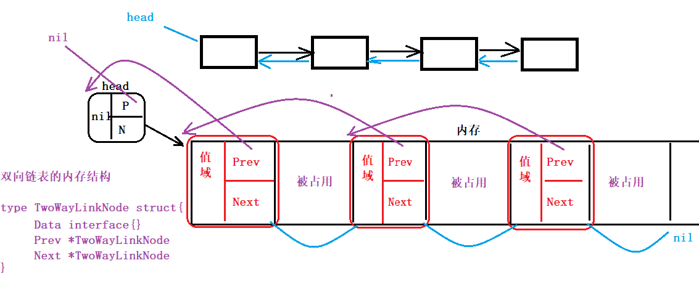
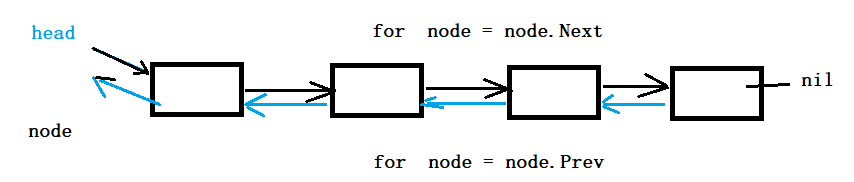
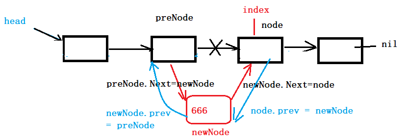
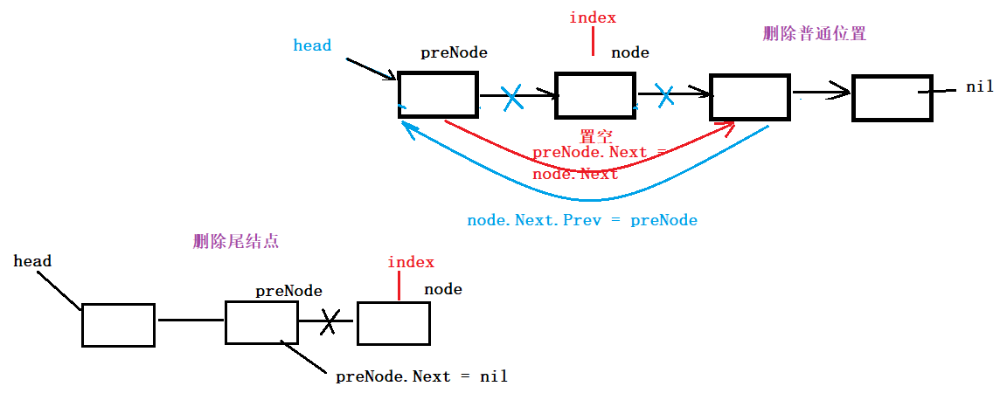
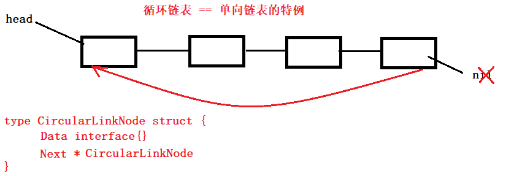

##  单向链表

### 单向链表操作函数

1. 创建单向链表 **Create**(...数据 interface{})
2. 打印单向链表 **Print**()
3. 获取单向链表的长度 Length()
4. 单向链表插入——头插法 **InsertByHead**()
5. 单向链表插入——尾插法 **InsertByTail**()
6. 单向链表插入——按位置插入 **InsertByIndex**()
7. 删除链表结点——按位置删除 **DeleteByIndex**()
8. 删除链表结点——按数据删除 **DeleteByData**()
9. 按数据插找结点 **SeachByData**()
10. 销毁链表 Destroy()


### ==打印单向链表==

#### ==循环打印==

1. 容错
2. 使用 for  node.Next != nil {  启动循环
    1. 如果 Data 不为空
    2. 打印 Data
    3. 结点后移。 node = node.Next

​    }

```go
// 打印链表 -- 循环
func (node *LinkNode) Print1() {
	// 容错
	if node == nil {
		return
	}
	for node.Next != nil {
		node = node.Next    // 结点后移
		if node.Data != nil {
			fmt.Print(node.Data, " ")
		}
	}
	fmt.Println()
}
```


#### ==递归打印==

1. 容错，同时也是递归出口  if  node == nil { return }
2. 判断，Data 不为nil ， 打印  if  node.Data != nil {   打印  Data  }
3. 递归调用本函数。  node.Next.Print()

```go
// 打印链表 -- 递归
func (node *LinkNode) Print2() {
	// 容错, 递归出口
	if node == nil {
		return
	}
	if node.Data != nil {
		fmt.Print(node.Data, " ")
	}
	node.Next.Print2()		// 调用过程,发生了 node = node.Next 赋值
}
```


### 获取链表长度

```go
// 获取链表长度 --- 计算数据结点个数
func (node *LinkNode) Length() int {
	if node == nil {
		return -1
	}
	// 定义计数器
	i := 0
	for node.Next != nil {
		i++
		node = node.Next // 结点循环后移
	}
	return i
}
```

### ==插入链表——头插==


- 实现流程
    1. 容错
    2. 创建新结点，并初始化 
    3. 先，将新结点的 Next 指向原链表的第一个数据结点。
    4. 后，将原链表的头结点（node）的next 指向新结点。

```go
// 插入链表 -- 头插
func (node *LinkNode) InsertByHead(Data interface{}) {
	if node == nil {
		return
	}
	// 创建新结点, 初始化
	newNode := new(LinkNode)
	newNode.Data = Data
	newNode.Next = nil

	// 将新结点的 Next, 指向原链表的 第一个数据结点(node.Next)
	newNode.Next = node.Next

	// 将头结点(node) 的 Next 指向新结点
	node.Next = newNode
}
```


### ==插入链表 —— 尾插==


- 实现流程
    1. 容错
    2. 创建新结点， 初始化
    3. 循环后移node， 使用node 保存尾结点
    4. 将尾结点的 Next 指向 新结点

```go
// 插入链表 -- 尾插
func (node *LinkNode) InsertByTail(Data interface{}) {
	if node == nil {
		return
	}
	// 创建新结点
	newNode := new(LinkNode)
	newNode.Data = Data
	newNode.Next = nil

	// 循环找到尾结点, 保存在 node 中.
	for node.Next != nil {
		node = node.Next
	}
	// 将node(代表尾结点)的next 指向 新结点
	node.Next = newNode
}
```


### ==插入链表 —— 按位置插==


- 实现流程
    1. 容错 
    2. 创建、初始化新结点
    3. 定义 preNode ，用来保存 index 对应结点的前一个结点。
    4. 循环，移动 node 和 preNode 。 保存 index 和 index 前一个位置
    5. 新结点的 Next 指向 node
    6. preNode 的 Next 指向 新结点。

```go

// 插入链表 -- 按位置插
func (node *LinkNode) InsertByIndex(Data interface{}, index int) {
	if node == nil || Data == nil {
		return
	}
	if index <= 0 || index > node.Length() {
		return
	}
	// 创建新结点, 初始化
	newNode := new(LinkNode)
	newNode.Data = Data
	newNode.Next = nil

	preNode := node		// 创建 preNode变量,保存, index 对应结点的前一个结点

	// 循环后移node, 保存 index 对应结点
	for i := 0; i < index; i++ {
		preNode = node
		node = node.Next
	}								// 循环结束, node 保存 index 对应结点

	// 新结点的 Next 指向 index 对应结点
	newNode.Next = node

	// preNode 的 next 指向新结点
	preNode.Next = newNode
}
```


### ==删除链表结点 —— 按位置删==


- 实现流程
    1. 容错
    2. 定 preNode，用来保存 index 对应结点的前一个结点。
    3. 循环 移动 preNode 和 node ， 分别指向 待删除结点的前一个 和 index 对应的结点
    4. 将 preNode 的 Next 执行 node 的 Next ( index 对应的 下一个结点)
    5. 置空链表上摘下的结点（保存在 node 中），促使GC回收

```go
// 删除结点 -- 按位置删
func (node *LinkNode) DeleteByIndex(index int) {
	if node == nil {
		return
	}
	if index <= 0 || index > node.Length() {
		return
	}
	// 定义preNode 保存 index 前一个结点
	preNode := node
	// 循环后移 node 和 preNode , 指向 待删除结点 和 前一个结点
	for i := 0; i < index; i++ {
		preNode = node
		node = node.Next
	}

	// preNode 的 Next 指向 index的后一个结点.
	preNode.Next = node.Next

	// 将链表上摘下的结点(node) 置空(促使GC回收)
	node.Data = nil
	node.Next = nil
	node = nil
}
```


### 删除结点 —— 按数据删


- 实现流程：
    1. 容错
    2. 定义preNode ，用来保存待删除结点的前一个结点
    3. for 循环找寻 与给定参数数据值一致的 结点， 保存在 node 中。preNode 保存前一个。
        - 比对：使用 ==reflect.DeepEqual()==可以实现 引用数据值的比较。 
    4. preNode 的 Next 执行 node 的 下一个结点。（将node对应的结点摘下）
    5. 置空，促使GC工作

```go
// 删除结点 --- 按数据
func (node *LinkNode) DeleteByData(Data interface{}) {
	if node == nil || Data == nil {
		return
	}
	// preNode 保存 待删除结点的前一个
	var preNode *LinkNode
	// 循环从链表中依次取出 数据, 与参数的 Data 比对
	for node.Next != nil {
		preNode = node
		node = node.Next
		//if node.Data == Data {		// == 比对 数据值, 如果包含引用类型,不能比较
		//if reflect.TypeOf(node.Data) == reflect.TypeOf(Data) && node.Data == Data {
		//if reflect.TypeOf(node.Data) == reflect.TypeOf(Data) && reflect.DeepEqual(node.Data, Data){
		
		if reflect.DeepEqual(node.Data, Data){  // 既可以比较数值类型,也可以比较引用类型
			// 从链表摘下
			preNode.Next = node.Next
			// 置空
			node.Data = nil
			node.Next = nil
			node = nil
			return
		}
	}
}
```


### 查找链表结点

- 方法一
    1. 容错
    2. 获取链表结点个数，保存在变量len中。 len := node.Length()
    3. 以 len 为循环上限，i:=1启动循环，遍历链表
        1. 将node 后移，依次取出每一个结点（保存在 node 中）
        2. 比对node 的数据，和参数传入的 Data 一致。 reflect.DeepEqual()
        3. 满足条件，返回 i
    4. 循环结束，返回 -1
- 方法二
    1. 容错
    2. 定义计数器 i := 0
    3. 循环， 以 node.Next == nil 为退出条件
        1. 先 做 i++（跳过 头结点对应的 下标）
        2. node = node.Next （跳过 头结点）
        3. 判断 node 的数据，和参数传入的 Data 一致。 reflect.DeepEqual()
        4. 满足条件返回
    4. 循环结束，返回 -1


#### 方法一

```go
// 查找结点 - 按数据
func (node *LinkNode) SearchByData(Data interface{}) int {
	if node == nil || Data == nil {
		return -1
	}
	// 获取链表的 实际长度(循环上限)
	len := node.Length()
	for i := 1; i <= len; i++ {
		node = node.Next			// 跳过 头结点
		if reflect.DeepEqual(node.Data, Data) {
			return i
		}
	}
	return -1
}
```


#### 方法二

```go

func (node *LinkNode) SearchByData2(Data interface{}) int {
	if node == nil || Data == nil {
		return -1
	}
	i := 0;  // 定义计数器, 记录结点下标
	for node.Next != nil {
		i++
		node = node.Next
		if reflect.DeepEqual(node.Data, Data) {
			return i
		}
	}
	return -1
}
```


### 销毁链表

- 参照递归打印链表的实现思路，销毁

```go
func (node *LinkNode) Destroy() {
	// 容错, 递归的出口
	if node == nil {
		return
	}
	// 递归调用本函数
	node.Next.Destroy()
    
	node.Data = nil
	node.Next = nil
	node = nil
}
```


## 顺序链式表 和 顺序线性表比对

### 线性表

- 优点
    - 数据连续存储在内存中， 查询速度快
    - 不需要额外的空间，描述元素之间的关系。
- 缺点
    - 删除、插入操作，涉及到后续元素的移动。效率低。
- 使用场景
    - 查询操作的使用频率远远高于插入、删除操作的使用评率。

### 链式表

- 优点
    - 删除、插入操作，不涉及到后续元素的移动。效率高。
- 缺点
    - 数据存储在不连续的内存中， 查询速度慢
    - 需要在数据结点中，额外提供空间描述结点之间的关系。（指针域）
- 使用场景
    - 插入、删除操作的使用频率远远高于查询操作的使用评率。


## 双向链表

### 存储结构



### 操作函数

1. 创建双向链表 **Create**()
2. 打印双向链表 **Print**()
3. 获取双向链表长度 Length()
4. 插入链表结点 **Insert**()
5. 删除链表结点 **Delete**()
6. 销毁双向链表


### ==创建双向链表==

- 实现思路
    1. 容错
    2. 循环获取用户键入的 数据， 将每一个数据，保存到一个结点中，拼接成双向链表
        1. 创建、初始化链表结点
        2. 新结点的 prev， 指向上一个结点的首地址。
        3. node.Next = newNode
        4. node = node.Next
    3. 循环结束，双向链表创建成功。

- 编码实现

```go
// 创建双向链表
func (node *TwoWayLinkNode)Create(Data ...interface{})  {
	if node == nil || len(Data) == 0 {
		return
	}
	// 循环获取用户输入, 创建新结点, 组成双向链表
	for _, v := range Data {
		// 创建新结点 ,并初始化
		newNode := new(TwoWayLinkNode)
		newNode.Data = v
		newNode.Prev = node		// 当创建第一个数据结点时， prev 指向头结点（node）
		newNode.Next = nil

		node.Next = newNode		// 将新结点赋值为当前结点的下一结点
		node = node.Next		// 更新新结点为当前结点
	}
}
```


### ==打印双向链表==

#### 正序打印 - 递归

- 参照 单向链表的 递归打印实现。

```go
// 正序打印 - 递归
func (node *TwoWayLinkNode) Print1() {
	if node == nil {  // 递归出口
		return
	}
	if node.Data != nil {
		fmt.Print(node.Data, " ")
	}
	node.Next.Print1()
}
```


#### 倒序打印 - 循环



1. 容错
2. 循环找到尾结点， 保存在node中
3. 循环从尾结点，使用prev 向前，提取每一个结点，打印数据域。到prev 指向 nil 为止。

```go
// 倒序打印 - 循环
func (node *TwoWayLinkNode) Print2() {
	if node == nil {
		return
	}
	// 找到尾结点,保存在 node 中
	for node.Next != nil {
		node = node.Next
	}
	for node.Prev != nil {
		if node.Data != nil {
			fmt.Print(node.Data, " ")
		}
		node = node.Prev
	}
	fmt.Println()
}
```


### 获取链表长度

- 参照 单向链表获取长度方法实现

```go

// 获取双向链表长度
func (node *TwoWayLinkNode) Length() int {
	if node == nil {
		return -1
	}
	i := 0
	for node.Next != nil {
		i++
		node = node.Next
	}
	return i
}

```


### ==插入结点==



- 实现流程
    1. 容错
    2. 定义 preNode ，用来保存 index对应结点的前一个结点
    3. 循环 移动 preNode 和 node ， node保存 index
    4. 创建新结点并初始化
        1. newNode.Next = node
        2. newNode.Prev = preNode
    5. 将preNode 的 next 指向新结点
    6. 将node 的 Prev 指向新结点
    7. 【扩展】： 如果用户插入的 index值，超出了 链表的长度。 使用“尾插入法”处理
        1. 判断超出： if index > node.Length()
        2. 找到原链表的尾结点  for  node = node.Next
        3. 创建新结点，初始化。
            1. newNode.Prev = node
            2. newNode.Next
        4. node 的 next 指向新结点。
        5. (node 的 prev 依然指向原来的前一个结点 ) 不用动。

- 编码实现

```go
// 按位置插入链表结点
func (node *TwoWayLinkNode) Insert(index int, Data interface{}) {
	if node == nil {
		return
	}
	if index < 0 {
		return
	}
	if index > node.Length() {
		for node.Next != nil {
			node = node.Next
		}
		// 尾插
		newNode := new(TwoWayLinkNode)
		newNode.Data = Data
		newNode.Prev = node
		newNode.Next = nil

		node.Next = newNode
		return
	}

	// 定义preNode, 用来保存 index 前一个结点. 用node 保存index 对应结点
	preNode := node

	// 循环移动 node 和 preNode
	for i := 0; i < index; i++ {
		preNode = node
		node = node.Next
	}

	// 创建/初始化新结点
	newNode := new(TwoWayLinkNode)
	newNode.Data = Data
	newNode.Prev = preNode
	newNode.Next = node

	// 将index 对应的结点的 prev 指向 新结点
	node.Prev = newNode

	// 将prevNode 的 next 指针,指向新结点.
	preNode.Next = newNode
}
```


### ==删除结点==



- 实现思路
    1. 容错
    2. 定义 preNode ，用来保存 index对应结点的前一个结点
    3. 循环 移动 preNode 和 node ， node 保存 index
    4. 将 preNode 的 next 指向 node 的下一个结点
    5. node 的下一个结点的 prev 指向  preNode
    6. 置空 摘下的结点（node），促使GC回收。
    7. 测试，当 index 对应结点为 尾结点时，报内存异常
        1. 添加 判断 index 是否为尾结点的处理代码。
        2. 如果是尾结点， preNOde 的 Next 置空
        3. 将 node 置空。

```go
// 按位置删除链表结点
func (node *TwoWayLinkNode) Delete(index int) {
	if node == nil {
		return
	}
	if index < 0 || index > node.Length() {
		return
	}
	preNode := node
	for i := 0; i < index; i++ {
		preNode = node
		node = node.Next
	}
	// 判断 node 对应的结点是否为 尾结点
	if node.Next != nil {
		// preNode 的 Next 指针,指向 node 的右一个结点
		preNode.Next = node.Next
		// node的后一个结点的 Prev指针,指向 preNode (将 node 对应结点,从链表摘下)
		node.Next.Prev = preNode
	} else {
		preNode.Next = nil
	}
	// 置空
	node.Data = nil
	node.Prev = nil
	node.Next = nil
	node = nil
}
```


### 销毁链表

- 参照 单向链表销毁实现

```go
// 销毁双向链表
func (node *TwoWayLinkNode) Destroy() {
	// 递归出口
	if node == nil {
		return
	}
	// 递归销毁链表
	node.Next.Destroy()
	node.Data = nil
	node.Next = nil
	node.Prev = nil
	node = nil
	runtime.GC()
}
```


## 循环链表

### ==循环链表的结构==



### 循环链表操作函数

1. 创建循环链表Create()
2. 打印循环链表 Print()
3. 获取循环链表 Length()
4. 插入循环链表结点 Insert()
5. 删除循环链表结点 Delete()


### ==创建循环链表==

- 实现流程
    1. 容错
    2. 定义 head变量， 保存 链表头结点。（将来用来形成环） head := node
    3. 循环获取用户键入数据， 创建新结点、初始，形成 单向链表。 
    4. （循环结束时， 尾结点保存在 node 中）
    5. 在循环结束后， 将node 的 Next 指向 链表的第一个数据结点。 node.Next = head.Next

```go
// 创建循环链表
func (node *CircularLinkNode) Create(Data ...interface{}) {
	if node == nil || len(Data) == 0 {
		return
	}
	// 保存链表头结点, 以便将来形成闭环
	head := node

	// 循环获取用户键入数据, 创建结点,组织循环链表
	for _, v := range Data {
		newNode := new(CircularLinkNode)
		newNode.Data = v
		newNode.Next = nil

		node.Next = newNode		// 将当前结点的下一个结点赋值为新结点
		node = node.Next 		// 更新 新结点为 当前结点

	}	// 当循环结束时, node 保存着 尾结点
	
	// 在循环之外,形成一个闭环
	node.Next = head.Next
}
```


### ==打印循环链表==

- 实现流程
    1. 容错
    2. 创建的 标记位置, 以第一个数据结点作为标记位（start := node.Next）
    3. 死循环，不断后移node ，依次取出结点， 打印数据域。当node.Next 再次 指向 标记位置时，跳出循环。
        1. 后移 node 。  node = node.Next
        2. 打印数据域
        3. 判断是否到达 标记位置。  if  start == node.Next  { break }
- 编码实现

```go
// 打印循环链表
func (node *CircularLinkNode) Print() {
	if node == nil {
		return
	}
	// 创建一个参考位置 --- 以第一个数据结点为参考结点
	start := node.Next

	for {
		node = node.Next		// 循环链表中,必须 先 后移 node , 然后在判断跳出点
		if node.Data != nil {
			fmt.Print(node.Data , " ")
		}
		if start == node.Next {
			break				// 此时，node代表链表的 尾结点。
		}
	}
}
```


### ==获取循环链表长度==

- 实现流程
    1. 容错
    2. 创建的 标记位置, 以第一个数据结点作为标记位（start := node.Next）
    3. 定义计数器  i := 0
    4. 死循环，不断后移node ，计数器自增。判断是否到达 标记位置。 break
        1. 后移 node 。  node = node.Next
        2. i++
        3. 判断是否到达 标记位置。  if  start == node.Next  { break }
    5. return i

- 编码实现

```go
// 获取循环链表长度
func (node *CircularLinkNode) Length() int {
	if node == nil {
		return -1
	}
	// 创建标记位置
	start := node.Next

	i := 0
	for {
		node = node.Next
		i++
		if start == node.Next {
			break
		}
	}
	return i
}
```

