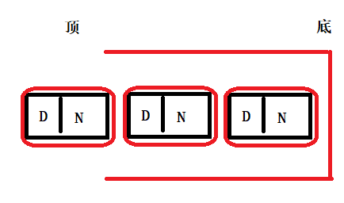
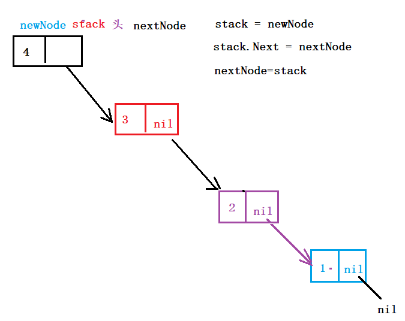

## 循环链表

### ==插入结点==


- 实现流程

    1. 参照单向链表，按位置插入结点实现。

    2. 判断如果插入位置在 第一个数据结点时 。

        1. 创建标记位置，保存第一个数据结点。用来找寻尾结点。 start := node.Next

        2. 死循环，找寻尾结点。保存在node中。

        3. 跳出循环后，将 node （尾结点）的 Next 指向 新结点。

            

- 代码实现

```go
// 插入链表结点
func (node *CircularLinkNode) Insert(index int, Data interface{}) {
	// 容错
	if node == nil || Data == nil {
		return
	}
	if index <= 0 || index > node.Length() {
		return
	}
	// 创建标记位置, 记录第一个数据结点
	start := node.Next

	// 定义preNode, 用来标记index 对应结点的前一个结点
	preNode := node
	// 循环找到index 对应结点
	for i := 0; i < index; i++ {
		preNode = node
		node = node.Next
	}
	// 创建/初始化新结点
	newNode := new(CircularLinkNode)
	newNode.Data = Data
	newNode.Next = node		// 将新结点的 Next 域指向 node

	// 将 preNode 的 Next 指向 新结点
	preNode.Next = newNode
	
	if index == 1 {
		for {
			if start == node.Next {		// 找到 尾结点.
				break
			}
			node = node.Next
		}
		node.Next = newNode
	}
}
```


### ==删除结点==


- 实现流程
    1. 删除位置在中间、结尾处理方法，参照单向链表结点删除。
    2. 当 删除位置在 第一个数据结点时
        1. 创建标记位置，保存第一个数据结点。用来找寻尾结点。 start := node.Next
        2. 定义临时变量 temp，用来保存尾结点。（node 不适合使用）
        3. 死循环，找寻尾结点。保存在temp中。
        4. 跳出循环后，将 temp（尾结点）的 Next 指向 node 的下一个结点(node 会被摘除)。
        5. 置空 node 

- 编码实现

```go
// 删除链表结点
func (node *CircularLinkNode) Delete(index int) {
	if node == nil {
		return
	}
	if index <= 0 || index > node.Length() {
		return
	}

	// 定义标记位置
	start := node.Next

	// 定义preNode, 用来标记index 对应结点的前一个结点
	preNode := node
	// 循环找到index 对应结点
	for i := 0; i < index; i++ {
		preNode = node
		node = node.Next
	}

	if index == 1 {
		// 定义临时变量, 用来找寻尾结点
		temp := node
		for {
			if start == temp.Next {
				break
			}
			temp = temp.Next
		}							// 当循环结束时,temp中保存尾结点
		// 将原链表的尾结点,指向删除后的第一个数据结点.
		temp.Next = node.Next
	}
	preNode.Next = node.Next

	// 置空
	node.Data = nil
	node.Next = nil
	node = nil
}
```


## 链式栈（stack）

### 特性：

- 链式栈，是受限的线性表。受栈型存储结构存储数据特性限制。 FILO 先进后出。
- 本质：单向链表。（通常没有头结点，第一个数据结点当成头结点）
- 只支持：头插（压栈）、头删（弹栈）

- 数据结构

    ```go
    type StackNode struct {
        Data interface{}
        Next *StackNode
    }
    ```



### 操作方法

1. 创建链栈 Create
2. 打印链栈 Print
3. 获取链栈长度 Length
4. 压栈（头插）Push
5. 弹栈（头删）Pop


### ==创建链栈==



- 实现流程
    1. 容错
    2. 创建链栈头结点。stack := new(StackNode)
    3. 循环获取用户键入的数据，创建结点，形成链栈
        1. 创建、初始化新结点。 
            1. newNode := new(Stack)   
            2. newNode.Data = v
            3. newNode.Next = nil
        2. 设置新结点为 头结点       `stack = newNode`
        3. 创建 nextNode 结点，用来记录 下一个结点。
        4. 更新 新结点的 下一个结点为 nextNode 。   `stack.Next = nextNode`
        5. 将当前结点设置为 下一个结点  。   `nextNode = stack`

- 代码实现

```go
// 创建链式栈
func Create(Data ...interface{}) *StackNode {
	if Data == nil {
		return nil
	}
	// 创建头结点
	stack := new(StackNode)

	// 创建结点,保存 新结点的下一个结点
	var nextNode *StackNode

	// 循环获取元素,创建结点,组成链栈
	for _, v := range Data {
		newNode := new(StackNode)
		newNode.Data = v
		newNode.Next = nil

		stack = newNode			// 将新结点,设置为头结点
		newNode.Next = nextNode // 将头结点的 Next 指向 下一结点
		nextNode = stack	// 更新当前结点为下一结点
	}
	return stack
}
```

### 打印链栈

```go
// 打印链式栈
func PrintStack(s *StackNode) {
	if s == nil {
		return
	}
	for s != nil {
		if s.Data != nil {
			fmt.Print(s.Data, " ")
		}
		s = s.Next
	}
	fmt.Println()
}
```


### 获取链栈长度

```go
// 获取链栈长度
func LengthStack(s *StackNode) int {
	if s == nil {
		return -1
	}
	// 定义计数器
	i := 0
	for s != nil {
		s = s.Next
		i++
	}
	return i
}
```


### ==压栈（入栈）-- 头插==

```go
// 压栈 --- 头插
func Push(s *StackNode, Data interface{}) *StackNode {
	if s == nil {
		return nil
	}
	if Data == nil {
		return s
	}
	// 创建新结点/初始化
	newNode := new(StackNode)
	newNode.Data = Data
	newNode.Next = s

	return newNode
}
```


### ==弹栈（出栈）-- 头删==

```go
// 出栈(弹栈) -- 头删
func Pop(s *StackNode) *StackNode {
	if s == nil {
		return nil
	}
	return s.Next
}

// 出栈(弹栈) -- 头删
func Pop2(s *StackNode) *StackNode {
	if s == nil {
		return nil
	}
	// 定义变量,保存待摘除结点
	temp := s.Next

	// 置空
	s.Data = nil
	s.Next = nil
	s = nil

	return temp
}
```


## 链式队列（Queue）

### 特性：

- 链式队列，是受限的线性表。受队列存储结构存储数据特性限制。 FIFO 先进先出。
- 本质：单向链表。
- 只支持：尾插（入队）、头删（出队）

- 数据结构

```go
type QueueNode struct {
    Data interface{}
    Next *QueueNode
}
```

### 操作函数

1. 创建链式队列Create
2. 打印链式队列 Print
3. 获取队列元素长度 Length
4. 入队。Push
5. 出队。Pop


## 树

- 线性表：1:1
- 树：1：N
    - 根节点：只有后继，没有前驱
    - 子结点：	既有前驱，又有后继
    - 叶子结点：只有前驱，没有后继

### 树的定义：

1. 互不相交的有限结点集合
2. 只有一个根结点

### 树的特性：

1. 只有一个前驱，可以有多个后继
2. 树中可以有树（子树）。递归。
3. 树可以为空，结点0

### 相关概念：

- 结点的度：
    - 结点的直接后继个数
- 树的度：
    - 先求每个结点分支数， 这些数中取max， 为“树”的度。
- 树的深度（高度）：
    - 树的层数。


### ==二叉树：==

1. 每个结点最多两颗子树，即结点的度，不能大于 2 。可以0、1。 
2. 左子树、右子树 不能颠倒。（有序）

### ==满二叉树：==

- 每个结点都有 左子结点、右子结点 的 二叉树。【要求会画】

### ==完全二叉树：==

- 除最后一层外，每一层的结点数都达到最大值。（左子、右子都不缺）
- 最后一层上，只能自右向左顺序缺失。
- “满二叉树” 是“完全二叉树”的特例！


### ==左子右兄==：

- 作用：用来将 多叉树 转换成 二叉树。

1. **兄弟连**：将同层所有兄弟连成一条线 （2 兄弟的也连）
2. **右子断**：将所有右儿子，与父亲的边断掉。
3. **45°转**：将刚才连成的那条线，顺时针旋转 45°

【结论】：“兄弟”被线连起来的，都在它们的大哥右子树中，且根结点一定没有右儿子，因为根没有兄弟。


## 二叉树操作：

### 二叉树存储结构：


```go
type BinTreeNode struct {
    Data interface{}
    LChild *BinTreeNode
    RChild *BinTreeNode
}
```


### 二叉树操作方法：

1. 创建二叉树 Create（）
2. 二叉树的遍历：	**大前提：先左后右**
    - 先序遍历：根、左、右	PreOrder（）
    - 中序遍历：左、根、右	MideOrder（）
    - 后序遍历：左、右、根	PostOrder（）
3. 获取二叉树深度（高度）：TreeHeight（）
4. 获取二叉树叶子结点个数：LeafNum（）
5. 二叉树的数据查找  Search（）
6. 销毁二叉树 Destroy（）
7. 二叉树的翻转 Reverse()
8. 二叉树的拷贝 Copy（）


### 创建二叉树

- 先要确定二叉树的结构，根据图，组织结点关系。

```go
// 定义二叉树结点结构体
type BinTreeNode struct {
	Data   interface{}
	LChild *BinTreeNode
	RChild *BinTreeNode
}

// 创建二叉树 --- 根据树的结构(图)
func (node *BinTreeNode) Create() {
	if node == nil {
		return
	}
	// 创建二叉树上的所有结点
	node1 := BinTreeNode{1, nil, nil}
	node2 := BinTreeNode{2, nil, nil}
	node3 := BinTreeNode{3, nil, nil}
	node4 := BinTreeNode{4, nil, nil}
	node5 := BinTreeNode{5, nil, nil}
	node6 := BinTreeNode{6, nil, nil}
	node7 := BinTreeNode{7, nil, nil}

	// 给根结点赋值, 组织二叉树关系
	node.Data = 666
	node.LChild = &node1
	node.RChild = &node2

	node1.LChild = &node3
	node1.RChild = &node4
	node2.LChild = &node5
	node2.RChild = &node6
	node3.LChild = &node7
}
```


### 二叉树遍历

- 先左 后右

#### ==先序遍历==

- 先根，再左，再右

- 每次打印子树时，都要遵循，先根再左再右顺序，递归进行打印。

```go
// 先序遍历 -- DLR
func (node *BinTreeNode) PreOrder()  {
	// 容错, 递归出口
	if node == nil {
		return
	}
	// 先根: 直接打印结点的数据域
	fmt.Print(node.Data, " ")
	// 再左: 左子树,递归调用本函数.
	node.LChild.PreOrder()
	// 再右: 右子树,递归调用本函数
	node.RChild.PreOrder()
}
```


#### ==中序遍历==

- 先左，再根，再右

```go
// 中序遍历 -- LDR
func (node *BinTreeNode) MidOrder() {
	// 容错, 递归出口
	if node == nil {
		return
	}
	// 先左: 左子树递归调用本函
	node.LChild.MidOrder()
	// 再中: 打印Data
	fmt.Print(node.Data, " ")
	// 再右: 右子树递归调用本函数
	node.RChild.MidOrder()
}
```


#### ==后序遍历==

- 先做，再右，再根 -- 73415620

```go
// 后序遍历 -- LRD
func (node *BinTreeNode) PostOrder() {
	if node == nil {
		return
	}
	// 先左: 左子树递归调用本函
	node.LChild.PostOrder()
	// 再右: 右子树递归调用本函数
	node.RChild.PostOrder()
	// 再中: 打印Data
	fmt.Print(node.Data, " ")
}
```


### ==获取二叉树的高度（深度）==

- 实现流程
    1. 设定递归出口。if node == nil { return 0}  （不能return -1）
    2. 左、右子树，各自递归进入。调用本函数。各自保存返回值。
    3. 比较左、右子树返回值大小，取大值 ++。 return 累加后的 大值。

- 编码实现

```go
// 获取二叉树深度(高度)
func (node *BinTreeNode) TreeHeight() int {
	// 递归出口
	if node == nil {
		return 0		// 用来累加树高,不能使用-1
	}
	// 左子树递归调用本函数
	lh := node.LChild.TreeHeight()
	// 右子树,递归调用本函数
	rh := node.RChild.TreeHeight()

	// 比较左子树和右子树各自返回值, 进行累加
	if lh > rh {
		lh++
		return lh
	} else {
		rh++
		return rh
	}
}
```


### ==获取叶子结点个数==

#### 全局变量

```go
// 统计二叉树的叶子结点个数
var num = 0   // 统计叶子结点个数
func (node *BinTreeNode) LeafNum() {
	// 递归出口
	if node == nil {
		return
	}
	// 找寻叶子结点
	if node.LChild == nil && node.RChild == nil {
		num++  // 找到叶子结点,累加给全局变量.做统计
	}
	// 左/右子树各自递归调用本函数.
	node.LChild.LeafNum()
	node.RChild.LeafNum()
}
```


#### 指针传参

```go
func (node *BinTreeNode) LeafNum2(n *int) {
	// 递归出口
	if node == nil {
		return
	}
	// 找寻叶子结点
	if node.LChild == nil && node.RChild == nil {
		(*n)++  // 找到叶子结点,累加给全局变量.做统计
	}
	// 左/右子树各自递归调用本函数.
	node.LChild.LeafNum2(n)
	node.RChild.LeafNum2(n)
}
```


### 查找二叉树是否包含xxx数据

```go
// 查找二叉树上是否含有 xxx 数据
var bl = false		// 表示是否在树上找到数据
func (node *BinTreeNode) Search(Data interface{}) {
	if node == nil {
		return
	}
	// 比较二叉树的结点的值域与传递的数据是否一致
	//if node.Data == Data {
	if reflect.DeepEqual(node.Data, Data) {
		bl = true
		return
	}
	// 左右子树各自递归调用本函数
	node.LChild.Search(Data)
	node.RChild.Search(Data)
}

// 测试：
tree.Search(5)
if bl {
    fmt.Println("bingo!")
} else {
    fmt.Println("none!")
}
```


### ==二叉树的翻转==

```go
// 二叉树的翻转
func (node *BinTreeNode) Reverse() {
	if node == nil {
		return
	}
	// 利用go语言特有的多重赋值,将左右子树翻转
	node.LChild, node.RChild = node.RChild, node.LChild

	// 左右子树各自递归
	node.LChild.Reverse()
	node.RChild.Reverse()
}
```


### ==拷贝二叉树==

- 实现流程：
    1. 容错、递归出口
    2. 左子树递归调用 本函数，返回 一个结点。 保存在变量中 leftChild
    3. 右子树递归调用 本函数，返回 一个结点。 保存在变量中 rightChild
    4. 创建新结点并初始化
        1. newNode := new(BinTreeNode)
        2. newNode.Data = node.Data   （node 代表本结点，递归调用本函数的那个结点）
        3. newNode.LChild = leftChild   （给node代表的结点左子树赋值）
        4. newNode.RChild = rightChild   （给node代表的结点右子树赋值）
    5. 返回 newNode 。 （当newNode 最为递归的最后一次返回时，是 根节点。）

- 编码实现

```go
// 二叉树的拷贝
func (node *BinTreeNode) Copy() *BinTreeNode {
	if node == nil {
		return nil
	}
	// 左子树递归调用本函数
	leftChild := node.LChild.Copy()

	// 右子树递归调用本函数
	rightChild := node.RChild.Copy()

	// 创建新结点
	newNode := new(BinTreeNode)
	newNode.Data = node.Data
	newNode.LChild = leftChild
	newNode.RChild = rightChild

	return newNode
}

// 测试二叉树拷贝
tree.PreOrder()
newTree := tree.Copy()
newTree.LChild.RChild.Data = 999
fmt.Println()
newTree.PreOrder()
```

