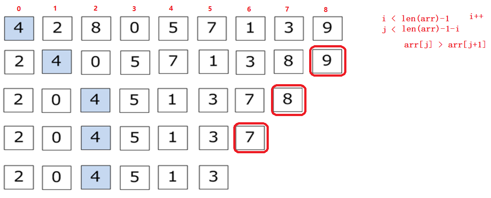
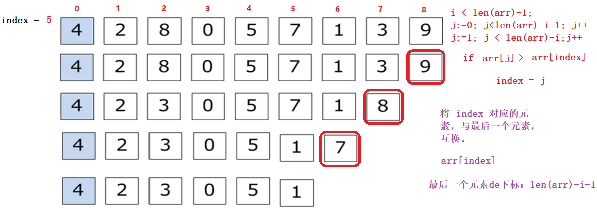
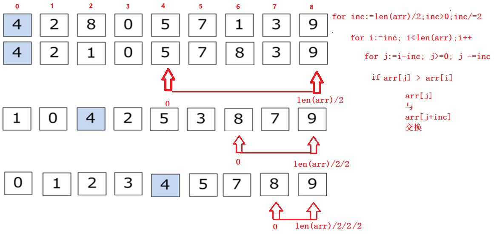
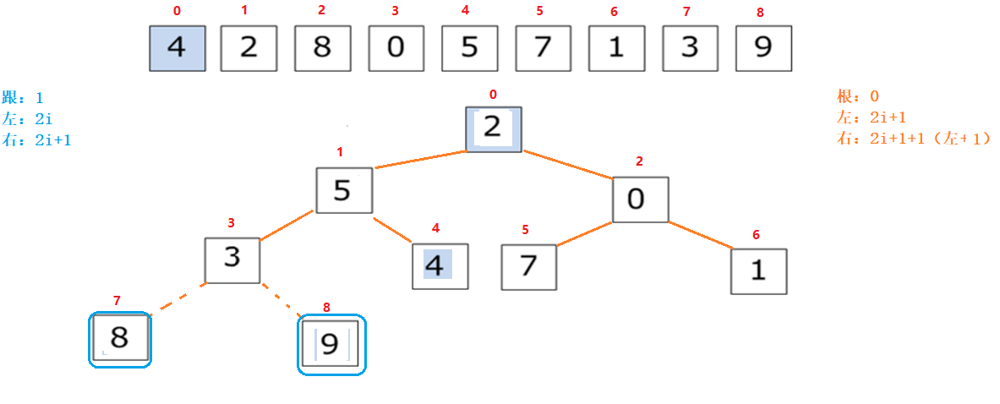

# 排序算法

- 排序算法稳定性界定：

    - 乱序数据集中，相同数据，排序后顺序不变。—— 稳定。

- 排序算法的审判标准：

    - 时间复杂度。 —— 越短越好

    - 空间复杂度。—— 越小越好

    - 可读性。 —— 越强越好

        

## ==大 O 表示法==

- 表示规则：
    - 只关注最高次项。
    - 只有常数项看做1.
    - 时间复杂度通常指的是最坏情况。

| 执行次数函数  | 阶       | 非正式术语 |
| ------------- | -------- | ---------- |
| 12            | O(1)     | 常数阶     |
| 2n+3          | O(n)     | 线性阶     |
| 3n2+2n+1      | O(n2)    | 平方阶     |
| 5log2n+20     | O(logn)  | 对数阶     |
| 2n+3nlog2n+19 | O(nlogn) | nlogn阶    |
| 6n3+2n2+3n+4  | O(n3)    | 立方阶     |
| 2n            | O(2n)    | 指数阶     |

​        


## 冒泡排序

- BubbleSort


- 排序思想：
    1. 外层控制行
    2. 内层控制列
    3. 相邻元素比大小
    4. 满足条件交换



- 编码实现

```go
func BubbleSort(arr []int) {
	// 外层控制行
	for i := 0; i < len(arr)-1; i++ {
		// 内层控制列
		for j := 0; j< len(arr)-1-i; j++ {
			// 相邻元素比大小
			if arr[j] > arr[j+1] {
				// 满足条件交换
				arr[j], arr[j+1] = arr[j+1], arr[j]
			}
		}
	}
}

func main() {
	arr := []int{6, 2, 8, 3, 5, 1, 4, 9, 7, 10}
	BubbleSort(arr)
	fmt.Println(arr)
}
```

- ==冒泡排序优化思想：==
    - 通过标记变量，控制内层循环比较次数。

```go
// 优化冒泡排序
func BubbleSort2(arr []int) {
	count := 0
	// 定义标记位置
	flg := false
	// 外层控制行
	for i := 0; i < len(arr)-1; i++ {
		// 内层控制列
		for j := 0; j < len(arr)-1-i; j++ {
			count++
			// 相邻元素比大小
			if arr[j] > arr[j+1] {
				// 满足条件交换
				arr[j], arr[j+1] = arr[j+1], arr[j]
				flg = true
			}
		}
		if !flg {		// flg为false, 说明上述循环中,所有的元素都没有交换的必要.(有序)
			fmt.Println("count=", count)
			return
		} else {
			flg = false
		}
	}
	fmt.Println("count=", count)
}
```


## ==选择排序==

- SelectSort()


- 实现思路：
    1. 外层控制行
    2. 内层控制列
    3. 将第一个元素当成最大值，记录下标 存 index
    4. index对应的元素依次向后比较，记录大数的下标。
    5. 将 index 对应的元素与 本行最后一个元素互换。




- 编码实现

```go
func SelectSort(arr []int) {
	// 外层控制行
	for i := 0; i < len(arr)-1; i++ {
		// 记录第一个元素(默认最大值) 的下标
		index := 0
		// 内层控制列
		for j := 1; j < len(arr)-i; j++ {
			// 比较 index 和 每个元素,找最大值,
			if arr[j] > arr[index] {
				// index记录最大值下标
				index = j
			}
		}
		// 本行循环比较结束, 将index 对应元素,与最后一个元素交换
		arr[index], arr[len(arr)-i-1] = arr[len(arr)-i-1], arr[index]
	}
}

func main() {
	arr := []int{6, 2, 8, 3, 5, 1, 4, 9, 7, 10}
	SelectSort(arr)
	fmt.Println(arr)
}
```


## ==插入排序==

- InsertSort()


- 实现思路：
    1. 将第一个元素划分为 “有序组”。
    2. 从第二个元素开始，遍历依次取出元素（无序组元素），与有序组中元素比较
    3. 无序组元素，比有序组元素小，循环依次比较有序组中的 所有元素， 依次交换


- 代码实现

```go

func InsertSort(arr []int) {
	// 将第一个元素作为有序组,循环依次取出无序组元素
	for i := 1; i < len(arr); i++ {
		// 将第一个无序组元素, 与最后一个有序组元素比较.
		if arr[i] < arr[i-1] {
			// 循环依次比较有序组中的元素
			for j := i; j > 0; j-- {			// j用作有序组中元素的 下标
				// 有序组中的后一个元素小于前一个元素时
				if arr[j] < arr[j-1] {
					// 交换
					arr[j], arr[j-1] = arr[j-1], arr[j]
				} else {
					break			// 不满足条件,没有循环的必要
				}
			}
		}
		// 将第一个无序组元素 > 最后一个有序组元素. 无需操作.
	}
}

func main() {
	arr := []int{6, 2, 8, 3, 5, 1, 4, 9, 7, 10}

	InsertSort(arr)

	fmt.Println(arr)
}
```


## 计数排序

- CountingSort()
- 利用数据统计方法，实现排序效果。
- 应用于特定场合。 100000个数， 介于 0-999 之间。


```go
func main() {
	// 创建一个切片,用于存储数据
	arr := make([]int, 0)

	rand.Seed(time.Now().UnixNano()) // 播种子

	// 创建10万个随机数
	for i := 0; i < 100000; i++ {
		arr = append(arr, rand.Intn(1000))
	}
	fmt.Println(arr)

	// 创建 map 用于统计每一个数出现的次数
	m := make(map[int]int)

	// 遍历10万个数,统计每一个数据出现多少次
	for i := 0; i < 100000; i++ {
		m[arr[i]]++
	}

	// 从 0-999 依次按每个数出现的次数, 输出所有10万个数据. ---- 相当于对 100000 个数排序.
	for i := 0; i < 1000; i++ {
		// 根据 m 中 key 对应的value, 决定每个数据循环输出的次数
		for j := 0; j < m[i]; j++ {
			// 输出数据
			fmt.Print(i, " ")
		}
	}
}
```


## 希尔排序

- ShellSort()
- 也叫 “缩小增量排序”


- 算法思想：

    1. 确定增量值： len(arr)/2 --> len(arr)/2/2 --> len(arr)/2/2/2 --> len(arr)/2/2/2/2 .... --> 1

    2. 将增量值位置 与 0 位置比较大小，交换， 按增量值后移

    3. 比较对应数据后，按增量前移，比较之前的数据。

        



- 编码实现

```go
func ShellSort(arr []int) {
	// 利用循环, 修改增量值. len(arr)/2 --- len(arr)/2/2 --- len(arr)/2/2/2 --- 1
	for inc := len(arr) / 2; inc > 0; inc /= 2 {
		// 利用增量, 做循环起始值,依次后移取出元素
		for i := inc; i < len(arr); i++ {
			temp := arr[i]
			// 利用增量数据找到对应元素
			for j := i - inc; j >= 0; j -= inc {
				// 前一个元素比后一个元素 大
				if temp < arr[j] {
					arr[j], arr[j+inc] = arr[j+inc], arr[j]  // 交换两个数据
				} else {
					break		// 不满足条件,之前的数据没有继续循环比较的必要.
				}
			}
		}
	}
}

func main() {
	// 创建一个切片,用于存储数据
	arr := make([]int, 0)
	rand.Seed(time.Now().UnixNano()) // 播种子
	// 创建10万个随机数
	for i := 0; i < 100; i++ {
		arr = append(arr, rand.Intn(40))
	}
	ShellSort(arr)
	fmt.Println(arr)
}
```


## ==快速排序==

- QuickSort()


- 算法思路：
    1. 确定基准值 base （第一个元素）
    2. 定义两个 下标 i，j ，分别从 数组的起始、结束位置，对向移动。
    3. j 对应 元素，如果比 base 大， 顺序前移。比base 小。 与 i 对应元素交换。
    4. i 对应 元素，如果比 base 小， 信息后移。 比base 大。 与 j 对应元素交换。
    5. 当 i、j 重合时， 产生分组。对分组 递归调用本函数。（i、j重合的位置，就是该元素，永久位置）

- 编码实现

```go
func QuickSort(arr []int, start int, end int) {
	// 起始下标 < 结束下标
	if start < end {
		i, j, base := start, end, arr[start]
		// i,j 对向移动, 直至重合
		for i < j {
			// j 一端先判断, 移动. 大于基准值, 前移
			for i < j && arr[j] >= base {
				j--
			}
			// 小于基准值, 与 i 对应的 元素交换.
			arr[i], arr[j] = arr[j], arr[i]

			// i 一端判断, 移动. 小于基准值, 后移
			for i < j && arr[i] <= base {
				i++
			}
			// 大于基准值, 与 j 对应的 元素交换.
			arr[i], arr[j] = arr[j], arr[i]
		}
		// 递归调用本函数
		QuickSort(arr, start, i-1)
		QuickSort(arr, i+1, end)
	}
}

func main() {
	// 创建一个切片,用于存储数据
	arr := make([]int, 0)
	rand.Seed(time.Now().UnixNano()) // 播种子
	// 创建10万个随机数
	for i := 0; i < 100; i++ {
		arr = append(arr, rand.Intn(80))
	}
	QuickSort(arr, 0, len(arr)-1)
	fmt.Println(arr)
}
```


## 堆排序

- HeapSort()


- 最大堆，大顶堆，大根堆：将数据结合转换成树形存储，将各个子树中的最大值置于树根。
- 最小堆，小顶堆，小根堆：将数据结合转换成树形存储，将各个子树中的最小值置于树根。

- 实现思路：
    	1.  将乱序数组转换成完全二叉树。
     	2.  将各个子树，按照 “大根堆” 交换数据。 将最大值，置于 整个树根结点上。
     	3.  将根节点与 最后一个叶子结点，交换。将叶子结点摘下 (确定了一个最大数据)。
     	4.  递归重复上述过程。



## ==二分法查找==

- 只能应用于有序的数据序列。 乱序数据集，需先排序，再查找。


```go
// 二分查找 BinarySearch(数据，元素) 返回值为下标
func BinarySearch(arr []int, num int) int {

	start := 0							//定义起始下标
	
	end := len(arr) - 1					//定义结束下标
	
	mid := (start + end) / 2			//定义中间基准值

	for i := 0; i < len(arr); i++ {
		
		if num == arr[mid] {			//中间基准值直接为查找值
		
			return mid					//返回下标
			
		} else if num > arr[mid] {		//查找值 比基准值大
			
			start = mid + 1				//查找右侧
			
		} else {						//查找值 比基准值小
			
			end = mid - 1				//查找左侧
		}
		
		mid = (start + end) / 2			//根据新起始、结束下标，再次设置中间基准值
	}
	
	return -1							//没有找到
}

func main() {
	//有序数据
	arr := []int{1, 2, 3, 4, 5, 6, 7, 8, 9, 10}

	index := BinarySearch(arr, 6)
	fmt.Println(index)
}

```


笔记动图出处：https://blog.csdn.net/hellozhxy/article/details/79911867

